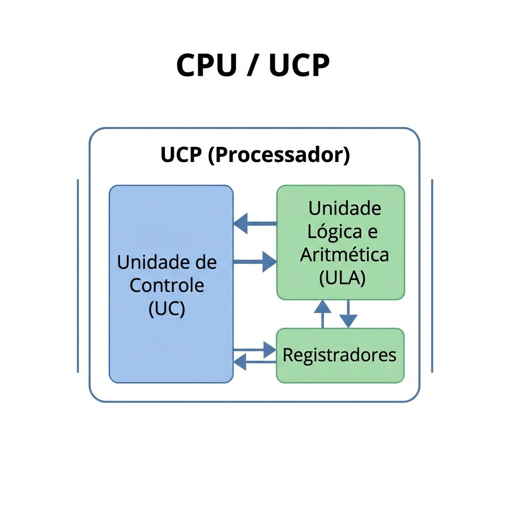
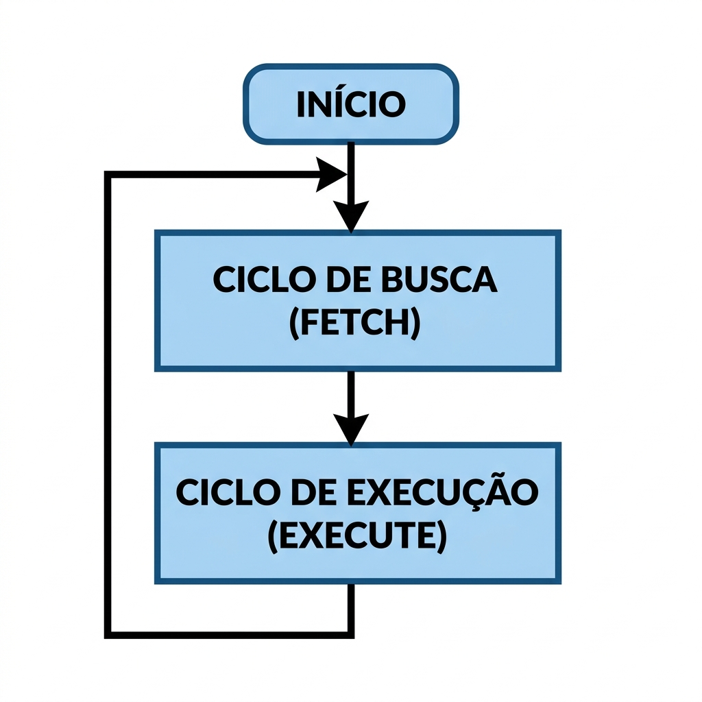
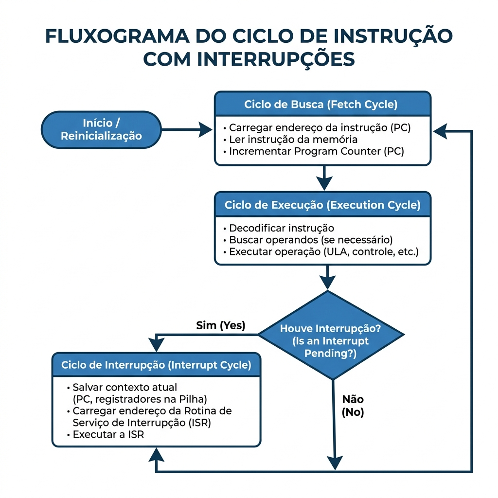

# 🖥️ Aula 05 — Unidades de Processamento e Ciclo de Instrução

**Disciplina:** 90388 — Arquitetura e Organização de Computadores · Sistemas de Informação (curso 160) — Uniube 
**Professor:** Romualdo Mathias Filho · **romualdo.filho@uniube.br** 
**Semana:** 05 · 2026-1 · [CONFIRMAR data] · 📘 Teórica (75 min) 
**Tópicos do programa:** item 4 (Unidades de processamento / Registradores) + item 6 (Ciclo de instrução e suas ações) 
**Página de referência:** [Plano de Ensino e Contrato](./Plano-de-Ensino-e-Contrato)

---

> [!INFO] 🎯 Visão Geral
> **O que você vai dominar:**
> - Abrir a "caixa preta" da Unidade Central de Processamento (UCP) e nomear seus três componentes internos — Unidade Lógica e Aritmética (ULA), Unidade de Controle (UC) e Registradores.
> - Os cinco registradores de controle — Program Counter (PC), Instruction Register (IR), Memory Address Register (MAR), Memory Buffer Register (MBR) e Program Status Word (PSW) — e o que cada um guarda.
> - O Ciclo de Instrução (Busca → Decodificação → Execução), a sequência passo a passo da busca e como uma interrupção quebra esse fluxo.
>
> **Objetivos de aprendizagem — ao final, o aluno deve:**
> - **Identificar** os componentes internos da UCP.
> - **Diferenciar** registradores visíveis ao usuário de registradores de controle e estado.
> - **Descrever** o fluxo de dados durante o Ciclo de Busca (Fetch) e o de Execução (Execute).
> - **Compreender** o papel das interrupções na quebra do fluxo normal de execução.
> - **Relacionar** a arquitetura de registradores com o desempenho do processador.
>
> **📂 Recursos**
> - [Plano de Ensino e Contrato](./Plano-de-Ensino-e-Contrato) — calendário, notas, prazos e regras.

---

<b>Nosso caminho até aqui</b>

Na Aula 04 estudamos o Conjunto de Instruções — o "idioma" do processador — e as duas filosofias que o organizam. Hoje abrimos a máquina para ver **como** ela executa esse idioma. Responda **antes** de avançar; se errar, acabou de descobrir o que revisar.

Qual é a diferença fundamental entre as filosofias CISC e RISC quanto ao número e ao tamanho das instruções?

CISC (Complex Instruction Set Computer) tem muitas instruções, de tamanhos variados, algumas fazendo bastante coisa por instrução. RISC (Reduced Instruction Set Computer) tem poucas instruções, de tamanho fixo e simples, pensadas para executar em um ciclo. A troca é complexidade do hardware contra regularidade: menos trabalho por instrução, mas mais fácil de encadear.

O que é a técnica de <b>pipeline</b> e qual é a sua maior vantagem?

É executar as etapas de várias instruções em paralelo, como uma linha de montagem: enquanto uma instrução é executada, a próxima já é decodificada e a seguinte, buscada. A vantagem é o aumento de vazão — o processador conclui mais instruções por unidade de tempo sem precisar de um clock mais rápido.

O que significa CPI (Ciclos por Instrução) e qual filosofia busca aproximá-lo de 1?

CPI (Cycles Per Instruction) é a média de ciclos de clock gastos por instrução. RISC busca aproximá-lo de 1: instruções simples e regulares, idealmente uma concluída por ciclo com o pipeline cheio.

---

<aside class="au-antes">
<b class="au-nota-t">Antes de começar</b>

**ULA** — a parte do processador que faz as contas: somas, subtrações e operações lógicas (AND, OR, NOT).

**UC** — a parte que lê a instrução e comanda o resto: decide o que fazer e envia os sinais que ativam a ULA e os caminhos de dados.

**Registrador** — uma célula de memória minúscula e muito rápida *dentro* do processador, usada para guardar um dado ou um endereço durante uma fração de instrução.

**Clock** — o pulso periódico que marca o ritmo do processador; cada instrução avança em passos sincronizados por ele.

</aside>

---

## 1. A Unidade Central de Processamento tem três peças por dentro [Teoria ⏳ 12 min]

A **UCP** (Unidade Central de Processamento), ou **CPU** (Central Processing Unit), é o componente que busca, decodifica e executa as instruções guardadas na memória principal. Para fazer isso, ela precisa de três coisas: uma parte que calcula, uma parte que comanda e um lugar imediato para guardar os dados do momento.

> **Stallings (Cap. 12):** para executar instruções, o processador precisa de uma memória de curto prazo acoplada a ele — os registradores — além de circuitos para cálculo e para decisão lógica.

| Componente | Função |
| :-- | :-- |
| **Unidade Lógica e Aritmética (ULA)** | Realiza os cálculos: somas, subtrações e operações booleanas (AND, OR, NOT). |
| **Unidade de Controle (UC)** | Interpreta a instrução e emite os sinais que ativam a ULA e abrem os caminhos de dados. |
| **Registradores** | Memória interna de altíssima velocidade (nível zero da hierarquia). Guardam dados imediatos e o estado da CPU. |
| **Barramentos internos** | Os caminhos elétricos que ligam ULA, UC e registradores dentro do próprio chip. |

<figure class="au-fig">

<figcaption class="au-legenda">A UCP por dentro: a ULA calcula, a UC comanda, os registradores guardam o dado do instante — tudo ligado por barramentos internos ao chip.</figcaption>
</figure>

> [!TIP] 💡 Dica de Produção (Pro-Tip)
> A analogia útil é a de um **chef de cozinha**: a ULA é a faca e a panela, que de fato transformam o ingrediente; a UC é o chef lendo a receita e comandando os movimentos; os registradores são as tigelas na bancada, onde os ingredientes ficam à mão durante o preparo. É uma imagem para fixar o papel de cada peça, não uma descrição do hardware.

> [!NOTE] 💼 Pergunta de Entrevista
> *"Onde ficam os registradores na hierarquia de memória, e por que são tão rápidos?"* — No **nível zero**, acima de qualquer cache. São rápidos porque ficam dentro do núcleo do processador, pertíssimo da ULA, e são poucos — não há custo de endereçamento de memória externa nem latência de barramento para alcançá-los.

---

## 2. Cinco registradores de controle fazem o ciclo acontecer [Teoria ⏳ 13 min]

Os registradores se dividem em duas categorias: os **visíveis ao usuário**, que o software (via Conjunto de Instruções, a ISA — Instruction Set Architecture) pode manipular diretamente, e os **de controle e estado**, que o hardware usa para conduzir o ciclo e que o software em geral não altera à mão. Os cinco abaixo são os de controle que fazem o ciclo mecânico da CPU funcionar.

| Registrador | Nome completo | O que guarda |
| :-- | :-- | :-- |
| **PC** | *Program Counter* | O **endereço** da *próxima* instrução a ser buscada na memória. |
| **IR** | *Instruction Register* | A instrução *atual*, recém-buscada, que está sendo decodificada e executada. |
| **MAR** | *Memory Address Register* | O **endereço** da memória principal onde será feita uma leitura ou escrita. |
| **MBR** | *Memory Buffer Register* | O **dado** (ou a instrução) que veio da memória, ou que será escrito nela. |
| **PSW** | *Program Status Word* | As *flags*\* de estado — por exemplo, se a última operação deu zero, teve estouro (*overflow*) ou resultou em valor negativo. |

<figure class="au-fig">

<figcaption class="au-legenda">O caminho da busca entre os registradores: o PC fornece o endereço ao MAR, a memória devolve o conteúdo pelo MBR, e o valor segue até o IR.</figcaption>
</figure>

*<b>flag</b>: um bit de sinalização que registra uma condição resultante de uma operação (zero, negativo, estouro aritmético). O conjunto dessas flags é o que o PSW guarda.

> [!TIP] 💡 Dica de Produção (Pro-Tip)
> **MAR e MBR trabalham em par e é fácil trocá-los:** o MAR carrega o *endereço* (para onde ir na memória); o MBR carrega o *dado* (o que foi lido de lá ou será escrito). Endereço no MAR, conteúdo no MBR — essa é a distinção que mais cai em prova.

> [!WARNING] ⚠️ Gotcha
> Nem todo registrador é alterável pelo software. Os cinco acima são **de controle**: o PC, por exemplo, é atualizado pelo hardware a cada busca (e por saltos/interrupções), não escrito diretamente por uma instrução comum. Confundir "registrador" com "variável do programa" leva a erro — os registradores visíveis ao usuário (como os de dados, R0, R1…) são outra categoria.

---

## 3. O Ciclo de Instrução é um laço contínuo que as interrupções sabem quebrar [Teoria ⏳ 15 min]

A função básica do computador é executar um programa, que é uma sequência de instruções em endereços da memória. O processo ordenado de tratar **uma** instrução é o **Ciclo de Instrução**.

> **Stallings (Cap. 3):** na forma mais simples, o processamento de uma instrução tem dois subciclos encadeados — o **Ciclo de Busca** (Fetch) e o **Ciclo de Execução** (Execute).

| Estado | O que ocorre no hardware |
| :-- | :-- |
| **Busca (Fetch)** | O processador lê da memória a próxima instrução e a leva ao IR, avançando o PC. |
| **Decodificação** | A UC interpreta a instrução, identificando a operação a realizar (o *opcode*\*). |
| **Execução (Execute)** | O hardware realiza a ação: uma operação na ULA, uma transferência de dados ou um salto. |
| **Repetição** | O macrociclo é contínuo e avança sincronizado pelo clock (a frequência do sistema). |

<figure class="au-fig">

<figcaption class="au-legenda">O ciclo básico: buscar, executar e recomeçar, indefinidamente, enquanto houver instruções.</figcaption>
</figure>

*<b>opcode</b> (<i>operation code</i>): o campo da instrução que diz qual operação executar (somar, carregar, saltar). A decodificação é justamente ler o opcode e preparar o hardware para ele.

Antes de rolar: no primeiro passo da busca, qual registrador recebe o endereço que está no PC — o MAR ou o MBR?

O **MAR** (Memory Address Register). Ele guarda **endereços**; o MBR guarda **dados/instruções**. O PC manda o endereço para o MAR, a memória responde, e o que volta (a instrução) é que entra no MBR. Trocar os dois é o erro clássico — a regra é: **MAR = endereço, MBR = conteúdo**.

### 3.1 A busca segue sempre a mesma sequência de quatro passos

Quando o subciclo de busca começa, os registradores atuam nesta ordem:

1. A UC envia o endereço contido no **PC** para o **MAR** e sinaliza, pelo barramento, um pedido de leitura.
2. A memória principal atende o pedido e devolve o conteúdo daquele endereço, que é depositado no **MBR**.
3. Como o processador está no subciclo de busca, ele copia o conteúdo do **MBR** para o **IR** (é uma instrução que acaba de chegar).
4. O **PC** é incrementado para apontar a instrução seguinte na memória.

> [!TIP] 💡 Dica de Produção (Pro-Tip)
> A analogia do **roteiro teatral** ajuda: o PC é a marcação que indica qual linha do texto (qual endereço) vem a seguir; o IR é o ator lendo e interpretando a fala atual. Primeiro lê (Busca), depois representa (Execução), e a marcação avança para a próxima linha. Use como apoio de memória — o mecanismo real são os quatro passos acima.

### 3.2 As interrupções permitem reagir a eventos sem parar de executar

A sequência Busca → Execução pressupõe um fluxo perfeitamente linear. Na prática, quase todo computador oferece **interrupções**: um mecanismo pelo qual módulos externos (disco, placa de rede, temporizador, ou uma falha de hardware) sinalizam que precisam de atenção, fazendo o processador desviar temporariamente do fluxo normal.

| Etapa | O que ocorre |
| :-- | :-- |
| **Verificação ao fim da execução** | Logo após concluir uma instrução, o hardware checa uma linha de sinalização para ver se há interrupção pendente. |
| **Preservação de contexto** | Havendo interrupção, a CPU salva na memória o valor atual do **PC** e do **PSW**, para poder voltar exatamente ao ponto em que estava. |
| **Rotina de tratamento (ISR)** | O **PC** recebe o endereço da **ISR** (Interrupt Service Routine), a rotina do sistema operacional que trata aquele evento. |
| **Retorno** | Concluída a ISR, o **PC** e o **PSW** salvos são restaurados, e o programa interrompido retoma como se nada tivesse ocorrido. |

<figure class="au-fig">

<figcaption class="au-legenda">O ciclo estendido: depois de cada execução, o hardware pergunta "houve interrupção?". Em caso afirmativo, salva o contexto, atende a ISR e depois retoma.</figcaption>
</figure>

Esse contexto salvo (o PC e o PSW) não é guardado num lugar fixo: ele é **empilhado** numa pilha\*, a mesma estrutura LIFO (*Last In, First Out* — último a entrar, primeiro a sair). É por isso que uma interrupção pode acontecer **dentro** de outra: cada atendimento empilha o seu ponto de retorno, e o desempilhamento na ordem inversa devolve cada programa exatamente de onde parou.

*<b>pilha</b> (<i>stack</i>): estrutura de dados em que o último item inserido é o primeiro a sair (LIFO). O processador a usa para guardar pontos de retorno — de interrupções e também de chamadas de função.

> [!NOTE] 💼 Pergunta de Entrevista
> *"Numa interrupção, por que basta salvar PC e PSW para retomar o programa depois?"* — Porque o PC diz **onde** o programa parou (a próxima instrução) e o PSW diz **em que estado** ele estava (as flags da última operação). Com esses dois, o processador reconstitui o ponto exato de retorno. Os registradores de dados, quando a ISR for usá-los, são salvos e restaurados por ela — tipicamente numa **pilha** (estrutura LIFO).

> [!TIP] 💡 Dica de Produção (Pro-Tip) — o preditor de desvio, com o número certo
> Quando o fluxo encontra um **desvio condicional** (um `if`), o processador em pipeline ainda não sabe qual caminho seguir — e esperar essa decisão deixaria o pipeline ocioso. Processadores modernos (famílias **Intel Core**, **Apple M**, núcleos **ARM**) usam um **preditor de desvio**: um circuito que, a partir de tabelas de histórico, aposta no caminho mais provável e já começa a buscar por ele. O ganho **não** se mede em "milhões de microssegundos" — mede-se em **ciclos de clock economizados** (ordem de **nanossegundos**). Ao acertar o palpite, o preditor evita a penalidade de **esvaziar o pipeline** (um *flush* custa alguns ciclos por desvio mal previsto); ao errar, paga-se exatamente essa penalidade. É economia de ciclos, não de milissegundos.

---

<b>Interativo</b> · Vevox · 3 min

Abra **vevox.app** e entre com o ID da sessão no projetor. Duas perguntas de múltipla escolha, anônimas, sobre o Ciclo de Instrução: (1) em que registrador fica a instrução recém-buscada? (2) o que o processador salva ao atender uma interrupção?

<b>Plano B:</b> se a rede do campus cair, as mesmas duas perguntas vão na mão com os cartões Plickers. Mesmo conteúdo, mesmo tempo.

---

## Seletor de camadas — as três fases do ciclo sobre o datapath

Selecione uma fase para isolar o que acontece nela, no mesmo caminho de dados (PC → MAR → Memória → MBR → IR). O que some da tela é o que não participa daquela fase.

<figure class="au-fig au-switch" role="group" aria-label="Seletor das fases do Ciclo de Instrução">
<input type="radio" name="a05fase" id="a05-busca" checked>
<input type="radio" name="a05fase" id="a05-decod">
<input type="radio" name="a05fase" id="a05-exec">

<label for="a05-busca">BUSCA</label>
<label for="a05-decod">DECODIFICAÇÃO</label>
<label for="a05-exec">EXECUÇÃO</label>

<svg class="au-camadas" viewBox="0 0 460 230" role="img" aria-label="Datapath com PC, MAR, Memória, MBR, IR, UC e ULA ao longo das três fases do ciclo">
<rect x="20" y="18" width="90" height="34" rx="6" fill="none" stroke="#2778c4" stroke-width="2"></rect>
<text x="65" y="40" text-anchor="middle" font-size="13" style="fill:#2778c4" font-family="monospace">PC</text>
<rect x="20" y="90" width="90" height="34" rx="6" fill="none" stroke="#2778c4" stroke-width="2"></rect>
<text x="65" y="112" text-anchor="middle" font-size="13" style="fill:#2778c4" font-family="monospace">MAR</text>
<rect x="185" y="54" width="90" height="34" rx="6" fill="none" stroke="#8a8f98" stroke-width="2"></rect>
<text x="230" y="76" text-anchor="middle" font-size="12" style="fill:#8a8f98" font-family="monospace">MEMÓRIA</text>
<rect x="185" y="126" width="90" height="34" rx="6" fill="none" stroke="#2778c4" stroke-width="2"></rect>
<text x="230" y="148" text-anchor="middle" font-size="13" style="fill:#2778c4" font-family="monospace">MBR</text>
<rect x="350" y="90" width="90" height="34" rx="6" fill="none" stroke="#2778c4" stroke-width="2"></rect>
<text x="395" y="112" text-anchor="middle" font-size="13" style="fill:#2778c4" font-family="monospace">IR</text>
<rect x="350" y="18" width="90" height="34" rx="6" fill="none" stroke="#00aa9f" stroke-width="2"></rect>
<text x="395" y="40" text-anchor="middle" font-size="13" style="fill:#00aa9f" font-family="monospace">UC</text>
<rect x="350" y="162" width="90" height="34" rx="6" fill="none" stroke="#b1541b" stroke-width="2"></rect>
<text x="395" y="184" text-anchor="middle" font-size="13" style="fill:#b1541b" font-family="monospace">ULA</text>

<g class="c1">
<line x1="65" y1="52" x2="65" y2="90" stroke="#2778c4" stroke-width="2"></line>
<line x1="110" y1="107" x2="185" y2="75" stroke="#2778c4" stroke-width="2"></line>
<line x1="230" y1="88" x2="230" y2="126" stroke="#2778c4" stroke-width="2"></line>
<line x1="275" y1="143" x2="350" y2="110" stroke="#2778c4" stroke-width="2"></line>
<text x="230" y="214" text-anchor="middle" font-size="12" style="fill:#2778c4" font-family="monospace">PC→MAR→Memória→MBR→IR, PC++</text>
</g>
<g class="c2">
<line x1="395" y1="90" x2="395" y2="52" stroke="#00aa9f" stroke-width="2"></line>
<text x="230" y="214" text-anchor="middle" font-size="12" style="fill:#00aa9f" font-family="monospace">IR→UC: a UC lê o opcode e decide</text>
</g>
<g class="c3">
<line x1="395" y1="124" x2="395" y2="162" stroke="#b1541b" stroke-width="2"></line>
<text x="230" y="214" text-anchor="middle" font-size="12" style="fill:#b1541b" font-family="monospace">UC comanda a ULA: a ação é realizada</text>
</g>
</svg>
<figcaption class="au-legenda"><b>Busca</b>: o endereço sai do PC pelo MAR, a memória responde pelo MBR e a instrução chega ao IR (e o PC é incrementado). <b>Decodificação</b>: a UC lê o IR e interpreta o opcode. <b>Execução</b>: a UC comanda a ULA e a ação acontece. É o mesmo datapath — muda só a parte que está em uso.</figcaption>
</figure>

---

<b>Prática — 15 min, em duplas</b>

Um processador didático tem no endereço 100 a instrução `LOAD R1, 500` (carregar em R1 o conteúdo que está no endereço 500 da memória). No início, **PC = 100**. Preencha a tabela acompanhando os registradores ao longo da busca e do começo da execução.

1. Abra o simulador **LMC** em [peterhigginson.co.uk/lmc](https://peterhigginson.co.uk/lmc) e carregue um programa simples com um `LOAD`.
2. Execute em modo passo a passo (*step*) e observe PC, MAR, MBR e IR mudando a cada etapa.
3. Preencha a tabela abaixo e confira com o simulador.

| Etapa | PC | MAR | MBR | IR | O que acontece |
| :-- | :-- | :-- | :-- | :-- | :-- |
| **Antes do fetch** | 100 | — | — | — | Estado inicial: o PC aponta a instrução, nada mais foi lido. |
| **Meio do fetch** | 100 | **[?]** | **[?]** | — | O MAR recebe o endereço do PC; a memória responde e o valor cai no MBR. |
| **Fim da busca** | **[?]** | 100 | `LOAD R1, 500` | **[?]** | O MBR é copiado para o IR e o PC é incrementado. |
| **Início da execução** | 101 | **[?]** | **[?]** | `LOAD R1, 500` | A UC decodifica e, para buscar o dado, aponta o MAR para o endereço do operando. |

<b>Critério de pronto:</b> a tabela preenchida bate com o passo a passo do simulador. Gabarito — meio do fetch: MAR = 100, MBR = <code>LOAD R1, 500</code>; fim da busca: PC = 101 (incrementado pelo hardware), IR = <code>LOAD R1, 500</code>; início da execução: MAR = 500 (agora buscando o operando), MBR = o conteúdo do endereço 500.

<b>Plano B:</b> se o simulador não abrir, a mesma tabela é resolvida no quadro, com a turma ditando os valores etapa por etapa.

---

<b>Resumo da aula</b>

| Conceito | Definição em uma frase |
| :-- | :-- |
| **UCP / CPU** | O componente que busca, decodifica e executa instruções; é feito de ULA, UC e registradores. |
| **ULA** | A unidade que faz os cálculos aritméticos e lógicos. |
| **UC** | A unidade que interpreta a instrução e comanda o resto do processador. |
| **PC** | Guarda o endereço da *próxima* instrução. |
| **IR** | Guarda a instrução *atual*, em decodificação/execução. |
| **MAR / MBR** | MAR leva o *endereço*; MBR leva o *dado*. |
| **PSW** | Guarda as flags de estado (zero, negativo, estouro). |
| **Fetch** | Subciclo que traz a próxima instrução até o IR. |
| **Execute** | Subciclo que realiza a ação da instrução. |
| **Interrupção** | Mecanismo que desvia o fluxo para atender um evento, salvando PC e PSW. |
| **Preditor de desvio** | Circuito que aposta no caminho de um desvio para não esvaziar o pipeline; economiza ciclos de clock. |

---

  

  
clique para virar

  <button class="au-fc-prev" type="button" aria-label="Card anterior">←</button>
  
  <button class="au-fc-next" type="button" aria-label="Próximo card">→</button>

---

  

  

  

  

    
    

      <button class="au-quiz-prev" type="button" aria-label="Questão anterior">←</button>
      
      <button class="au-quiz-next" type="button" aria-label="Próxima questão">→</button>
    

  

---

<b>Para pensar até a próxima aula</b>

Numa interrupção, salvar o PC e o PSW basta para o processador voltar ao ponto exato. Mas e se, enquanto a rotina de tratamento (ISR) estiver rodando, chegar <i>outra</i> interrupção? O que precisaria acontecer para que o processador conseguisse tratar uma interrupção dentro da outra sem perder o caminho de volta? Pense em quantos "pontos de retorno" ele teria de guardar — e onde.

<i>Não há resposta nesta página de propósito.</i>

---

<b>Na próxima aula</b>

Hoje vimos que os registradores são a memória mais rápida da máquina — mas são pouquíssimos. Na Aula 06 descemos um degrau: a <b>Hierarquia de Memória</b>, por que ela existe em camadas e como o processador decide o que manter perto e o que deixar longe.

---

<b>Referências desta aula</b>

- **STALLINGS, W.** *Arquitetura e Organização de Computadores.* 11. ed. São Paulo: Pearson, 2024. cap. 3 (Visão de Alto Nível: Função e Interconexão do Computador) e cap. 12 (Estrutura e Função do Processador) · [CONFIRMAR página]
- **TANENBAUM, A. S.** *Organização Estruturada de Computadores.* 6. ed. São Paulo: Pearson, 2013. cap. 2 (Organização de Sistemas de Computadores) · [CONFIRMAR página]
- **NULL, L.; LOBUR, J.** *The Essentials of Computer Organization and Architecture.* 5th ed. Burlington: Jones & Bartlett, 2018. [CONFIRMAR capítulo e página]

**Ferramentas de apoio**

- Simulador **LMC** (Little Man Computer): [peterhigginson.co.uk/lmc](https://peterhigginson.co.uk/lmc) — modelo didático para ver o ciclo buscar-executar passo a passo.
- **CPUlator**: [cpulator.01xz.net](https://cpulator.01xz.net/) — simulador de datapath em tempo real.

