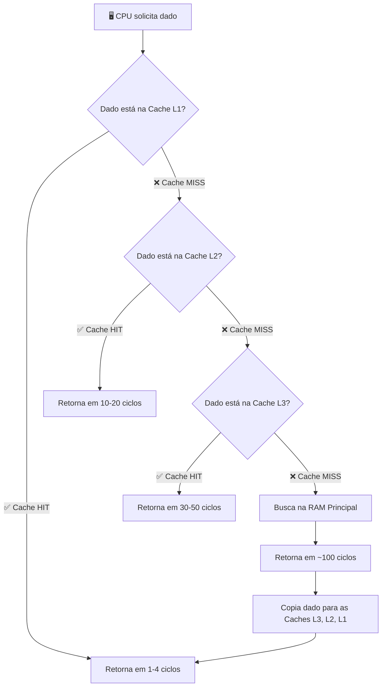
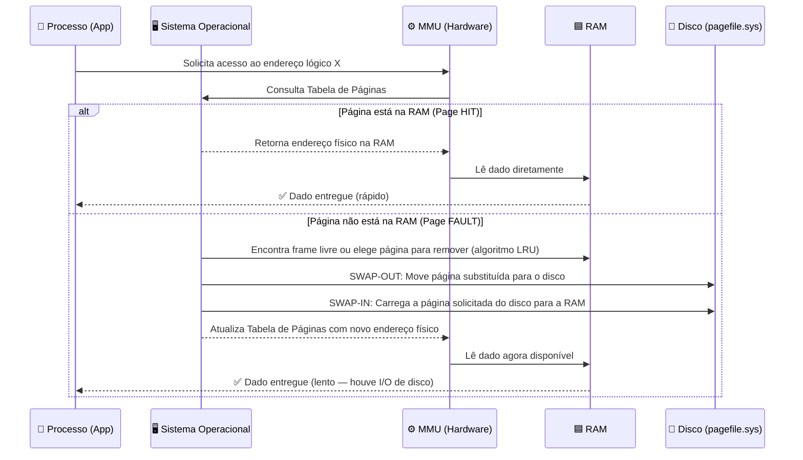

# 🟢 Aula 06: Hierarquia de Memória e Memória Virtual

**Disciplina:** Arquitetura de Computadores
**Curso:** Inteligência Artificial e Ciência de Dados — Uniube
**Semana:** 6
**Professor:** Romualdo Mathias Filho
**Tipo:** 📘 Teórica
**Tópicos:** Registradores, Cache L1/L2/L3, RAM, Memória Secundária, Memória Virtual, Paginação.

---

## 🎯 Objetivo da Aula

Ao final desta aula, os alunos serão capazes de:
- **Compreender** o conceito e a necessidade da hierarquia de memória nos sistemas computacionais.
- **Diferenciar** os níveis de memória (Registradores, Cache, RAM, HDD/SSD) quanto à velocidade, capacidade e custo.
- **Entender** o funcionamento da Memória Virtual e o processo de paginação (Swap) gerenciado pelo Sistema Operacional.
- **Analisar** o impacto da arquitetura de memória no desempenho geral do processador.

---

## 🔄 Revisão Rápida (5 min)

| **Conceito (Aula Anterior)** | **Conexão com hoje** |
| --- | --- |
| **Registradores (PC, IR)** | Vimos que eles armazenam a instrução e o dado exato do momento. Hoje veremos que eles são o "topo" da pirâmide de memória. |
| **Unidade de Controle (UC)** | A UC gerencia a busca (Fetch) na memória. Hoje entenderemos *onde* essa busca acontece primeiro: Cache antes da RAM. |
| **Gargalo de Processamento** | Processadores são extremamente rápidos; se a memória não acompanhar, a CPU fica ociosa. A hierarquia resolve esse problema. |

---

## 📌 1. A Pirâmide: Hierarquia de Memória

A **hierarquia de memória** é uma organização estruturada das tecnologias de armazenamento. O objetivo é criar a ilusão para o processador de que existe uma memória com a **velocidade dos registradores** e a **capacidade e custo do armazenamento em massa**.

![[assets/aula06_piramide_memoria.png]]
> *Legenda: Pirâmide da hierarquia de memória. No topo: memórias menores, mais rápidas e caras (Registradores, Cache). Na base: memórias maiores, mais lentas e baratas (HDD/SSD, Nuvem). Fonte: Elaborado pelo Prof. Romualdo com base em Stallings (2024, Cap. 4).*

### Regras de Ouro da Hierarquia

| **Característica** | **Do topo ao fundo da pirâmide** |
| --- | --- |
| **Velocidade** | ↓ Diminui (registradores são os mais rápidos) |
| **Capacidade** | ↑ Aumenta (do KB ao TB) |
| **Custo por byte** | ↓ Diminui (SRAM é cara, NAND Flash é barata) |
| **Distância da CPU** | ↑ Aumenta (registradores são físicamente integrados) |

> 💡 **Exemplo prático (Brasileiro):** Pense na hierarquia como a sua organização de trabalho.
> - **Registradores** → O que você está lendo neste segundo (está na sua mente).
> - **Cache L1** → O papel aberto na sua mesa agora.
> - **RAM** → O armário na sala com seus projetos ativos.
> - **SSD/HDD** → O arquivo morto no porão (cabe tudo, mas demora achar).
> - **Nuvem** → O Google Drive: acessível de qualquer lugar, mas você precisa de internet.

---

## 📌 2. Memória Cache: O Amortecedor da CPU

A **Cache** é o segredo de desempenho dos processadores modernos. Ela fica entre a CPU ultrarrápida e a RAM relativamente lenta, armazenando cópias dos dados que a CPU usa com maior frequência.

![[assets/aula06_cache_L1_L2_L3.png]]
> *Legenda: Organização interna dos níveis de cache em um processador multi-core moderno. L1 e L2 são privadas por núcleo; L3 é compartilhada. Fonte: Elaborado pelo Prof. Romualdo com base em Stallings (2024, p. 154).*

### Níveis de Cache e suas Latências Reais

| **Nível** | **Tamanho Típico** | **Latência** | **Quem compartilha** |
| --- | --- | --- | --- |
| **Registradores** | Bytes (dezenas) | ~1 ciclo de clock | Apenas o núcleo em uso |
| **Cache L1** | 32–64 KB | 1–4 ciclos | Privada por núcleo (I-Cache + D-Cache) |
| **Cache L2** | 256 KB – 1 MB | 10–20 ciclos | Privada por núcleo |
| **Cache L3** | 8 – 64 MB | 30–50 ciclos | **Compartilhada** entre todos os núcleos |
| **RAM (DRAM)** | 8 – 128 GB | ~100 ciclos | Todos os processos do sistema |
| **SSD NVMe** | 500 GB – 4 TB | ~100.000 ciclos | Todos os usuários e o SO |

> ⚠️ **Cache Miss:** Quando a CPU busca um dado e ele **não está na cache**, ocorre um "Cache Miss". O processador então busca na RAM (100x mais lento). Esse é o motivo pelo qual algoritmos que acessam memória de forma sequencial (cache-friendly) são muito mais rápidos do que os que pulam endereços aleatoriamente.

### Fluxo de Busca de Dado na Hierarquia de Cache

> *Legenda: Fluxo de decisão da CPU ao buscar um dado. A prioridade é sempre a memória mais rápida. Quando ocorre um Cache Miss encadeado, a CPU fica em estado de espera (stall), consumindo ciclos sem executar instruções úteis.*

---

## 📌 3. Memória Principal (RAM) e Secundária

### RAM — A Área de Trabalho Ativa

A **RAM (Random Access Memory)** é feita de tecnologia **DRAM (Dynamic RAM)** — mais lenta que a SRAM da Cache, mas viável em grandes quantidades. É **volátil**: desligou, perdeu tudo.

Tudo que está "aberto e em execução" no seu computador vive na RAM: o navegador com 50 abas, o Spotify, o VSCode, o jogo, o Discord. Quando a RAM esgota, o sistema operacional precisa de um plano B.

### SSD/HDD — Armazenamento Persistente

A memória secundária é **não volátil** (dados sobrevivem ao desligamento). Os SSDs NVMe revolucionaram essa camada com latências em microssegundos, mas continuam sendo **estruturalmente 1000x mais lentos** que a RAM no acesso aleatório.

---

## 📌 4. Memória Virtual: A Mágica do Sistema Operacional

### O Problema

Você abre o Chrome com 50 abas, o Photoshop, o VS Code e um jogo. A RAM de 8GB esgota. O que acontece?

### A Solução: Paginação (Paging)

A **Memória Virtual** é uma técnica gerenciada em conjunto pela **MMU (Memory Management Unit)** do processador e pelo **Sistema Operacional**. Ela "engana" os aplicativos fazendo cada processo acreditar que possui toda a memória do sistema para si, enquanto na prática os dados são distribuídos entre RAM e disco.

![[assets/aula06_memoria_virtual_paginacao.png]]
> *Legenda: Mecanismo de Paginação (Swap). Quando a RAM enche, páginas inativas são movidas para o disco (Swap-Out). Quando necessárias novamente, retornam para a RAM (Swap-In). A Tabela de Páginas traduz endereços lógicos em físicos. Fonte: Elaborado pelo Prof. Romualdo com base em Tanenbaum (2015, Cap. 3).*

### O Fluxo Completo da Paginação

> *Legenda: Sequência completa de um acesso à memória virtual. O Page Fault é o evento mais custoso — toda vez que ocorre, a CPU entra em estado de espera aguardando o disco.*

### O Perigo: Thrashing

> ⚠️ **Thrashing:** Quando a RAM está tão cheia que o SO fica o tempo todo movendo páginas entre disco e RAM (Swap-Out e Swap-In contínuos), sem conseguir executar nada de útil. Sintoma clássico: disco em 100%, máquina travada, CPU em baixo uso — ela está apenas esperando.

| **Situação** | **Causa** | **Solução** |
| --- | --- | --- |
| Máquina lenta, disco 100% | RAM esgotada → Thrashing | Adicionar RAM ou fechar processos |
| "Arquivo de paginação cheio" | pagefile.sys inadequado | Ampliar arquivo de paginação |
| Processo com "Page Fault" constante | Conjunto de trabalho maior que a RAM disponível | Otimizar uso de memória da aplicação |

---

## 📋 Resumo Estrutural

| **Conceito** | **Definição em Uma Frase** |
| --- | --- |
| **Hierarquia de Memória** | Estrutura em pirâmide que balanceia velocidade, capacidade e custo das memórias do sistema. |
| **Cache (L1/L2/L3)** | Memória intermediária (SRAM) super-rápida que guarda cópias de dados frequentes da RAM, reduzindo os Cache Misses. |
| **Cache Hit / Cache Miss** | Hit: dado encontrado na cache (rápido). Miss: dado ausente, forçando busca na RAM (lento). |
| **RAM (Memória Principal)** | Memória de trabalho volátil (DRAM) onde residem os programas em execução ativa. |
| **Memória Secundária** | Armazenamento em massa (HDD/SSD), não volátil e feito para retenção a longo prazo. |
| **Memória Virtual** | Técnica do SO (com suporte da MMU) que usa espaço do disco rígido como extensão artificial da RAM. |
| **Página / Page Frame** | Bloco de tamanho fixo (tipicamente 4KB) em que a memória virtual é dividida para gerenciamento. |
| **Page Fault** | Evento que ocorre quando a CPU acessa uma página não presente na RAM, forçando leitura do disco. |
| **Swap-Out / Swap-In** | Mover páginas da RAM para o disco (Out) ou do disco para a RAM (In) durante a paginação. |
| **Thrashing** | Degradação extrema de desempenho causada por excesso de Page Faults e Swapping contínuo. |

---

## ❓ Banco de Questões

> 🔒 Esta seção é visível apenas no Obsidian do professor. Não publicada.

### Questão 1: Prática (Múltipla Escolha — Nível: Intermediário)

**Enunciado:** Em um cenário de suporte, um usuário relata que seu computador, ao ter vários programas pesados abertos simultaneamente, não apresenta travamento total, mas sofre de extrema lentidão com a luz indicadora de uso do disco (HDD/SSD) acesa quase 100% do tempo. Qual conceito arquitetural explica esse comportamento?

- [ ] A) O processador aumentou o tamanho da Cache L3 invadindo o espaço do disco rígido.
- [ ] B) Ocorreu um erro fatal de "Kernel Panic" na área de registradores.
- [x] C) O sistema está em "Thrashing": a RAM física esgotou e o SO está realizando Swap contínuo entre RAM e disco via Memória Virtual. ✅
- [ ] D) A Unidade Lógica e Aritmética (ULA) está comprimindo os dados diretamente no SSD.

**Justificativa:** Quando a RAM está completamente cheia, o SO utiliza a Memória Virtual (Swap). Se ele precisa trocar páginas ativas o tempo todo entre a RAM e o disco lento, o gargalo de I/O do disco domina o sistema (Thrashing), causando a lentidão observada e o uso de disco em 100%. A solução seria adicionar mais RAM ao sistema.

---

### Questão 2: Teórica (Dissertativa — Nível: Básico/Intermediário)

**Enunciado:** Baseando-se no princípio de custo e velocidade, explique por que a arquitetura de computadores adota uma "hierarquia" de memórias em vez de construir toda a memória do computador utilizando a tecnologia super-rápida da Cache L1.

**Resposta esperada:** A hierarquia existe devido à relação inversamente proporcional entre velocidade e custo/densidade. Fabricar 16GB ou mais de memória utilizando a tecnologia da Cache (SRAM — Static RAM, baseada em flip-flops com múltiplos transistores por bit) seria economicamente inviável e ocuparia um espaço físico enorme no chip. A hierarquia cria a "ilusão" para a CPU de ter uma memória tão rápida quanto a Cache (pois os dados mais frequentes ficam nela) e tão espaçosa e barata quanto um HDD/SSD (onde os dados repousam). Essa combinação é o equilíbrio ótimo entre desempenho e custo. (Stallings, 2024, Cap. 4).

---

### Questão 3: Prática (Múltipla Escolha — Nível: Avançado)

**Enunciado:** Um programador percebe que seu algoritmo de ordenação A processa um array de 100 MB em 2 segundos, enquanto o algoritmo B, com a mesma complexidade Big-O, leva 8 segundos. A análise do profiler revela que o algoritmo B realiza muitos acessos a posições aleatórias do array. Qual é a causa mais provável dessa diferença de desempenho?

- [ ] A) O algoritmo B consome mais ciclos de ULA por ser matematicamente mais complexo.
- [ ] B) A frequência do clock da CPU é reduzida dinamicamente quando detecta acessos aleatórios.
- [x] C) O algoritmo A é "cache-friendly" (acesso sequencial gera baixa taxa de Cache Miss), enquanto o B gera muitos Cache Misses por acessar endereços aleatórios, forçando buscas frequentes na RAM (~100 ciclos cada). ✅
- [ ] D) O algoritmo B utiliza mais registradores, causando sobrecarga no banco de registradores da CPU.

**Justificativa:** O princípio da localidade temporal e espacial da cache explica esse fenômeno. Acessos sequenciais à memória permitem que o hardware faça *prefetching* (pré-busca) e mantenha os dados relevantes na cache L1/L2. Acessos aleatórios constantes causam Cache Misses repetidos, e cada miss força a CPU a esperar ~100 ciclos pela RAM — o que se acumula em segundos de diferença.

---

## 📄 Artigo de Aprofundamento

- [What is Virtual Memory? (Red Hat — En)](https://www.redhat.com/en/blog/what-virtual-memory)
> *Resumo prático: Artigo direto ao ponto que explica como o kernel Linux gerencia a abstração da memória virtual, garantindo isolamento entre processos e escalabilidade do sistema operacional.*

---

## 📚 Referências Bibliográficas e Citações

- **STALLINGS, William**, *Arquitetura e Organização de Computadores: projetando com foco em desempenho*. 11ª ed. Pearson, 2024. **(Capítulo 4: Memória Cache — p. 132–170; Capítulo 8: Memória Principal — p. 250–285)**.
- **TANENBAUM, Andrew S.**, *Sistemas Operacionais Modernos*. 4ª ed. Pearson, 2015. **(Capítulo 3: Gerenciamento de Memória — Páginas e Memória Virtual — p. 193–267)**.

---
*Última atualização: 2026-04-27 | Status: publicado*
