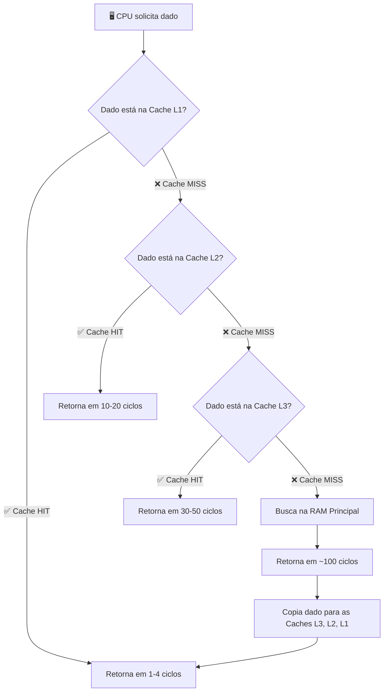
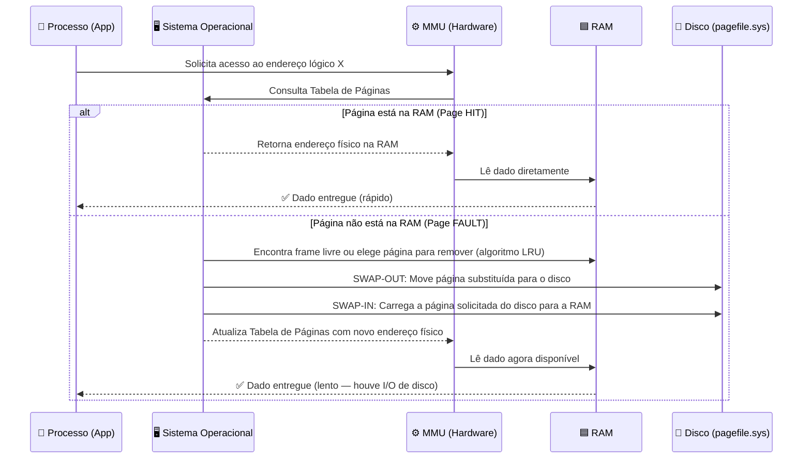

# 🟢 Aula 06: Hierarquia de Memória e Memória Virtual

**Disciplina:** Arquitetura de Computadores (Cód. ARQ-01)
**Curso:** Inteligência Artificial e Ciência de Dados, Uniube
**Semana:** 6 | 23/03/2026
**Professor:** Romualdo Mathias Filho
**Tipo:** 📘 Teórica
**Tópicos:** Registradores, Cache L1/L2/L3, RAM, Memória Secundária, Memória Virtual, Paginação.

---

> [!INFO] 🎯 Visão Geral da Aula & Recursos
> **Nesta aula, desceremos ao nível de silício para compreender como o processador e o sistema operacional cooperam para equilibrar velocidade extrema e capacidade massiva de armazenamento por meio da Hierarquia de Memória e da Memória Virtual.**
> 
> * **O que você vai dominar:**
>   - A estrutura em pirâmide e a matemática de latência que rege a busca de dados na CPU.
>   - O funcionamento dos níveis de cache L1/L2/L3 e o impacto de algoritmos cache-friendly.
>   - O mecanismo de paginação, MMU e a prevenção da degradação crítica por thrashing.
> * **Pré-requisitos:** Noções sobre o Ciclo de Instrução (Busca-Decodificação-Execução).
> * **📂 Recursos Adicionais para Download:**
>   - [[../../40_Recursos/cheatsheet_hierarquia_memoria.pdf|Cheatsheet de Referência Rápida (PDF)]] *(futuro)*

---

## 🎯 Objetivo da Aula

Ao final desta aula, os alunos serão capazes de:
- **Compreender** o conceito e a necessidade da hierarquia de memória nos sistemas computacionais.
- **Diferenciar** os níveis de memória (Registradores, Cache, RAM, HDD/SSD) quanto à velocidade, capacidade e custo.
- **Entender** o funcionamento da Memória Virtual e o processo de paginação (Swap) gerenciado pelo Sistema Operacional.
- **Analisar** o impacto da arquitetura de memória no desempenho geral do processador.

---

## 🔄 Revisão Rápida (5 min)

| **Conceito (Aula Anterior)** | **Conexão com hoje** |
| --- | --- |
| **Registradores (PC, IR)** | Vimos que eles armazenam a instrução e o dado exato do momento. Hoje veremos que eles são o "topo" da pirâmide de memória. |
| **Unidade de Controle (UC)** | A UC gerencia a busca (Fetch) na memória. Hoje entenderemos *onde* essa busca acontece primeiro: Cache antes da RAM. |
| **Gargalo de Processamento** | Processadores são extremamente rápidos; se a memória não acompanhar, a CPU fica ociosa. A hierarquia resolve esse problema. |

---

## 📌 1. A Pirâmide: Hierarquia de Memória [Teoria ⏳ 15 min]

A **hierarquia de memória** é uma organização estruturada das tecnologias de armazenamento. O objetivo é criar a ilusão para o processador de que existe uma memória com a **velocidade dos registradores** e a **capacidade e custo do armazenamento em massa**.

![[assets/aula06_piramide_memoria.png]]
> *Legenda: Pirâmide da hierarquia de memória. No topo: memórias menores, mais rápidas e caras (Registradores, Cache). Na base: memórias maiores, mais lentas e baratas (HDD/SSD, Nuvem). Fonte: Elaborado pelo Prof. Romualdo com base em Stallings (2024, Cap. 4).*

### Regras de Ouro da Hierarquia

| **Característica** | **Do topo ao fundo da pirâmide** |
| --- | --- |
| **Velocidade** | ↓ Diminui (registradores são os mais rápidos) |
| **Capacidade** | ↑ Aumenta (do KB ao TB) |
| **Custo por byte** | ↓ Diminui (SRAM é cara, NAND Flash é barata) |
| **Distância da CPU** | ↑ Aumenta (registradores são físicamente integrados) |

> [!TIP] 💡 Dica de Produção (Pro-Tip)
> **Analogia de Produtividade**: Pense na hierarquia de memória como a organização física do seu escritório de engenharia:
> - **Registradores** → O que você está lendo ou segurando nas mãos neste exato segundo (está na sua mente).
> - **Cache L1/L2/L3** → Os documentos e anotações abertos na sua mesa de trabalho (acesso imediato, sem sair da cadeira).
> - **RAM (Memória Principal)** → O armário organizador no canto da sua sala (bastante espaço, mas exige levantar e caminhar).
> - **SSD/HDD (Secundária)** → O arquivo morto localizado no porão do prédio (cabe tudo, mas o acesso demora minutos ou horas).
> - **Nuvem** → O galpão terceirizado de outra empresa em outra cidade: capacidade virtualmente infinita, mas exige transporte rodoviário (latência de rede).

---

## 📌 2. Memória Cache: O Amortecedor da CPU [Teoria ⏳ 20 min]

A **Cache** é o segredo de desempenho dos processadores modernos. Ela fica entre a CPU ultrarrápida e a RAM relativamente lenta, armazenando cópias dos dados que a CPU usa com maior frequência.

![[assets/aula06_cache_L1_L2_L3.png]]
> *Legenda: Organização interna dos níveis de cache em um processador multi-core moderno. L1 e L2 são privadas por núcleo; L3 é compartilhada. Fonte: Elaborado pelo Prof. Romualdo com base em Stallings (2024, p. 154).*

### Níveis de Cache e suas Latências Reais

| **Nível** | **Tamanho Típico** | **Latência** | **Quem compartilha** |
| --- | --- | --- | --- |
| **Registradores** | Bytes (dezenas) | ~1 ciclo de clock | Apenas o núcleo em uso |
| **Cache L1** | 32–64 KB | 1–4 ciclos | Privada por núcleo (I-Cache + D-Cache) |
| **Cache L2** | 256 KB – 1 MB | 10–20 ciclos | Privada por núcleo |
| **Cache L3** | 8 – 64 MB | 30–50 ciclos | **Compartilhada** entre todos os núcleos |
| **RAM (DRAM)** | 8 – 128 GB | ~100 ciclos | Todos os processos do sistema |
| **SSD NVMe** | 500 GB – 4 TB | ~100.000 ciclos | Todos os usuários e o SO |

> [!WARNING] ⚠️ Gotcha de Infraestrutura
> **Penalidade de Cache Miss**: Quando a CPU busca um dado e ele não está na cache L1/L2/L3, ocorre um **Cache Miss**. O processador é obrigado a suspender a execução das instruções (stall) e ir buscar o dado na RAM física, o que é estruturalmente **100x mais lento** (cerca de 100 a 200 ciclos de CPU desperdiçados em espera). 
> 
> **Boas Práticas de Código:** Desenvolvedores experientes otimizam seus loops de dados para garantir **localidade espacial e temporal** (arrays contíguos na memória em vez de estruturas de dados dinâmicas dispersas como listas encadeadas), maximizando os **Cache Hits**.

### 🧠 Checkpoint: Teste seu Conhecimento!

<b>🔍 Exercício Rápido: Por que os caches multi-core são divididos em L1, L2 e L3 em vez de termos um único cache L1 gigantesco de 32MB?</b>

<blockquote>

**Resposta Correta:** Devido às limitações físicas da velocidade de propagação elétrica e decodificação de endereços no silício. Caches maiores exigem circuitos mais complexos e distâncias físicas maiores dentro do die, o que aumenta a latência de acesso. Ao criar níveis menores e super-rápidos integrados ao núcleo (L1/L2) e um nível compartilhado maior (L3), a arquitetura atinge o balanço perfeito de velocidade ultrarrápida para instruções imediatas e capacidade compartilhada para comunicação inter-núcleos.

</blockquote>

### Fluxo de Busca de Dado na Hierarquia de Cache

```mermaid
flowchart TD
    A[🖥️ CPU solicita dado] --> B{Dado está na Cache L1?}
    B -- ✅ Cache HIT --> C[Retorna em 1-4 ciclos]
    B -- ❌ Cache MISS --> D{Dado está na Cache L2?}
    D -- ✅ Cache HIT --> E[Retorna em 10-20 ciclos]
    D -- ❌ Cache MISS --> F{Dado está na Cache L3?}
    F -- ✅ Cache HIT --> G[Retorna em 30-50 ciclos]
    F -- ❌ Cache MISS --> H[Busca na RAM Principal]
    H --> I[Retorna em ~100 ciclos]
    I --> J[Copia dado para as Caches L3, L2, L1]
    J --> C
```
> *Legenda: Fluxo de decisão da CPU ao buscar um dado. A prioridade é sempre a memória mais rápida. Quando ocorre um Cache Miss encadeado, a CPU fica em estado de espera (stall), consumindo ciclos sem executar instruções úteis.*

---

## 📌 3. Memória Principal (RAM) e Secundária [Teoria ⏳ 10 min]

> [!NOTE] 💼 Pergunta de Entrevista
> **DRAM vs. SRAM (Processo Seletivo SRE/Hardware)**: Em uma entrevista para Engenharia de Performance, o recrutador pergunta: *"Por que a memória RAM do nosso servidor de produção usa tecnologia DRAM (Dynamic RAM) enquanto as caches da CPU usam SRAM (Static RAM)?"*
> 
> **Resposta Esperada:** A SRAM (Static RAM) usa circuitos estáveis de flip-flops (tipicamente 6 transistores por bit), o que a torna extremamente rápida e isenta de refresh elétrico, porém possui baixa densidade física e altíssimo custo de fabricação. Já a DRAM (Dynamic RAM) utiliza apenas 1 transistor e 1 capacitor por bit, permitindo altíssima densidade física e custo reduzido (viabilizando gigabytes de RAM), contudo ela exige ciclos de **Refresh** elétrico contínuos porque os capacitores perdem carga naturalmente, tornando-a substancialmente mais lenta que a SRAM.

### RAM — A Área de Trabalho Ativa

A **RAM (Random Access Memory)** é feita de tecnologia **DRAM (Dynamic RAM)** — mais lenta que a SRAM da Cache, mas viável em grandes quantidades. É **volátil**: desligou, perdeu tudo.

Tudo que está "aberto e em execução" no seu computador vive na RAM: o navegador com 50 abas, o Spotify, o VSCode, o jogo, o Discord. Quando a RAM esgota, o sistema operacional precisa de um plano B.

### SSD/HDD — Armazenamento Persistente

A memória secundária é **não volátil** (dados sobrevivem ao desligamento). Os SSDs NVMe revolucionaram essa camada com latências em microssegundos, mas continuam sendo **estruturalmente 1000x mais lentos** que a RAM no acesso aleatório.

---

## 📌 4. Memória Virtual: A Mágica do Sistema Operacional [Teoria & Prática ⏳ 15 min]

### O Problema

Você abre o Chrome com 50 abas, o Photoshop, o VS Code e um jogo. A RAM de 8GB esgota. O que acontece?

### A Solução: Paginação (Paging)

A **Memória Virtual** é uma técnica gerenciada em conjunto pela **MMU (Memory Management Unit)** do processador e pelo **Sistema Operacional**. Ela "engana" os aplicativos fazendo cada processo acreditar que possui toda a memória do sistema para si, enquanto na prática os dados são distribuídos entre RAM e disco.

![[assets/aula06_memoria_virtual_paginacao.png]]
> *Legenda: Mecanismo de Paginação (Swap). Quando a RAM enche, páginas inativas são movidas para o disco (Swap-Out). Quando necessárias novamente, retornam para a RAM (Swap-In). A Tabela de Páginas traduz endereços lógicos em físicos. Fonte: Elaborado pelo Prof. Romualdo com base em Tanenbaum (2015, Cap. 3).*

### O Fluxo Completo da Paginação

```mermaid
sequenceDiagram
    participant Processo as 🧩 Processo (App)
    participant SO as 🖥️ Sistema Operacional
    participant MMU as ⚙️ MMU (Hardware)
    participant RAM as 🟦 RAM
    participant Disco as 💾 Disco (pagefile.sys)

    Processo->>MMU: Solicita acesso ao endereço lógico X
    MMU->>SO: Consulta Tabela de Páginas
    alt Página está na RAM (Page HIT)
        SO-->>MMU: Retorna endereço físico na RAM
        MMU->>RAM: Lê dado diretamente
        RAM-->>Processo: ✅ Dado entregue (rápido)
    else Página não está na RAM (Page FAULT)
        SO->>RAM: Encontra frame livre ou elege página para remover (algoritmo LRU)
        SO->>Disco: SWAP-OUT: Move página substituída para o disco
        SO->>Disco: SWAP-IN: Carrega a página solicitada do disco para a RAM
        SO-->>MMU: Atualiza Tabela de Páginas com novo endereço físico
        MMU->>RAM: Lê dado agora disponível
        RAM-->>Processo: ✅ Dado entregue (lento — houve I/O de disco)
    end
```
> *Legenda: Sequência completa de um acesso à memória virtual. O Page Fault é o evento mais custoso — toda vez que ocorre, a CPU entra em estado de espera aguardando o disco.*

### O Perigo: Thrashing

> [!WARNING] ⚠️ Gotcha de Infraestrutura
> **Degradação por Thrashing**: O Thrashing ocorre quando a RAM física está tão escassa que o Sistema Operacional passa virtualmente 100% do seu tempo movendo páginas de dados de um lado para o outro (Swap-Out e Swap-In) entre o disco e a RAM. O uso de CPU despenca (ela fica em stall perpétuo aguardando I/O de disco) e o disco trava em 100% de uso. 
> 
> **Atenção:** Em ambientes de nuvem/SRE (como Kubernetes ou AWS Auto Scaling), o Thrashing pode causar falhas em cascata de Liveness Probes, derrubando o microserviço e forçando reinicializações desnecessárias. A solução imediata é aumentar a memória RAM física (Scale-Up) ou aplicar limites rígidos de memória por container (cgroups).

| **Situação** | **Causa** | **Solução** |
| --- | --- | --- |
| Máquina lenta, disco 100% | RAM esgotada → Thrashing | Adicionar RAM ou fechar processos |
| "Arquivo de paginação cheio" | pagefile.sys inadequado | Ampliar arquivo de paginação |
| Processo com "Page Fault" constante | Conjunto de trabalho maior que a RAM disponível | Otimizar uso de memória da aplicação |

---

## 📋 Resumo Estrutural

| **Conceito** | **Definição em Uma Frase** |
| --- | --- |
| **Hierarquia de Memória** | Estrutura em pirâmide que balanceia velocidade, capacidade e custo das memórias do sistema. |
| **Cache (L1/L2/L3)** | Memória intermediária (SRAM) super-rápida que guarda cópias de dados frequentes da RAM, reduzindo os Cache Misses. |
| **Cache Hit / Cache Miss** | Hit: dado encontrado na cache (rápido). Miss: dado ausente, forçando busca na RAM (lento). |
| **RAM (Memória Principal)** | Memória de trabalho volátil (DRAM) onde residem os programas em execução ativa. |
| **Memória Secundária** | Armazenamento em massa (HDD/SSD), não volátil e feito para retenção a longo prazo. |
| **Memória Virtual** | Técnica do SO (com suporte da MMU) que usa espaço do disco rígido como extensão artificial da RAM. |
| **Página / Page Frame** | Bloco de tamanho fixo (tipicamente 4KB) em que a memória virtual é dividida para gerenciamento. |
| **Page Fault** | Evento que ocorre quando a CPU acessa uma página não presente na RAM, forçando leitura do disco. |
| **Swap-Out / Swap-In** | Mover páginas da RAM para o disco (Out) ou do disco para a RAM (In) durante a paginação. |
| **Thrashing** | Degradação extrema de desempenho causada por excesso de Page Faults e Swapping contínuo. |

---
## 📄 Artigo de Aprofundamento

- [What is Virtual Memory? (Red Hat — En)](https://www.redhat.com/en/blog/what-virtual-memory)
> *Resumo prático: Artigo direto ao ponto que explica como o kernel Linux gerencia a abstração da memória virtual, garantindo isolamento entre processos e escalabilidade do sistema operacional.*

---

## 📚 Referências Bibliográficas

- **STALLINGS, William**, *Arquitetura e Organização de Computadores: projetando com foco em desempenho*. 11ª ed. Pearson, 2024. **(Capítulo 4: Memória Cache — p. 132–170; Capítulo 8: Memória Principal — p. 250–285)**.
- **TANENBAUM, Andrew S.**, *Sistemas Operacionais Modernos*. 4ª ed. Pearson, 2015. **(Capítulo 3: Gerenciamento de Memória — Páginas e Memória Virtual — p. 193–267)**.

---
*Última atualização: 2026-05-20 | Status: publicado*
