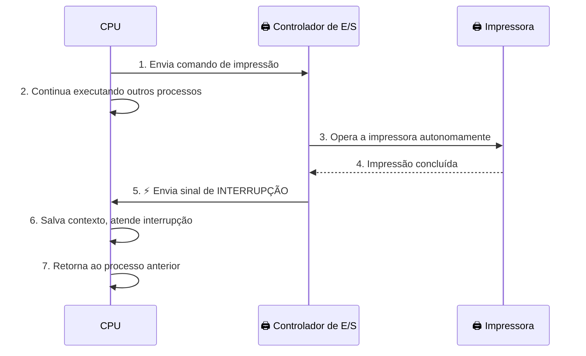
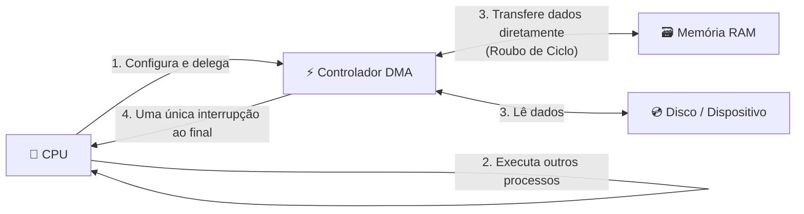

# 🟢 Aula 09: Mecanismos de Entrada e Saída (E/S)

**Disciplina:** Arquitetura de Computadores (Cód. 14188)
**Curso:** Inteligência Artificial e Ciência de Dados — Uniube
**Semana:** 9
**Professor:** Romualdo Mathias Filho
**Tipo:** 📘 Teórica
**Tópicos:** Módulos de E/S, E/S Programada (Polling), Interrupções, DMA, Barramentos, Controladores.

---

> 💬 *"Um computador sem mecanismos de E/S é como um cérebro sem sentidos — por mais poderoso que seja internamente, não consegue interagir com o mundo."*

---

## 🎯 Objetivo da Aula

Ao final desta aula, os alunos serão capazes de:
- **Compreender** o papel dos mecanismos de Entrada/Saída (E/S) na comunicação entre o processador e o mundo externo.
- **Distinguir** os três métodos de transferência de dados: E/S Programada (Polling), E/S por Interrupções e DMA (Acesso Direto à Memória).
- **Identificar** a função dos barramentos (dados, endereços e controle) e dos controladores de E/S na arquitetura de um computador.
- **Analisar** as vantagens e limitações de cada método de transferência em cenários práticos do cotidiano.

---

## 🔄 Revisão Rápida (5 min)

| **Conceito (Aula Anterior — Aula 08)** | **Conexão com hoje** |
| --- | --- |
| **Processamento Paralelo** | Múltiplos núcleos processam dados *internamente* ao mesmo tempo. Hoje, veremos como esses dados chegam e saem do computador — o gargalo externo. |
| **Lei de Amdahl** | O paralelismo tem limites; da mesma forma, um processador ultrarrápido é limitado pela velocidade com que seus dispositivos de E/S conseguem alimentá-lo de dados. |
| **Sincronização entre Núcleos** | Assim como núcleos precisam se coordenar para não corromper dados na RAM, a CPU e os dispositivos de E/S precisam de mecanismos de sincronização (interrupções, DMA) para não perder dados na transferência. |

---

## 📌 1. O Problema da Comunicação: CPU vs. Dispositivos

Existe uma diferença brutal de velocidade entre o processador e os dispositivos periféricos:

| **Dispositivo** | **Velocidade Típica** |
| --- | --- |
| CPU (Clock interno) | 3 a 5 GHz |
| Memória RAM (DDR5) | ~50 GB/s |
| SSD NVMe | ~7 GB/s |
| HD Mecânico | ~150 MB/s |
| Teclado (digitação) | < 0,001 MB/s |

> 💡 **Analogia:** Imagine que a CPU é um cozinheiro profissional que prepara um prato em 2 segundos. Se ele tiver que esperar 10 minutos pelo entregador de ingredientes (o dispositivo de E/S) para preparar o *próximo* prato, a maioria do seu tempo é desperdiçada. Os mecanismos de E/S existem para que o cozinheiro não fique parado esperando.

Por isso, surgiram três estratégias progressivamente mais eficientes para gerenciar essa comunicação.

![[assets/aula09_comparacao_es.png]]
> *Legenda: Comparação visual dos três métodos de E/S — Polling, Interrupção e DMA. Fonte: Gerado por IA para fins didáticos.*

---

## 📌 2. Método 1 — E/S Programada (Polling)

Na **E/S Programada** (também chamada de *polling* ou *busy-wait*), o processador assume o controle total da transferência. Após enviar um comando ao dispositivo, ele entra em um loop de verificação, perguntando repetidamente: *"Você já terminou?"*

> *"No I/O programado, o processador emite um comando de I/O ao módulo de I/O e então deve esperar que a operação seja concluída antes de prosseguir."* (STALLINGS, 2024, Capítulo 7, p. 245).

**Como funciona:**
1. A CPU envia um comando de leitura/escrita ao controlador do dispositivo.
2. A CPU verifica em *loop* o registrador de status do dispositivo (*polling*).
3. Enquanto o dispositivo não termina, a CPU fica presa neste loop — **bloqueada**.
4. Quando o dispositivo conclui, a CPU lê o resultado e continua o processamento normal.

**Exemplo real:** Imagine o aplicativo de impressão no Windows esperando a impressora de jato de tinta confirmar que terminou de imprimir a página 1 antes de enviar a página 2. Se fosse por polling, o seu computador ficaria completamente travado durante a impressão.

| **Vantagem** | **Desvantagem** |
| --- | --- |
| Simples de implementar no hardware e software | CPU desperdiça 100% do seu tempo no loop de espera |
| Previsível (sem eventos assíncronos) | Ineficiente: inviável para múltiplos dispositivos simultâneos |

---

## 📌 3. Método 2 — E/S por Interrupções

A **E/S por Interrupções** resolve o desperdício da CPU: em vez de o processador *perguntar* repetidamente ao dispositivo se terminou, o próprio **dispositivo avisa a CPU** quando estiver pronto, enviando um sinal elétrico chamado **interrupção (interrupt)**.

> *"Com I/O controlado por interrupção, o processador envia um comando de I/O ao módulo e então executa outro programa. Quando o módulo de I/O termina a operação, ele interrompe o processador, que salva o contexto do processo atual e trata a interrupção."* (STALLINGS, 2024, Capítulo 7, p. 249).

**Como funciona:**
1. A CPU envia o comando ao controlador e **continua executando outros processos**.
2. O controlador opera o dispositivo de forma autônoma.
3. Quando termina, o controlador envia um sinal de interrupção à CPU.
4. A CPU **pausa o que está fazendo** (salva o estado — *context switch*), atende a interrupção e retorna ao processo anterior.

**Exemplo real:** Quando você pressiona uma tecla no teclado, o controlador do teclado envia uma interrupção à CPU. A CPU não estava esperando por isso — ela estava rodando o Chrome, o Spotify e o antivírus ao mesmo tempo. Ao receber a interrupção, ela registra o caractere e volta ao que estava fazendo. Isso acontece centenas de vezes por segundo sem que você perceba.

| **Vantagem** | **Desvantagem** |
| --- | --- |
| CPU livre para outras tarefas enquanto espera | Cada transferência ainda exige intervenção da CPU |
| Eficiente para dispositivos lentos (teclado, mouse) | Ineficiente para grandes volumes de dados (ex: copiar um arquivo de 10 GB) |

---

## 📌 4. Método 3 — Acesso Direto à Memória (DMA)

O **DMA (Direct Memory Access)** é a solução definitiva para grandes transferências. Ele introduz um chip dedicado — o **Controlador DMA** — que transfere blocos de dados diretamente entre o dispositivo e a memória RAM, **sem envolver a CPU** a cada byte transferido.

> *"O DMA permite que o módulo de I/O transfira dados diretamente de/para a memória, sem a intervenção contínua do processador. O processador é liberado para executar outras instruções durante a transferência."* (STALLINGS, 2024, Capítulo 7, p. 255).

**Como funciona:**
1. A CPU configura o Controlador DMA: *"Transfira X bytes do endereço Y do disco para o endereço Z da RAM."*
2. A CPU **vai embora** — o DMA assume o controle do barramento.
3. O Controlador DMA realiza a transferência em blocos, usando a técnica de **roubo de ciclo** (*cycle stealing*): ele usa o barramento nos momentos em que a CPU não está acessando a memória.
4. Ao terminar, o DMA envia **apenas uma interrupção** à CPU.

**Exemplo real:** Quando você copia um filme de 4 GB de um HD externo para o SSD interno do seu PC. Se fosse por interrupções, a CPU receberia *bilhões* de interrupções para transferir cada byte. Com o DMA, a CPU recebe **apenas uma interrupção** ao final de toda a cópia, enquanto esteve livre para você continuar usando o computador normalmente.

| **Vantagem** | **Desvantagem** |
| --- | --- |
| CPU quase completamente liberada durante grandes transferências | Requer hardware adicional (chip controlador DMA) |
| Altamente eficiente para mídias de armazenamento e redes | Pode causar contenção de barramento com a CPU (*cycle stealing*) |

---

## 📌 5. Barramentos e Controladores de E/S

Para que qualquer um dos métodos acima funcione, existe uma infraestrutura de comunicação física: os **barramentos** e os **controladores**.

### 5.1 — Os Três Barramentos

> *"O barramento é um caminho de comunicação conectando dois ou mais dispositivos. Uma característica chave de um barramento é que ele é um meio compartilhado."* (STALLINGS, 2024, p. 68).

| **Barramento** | **Função** | **Analogia** |
| --- | --- | --- |
| **Barramento de Dados** | Transporta os dados reais entre CPU, memória e E/S | O **conteúdo** da carta (os bytes) |
| **Barramento de Endereços** | Indica o endereço de memória de origem ou destino | O **CEP** de destino da carta |
| **Barramento de Controle** | Sinaliza o tipo de operação: leitura ou escrita | O **tipo de serviço** dos Correios (expresso, sedex) |

### 5.2 — O Controlador de E/S

O **Controlador de E/S** (ou Módulo de E/S) é um chip intermediário que traduz os comandos genéricos da CPU (em linguagem de barramento) para os comandos específicos de cada dispositivo.

> 💡 **Analogia:** O Controlador de E/S é como um **intérprete multilíngue** em uma negociação internacional. A CPU fala apenas "protocolo de barramento interno". A impressora fala "USB". O controlador sabe os dois idiomas e traduz em tempo real.

**Por que ele é necessário?**
- Dispositivos operam em velocidades e formatos diferentes.
- A CPU não pode conhecer o protocolo específico de cada periférico do mundo.
- O controlador **abstrai** a complexidade do dispositivo, expondo uma interface padronizada à CPU.

---

## 📋 Resumo Estrutural

| **Conceito** | **Definição em Uma Frase** |
| --- | --- |
| **E/S Programada (Polling)** | A CPU verifica repetidamente o status do dispositivo, desperdiçando ciclos de processamento na espera. |
| **E/S por Interrupções** | O dispositivo avisa a CPU quando termina, liberando-a para outras tarefas durante a espera. |
| **DMA (Direct Memory Access)** | Um controlador dedicado transfere grandes blocos de dados diretamente para a RAM, sem intervenção contínua da CPU. |
| **Roubo de Ciclo (Cycle Stealing)** | Técnica do DMA de usar o barramento somente nos momentos em que a CPU não o está utilizando. |
| **Barramento de Dados** | Via física que transporta os bytes entre CPU, memória e dispositivos. |
| **Barramento de Endereços** | Via física que indica o endereço de origem ou destino de cada transferência. |
| **Controlador de E/S** | Chip intermediário que traduz os comandos genéricos da CPU em operações específicas do dispositivo periférico. |

---

%%
## ❓ Banco de Questões

> 🔒 *Seção exclusiva do professor — não publicada para os alunos.*

### Questão 1 (Múltipla Escolha — Nível: Básico)

**Enunciado:** Você está usando o computador normalmente — o Spotify tocando, o Chrome aberto e um documento no Word — quando pressiona uma tecla no teclado. O computador registra a tecla imediatamente sem travar nenhum dos outros programas. Qual mecanismo de E/S torna isso possível?

- [ ] A) E/S Programada (Polling), pois a CPU estava constantemente verificando o estado do teclado.
- [ ] B) DMA (Acesso Direto à Memória), pois o controlador DMA transferiu o caractere diretamente para a RAM.
- [x] C) E/S por Interrupção, pois o controlador do teclado enviou um sinal de interrupção à CPU ao detectar o pressionamento da tecla. ✅
- [ ] D) Barramento de Controle, pois ele sinalizou à CPU que uma operação de escrita ocorreu.

**Justificativa:** Dispositivos lentos e assíncronos como teclado e mouse usam interrupções. O controlador do teclado gera uma interrupção ao pressionar uma tecla, a CPU salva o contexto atual, registra o caractere e retorna imediatamente ao que estava fazendo. Polling travaria o sistema; DMA é ineficiente para transferências de 1 byte.

---

### Questão 2 (Múltipla Escolha — Nível: Intermediário)

**Enunciado:** Um técnico precisa mover um arquivo de backup de 50 GB de um HD externo para um servidor NAS na rede. Durante a transferência, ele quer continuar usando o computador normalmente. Qual método de E/S é o mais adequado e por quê?

- [ ] A) E/S Programada, pois é o método mais simples e confiável para grandes volumes.
- [ ] B) E/S por Interrupções, pois o HD externo avisará a CPU a cada bloco de dados transferido.
- [x] C) DMA, pois delega a transferência ao controlador DMA, liberando a CPU quase completamente durante os 50 GB de transferência. ✅
- [ ] D) Barramento de Endereços, pois ele identifica onde os dados devem ser gravados no servidor.

**Justificativa:** O DMA é projetado exatamente para grandes transferências de bloco. A CPU configura o controlador DMA uma única vez e recebe apenas uma interrupção ao final. Com Polling, a CPU ficaria bloqueada; com Interrupções, receberia bilhões de interrupções (uma para cada setor do HD).

---

### Questão 3 (Dissertativa — Nível: Avançado)

**Enunciado:** Compare os três métodos de E/S (E/S Programada, Interrupções e DMA) em termos de: (a) ocupação da CPU durante a transferência, (b) complexidade de hardware necessária e (c) cenário de uso ideal. Utilize exemplos de dispositivos reais.

**Resposta esperada:**
- **(a) Ocupação da CPU:** E/S Programada ocupa 100% da CPU (loop de polling). E/S por Interrupções libera a CPU durante a espera, mas a interrompe para cada transferência. DMA ocupa a CPU apenas na configuração inicial e na interrupção final — quase zero de occupação para grandes blocos.
- **(b) Complexidade de hardware:** E/S Programada é a mais simples (apenas o controlador do dispositivo). Interrupções requerem um Controlador de Interrupções (PIC/APIC). DMA requer um chip controlador DMA dedicado, tornando o hardware mais caro e complexo.
- **(c) Cenário ideal:** E/S Programada é usada em microcontroladores simples (Arduino) onde não há SO e a CPU deve controlar tudo. Interrupções são ideais para dispositivos lentos e assíncronos (teclado, mouse, sensor IoT). DMA é obrigatório para mídias de armazenamento (SSD, HD), placas de rede e placas de vídeo onde a taxa de transferência é alta.

---
%%

## 📄 Artigo de Aprofundamento

- [Input/Output Organization — GeeksforGeeks](https://www.geeksforgeeks.org/input-output-organization-in-computer-architecture/)
> *Resumo prático: Artigo técnico com diagramas claros explicando os três métodos de E/S (Polling, Interrupt-driven e DMA), incluindo o fluxo do cycle stealing. Excelente complemento visual para as analogias vistas em aula.*

---

## 📚 Referências Bibliográficas e Citações

- **STALLINGS, William.** *Arquitetura e Organização de Computadores: projetando com foco em desempenho*. 11ª ed. Pearson, 2024. **(Capítulo 7: Entrada/Saída — pp. 240–290)**. Abrange E/S Programada, E/S por Interrupção, DMA e Barramentos.
- **TANENBAUM, Andrew S.** *Organização Estruturada de Computadores*. 6ª ed. Pearson, 2013. **(Capítulo 3: Nível de Lógica Digital — pp. 180–220)**. Apresenta a arquitetura dos barramentos e controladores de dispositivos.
- **PATTERSON, David A.; HENNESSY, John L.** *Organização e Projeto de Computadores: A Interface Hardware/Software*. 5ª ed. Elsevier, 2014. **(Apêndice D: Armazenamento, Redes e Outros Tópicos de E/S — pp. D1–D50)**. Análise quantitativa do impacto de E/S no desempenho de sistemas.

---
*Última atualização: 2026-05-18 | Status: publicado*
