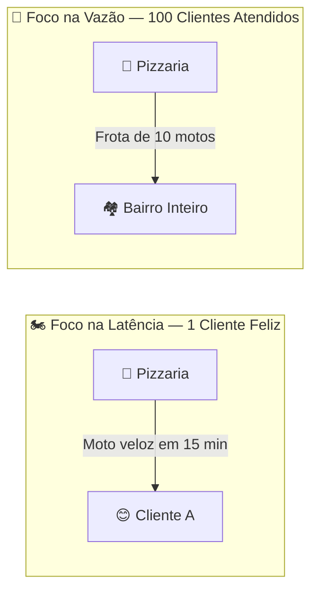
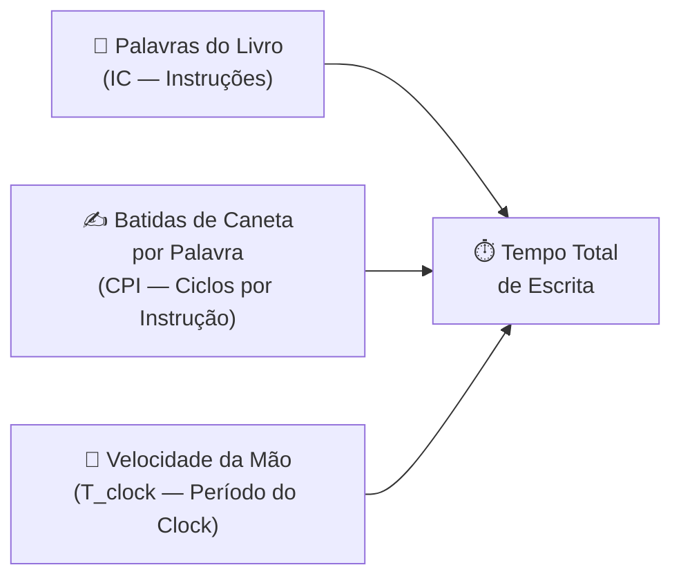
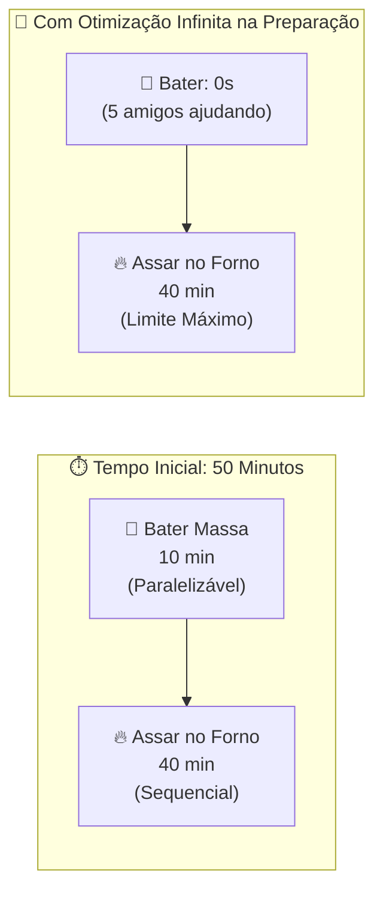

# 🟢 Aula 10: Medidas de Desempenho: Latência, Vazão e Lei de Amdahl

**Disciplina:** Arquitetura de Computadores (Cód. ARQ-01)
**Curso:** Inteligência Artificial e Ciência de Dados, Uniube
**Semana:** 10 | 20/04/2026
**Professor:** Romualdo Mathias Filho
**Tipo:** 📘 Teórica
**Tópicos:** O Dilema da Pizzaria (Latência vs. Vazão), A Receita de Escrever um Livro (Equação da CPU), e O Bolo no Forno (A Lei de Amdahl).

---

> [!INFO] 🎯 Visão Geral da Aula & Recursos
> **Seja muito bem-vindo! Hoje faremos uma viagem tranquila e cheia de analogias simples para desmistificar o que torna um computador rápido de verdade. Esqueça termos técnicos áridos! Vamos usar exemplos divertidos do nosso cotidiano para entender como medimos o tempo das máquinas e por que colocar mais processadores nem sempre resolve todos os nossos problemas.**
> 
> * **O que você vai dominar:**
>   - Diferenciar velocidade individual de capacidade coletiva de processamento com analogias práticas.
>   - Compreender as três engrenagens que definem o tempo de execução de um programa no computador.
>   - Entender de forma leve a matemática por trás da Lei de Amdahl e por que existem gargalos impossíveis de acelerar.
> * **📂 Recursos Adicionais para Download:**
>   - [Amdahl's Law Calculator (Simulador Interativo Omni)](https://www.omnicalculator.com/other/amdahls-law) — Uma ferramenta interativa fantástica para você arrastar barras e simular os limites de ganho de velocidade de forma imediata e visual.

---

## 🎯 Objetivo da Aula

Ao final desta aula, você será capaz de:
- **Explicar** a diferença entre a velocidade de uma tarefa única e a capacidade de um sistema usando o exemplo de uma pizzaria.
- **Identificar** as três variáveis que controlam o tempo que o processador gasta para rodar um programa.
- **Discutir** por que métricas comerciais simples nem sempre dizem a verdade sobre a velocidade real de um chip.
- **Usar** a lógica da Lei de Amdahl para prever o limite de ganho de tempo ao otimizar apenas uma parte de um trabalho cotidiano.

---

## 🔄 Revisão Rápida (5 min)

Para começarmos nossa jornada com o pé direito e a mente tranquila, vamos relembrar rapidamente como o que já estudamos se conecta perfeitamente com a nossa aula de hoje:

| **Conceito Simples (Aulas Passadas)** | **Como se Conecta com Hoje?** |
| :--- | :--- |
| **[[Aula 09 - Mecanismos de Entrada e Saida\|Aula 09 (Entrada/Saída)]]** | Vimos como periféricos transferem dados (com ou sem DMA). Hoje entenderemos que o tempo de espera do processador por essas transferências (I/O) é um componente crítico da latência total do sistema. |
| **[[Aula 08 - Processamento Paralelo e Multicore\|Aula 08 (Processamento Paralelo)]]** | Aprendemos sobre múltiplos núcleos cooperativos. Hoje, com a Lei de Amdahl, calcularemos exatamente o limite de ganho de desempenho obtido ao paralelizar um programa nessas CPUs multicore. |
| **[[Aula 07 - Conjunto de Instrucoes e Ciclo da Instrucao\|Aula 07 (Ciclo da Instrução)]]** | Entendemos o ciclo básico de busca, decodificação e execução. Esse ciclo representa os passos físicos de silício; hoje veremos que a média de ciclos de clock gastos por instrução (CPI) é a chave da Equação da CPU. |

---

## 📌 1. A Equação do Desempenho: O Dilema da Pizzaria [Teoria ⏳ 15 min]

Para entender a velocidade de um computador de maneira leve, o melhor caminho é sair do laboratório de informática e visitar uma **pizzaria**. Imagine que você acabou de realizar o sonho de abrir a *Pizzaria do Romualdo*. O forno está aquecido, o queijo derretendo e os pedidos começam a chegar. 

Você logo percebe que "desempenho" e "rapidez" podem significar duas coisas completamente diferentes, dependendo de quem está perguntando!

### 1.1 — Latência (O Tempo de Entrega)
A **Latência** é o tempo que leva para um único trabalho começar e terminar. É a velocidade sob a perspectiva de **um cliente individual** que está com fome.
*   **Foco:** Rapidez de ponta a ponta.
*   **O exemplo da pizza:** O tempo de espera desde o momento em que você clica em "Confirmar Pedido" no aplicativo do *iFood* até o motoboy tocar a campainha do seu portão com a pizza quentinha. Se levou **30 minutos**, essa é a latência da sua entrega.
*   **No computador:** O tempo que leva para a tela do aplicativo do banco abrir após você digitar a sua senha ($100\ ms$).

### 1.2 — Vazão ou Throughput (A Capacidade da Cozinha)
A **Vazão** é a quantidade total de trabalho concluída em um determinado período de tempo. É a produtividade sob a perspectiva **da pizzaria inteira**.
*   **Foco:** Volume e capacidade de atendimento coletivo.
*   **O exemplo da pizza:** Quantas pizzas a cozinha da sua pizzaria consegue assar e despachar por hora durante o pico de um sábado à noite. Se a cozinha produz **120 pizzas por hora**, essa é a sua vazão.
*   **No computador:** Quantos pagamentos Pix os servidores centrais conseguem processar por segundo durante a Black Friday ($15.000\ TPS$).

> [!WARNING] ⚠️ Gotcha de Infraestrutura
> **Contratar mais motoboys não acelera a sua própria pizza:** Um erro clássico de desenvolvedores e gerentes de TI é achar que colocar "mais processadores" (escala horizontal) torna um programa sequencial individual mais rápido. Adicionar 5 processadores extras é como contratar 5 novos motoboys para a pizzaria: você conseguirá atender mais clientes no bairro ao mesmo tempo (aumenta a **vazão**), mas a sua pizza individual não sairá do forno mais rápido, pois o tempo de preparo físico da massa e o limite de velocidade da moto continuam exatamente os mesmos (a **latência** permanece idêntica).

---

## 📌 2. Métricas de Performance e a Receita de Escrever um Livro [Teoria & Prática ⏳ 20 min]

No mercado de tecnologia, as fabricantes costumam usar siglas como **MIPS** (Milhões de Instruções por Segundo) para tentar mostrar que seus processadores são os mais rápidos do planeta. Porém, medir a velocidade de uma CPU apenas por "quantidade de instruções" é uma armadilha clássica.

### 2.1 — O Dilema do MIPS: Por que números grandes enganam?
Imagine que duas pessoas, a **Ana** e o **Bruno**, receberam a tarefa de escrever a mesma redação:
*   A **Ana** escreve de forma muito detalhada, usando palavras simples, curtas e repetitivas. Ela escreve **100 palavras por minuto**.
*   O **Bruno** é muito conciso, escreve usando vocabulário rico, direto e termos densos. Ele escreve apenas **30 palavras por minuto**.

Se avaliarmos apenas a "taxa de escrita" (equivalente ao MIPS), a Ana parece ser mais de 3 vezes melhor. No entanto, se para passar a mesma ideia a Ana precisa escrever 300 palavras e o Bruno resolve a redação com apenas 90 palavras, **ambos terminarão exatamente no mesmo minuto!** 

O MIPS é enganoso porque processadores diferentes (como os chips da Intel do seu computador e os chips ARM do seu celular) precisam de quantidades diferentes de instruções para realizar a mesma tarefa real do dia a dia.

### 2.2 — As Três Engrenagens do Tempo de CPU
Para calcular de forma científica e suave o tempo de um computador, nós decompomos o tempo em uma receita simples de três ingredientes chamada de **Equação Clássica da CPU**:

$$\text{Tempo de CPU} = IC \times CPI \times T_{clock} = \frac{IC \times CPI}{\text{Frequência}}$$

Não se assuste com as siglas matemáticas! Elas são apenas uma forma elegante de registrar três segredos muito simples:
*   $IC$ = Quantidade total de **Instruções** executadas pelo programa (o tamanho do trabalho).
*   $CPI$ = **Ciclos por Instrução** (a média de batimentos do clock gastos por instrução).
*   $T_{clock}$ = Período do Clock (a duração de um único ciclo, o inverso da **Frequência** de GHz).

Para entender isso sem nenhuma complicação, pense na analogia de **escrever um livro à mão**:

Para diminuir o tempo de escrita del livro (tornar o computador mais rápido), você tem apenas três caminhos possíveis:
1.  **Reduzir as palavras (Otimizar o Código):** Usar um vocabulário que diga a mesma coisa com menos texto (trabalho do programador e do compilador).
2.  **Diminuir as batidas por palavra (Melhorar a Micro-arquitetura):** Desenhar letras mais simples que exijam menos traços físicos da caneta no papel (trabalho dos engenheiros de hardware).
3.  **Mover a mão mais rápido (Aumentar a Frequência):** Acelerar o ritmo físico da caneta (trabalho físico do silício e do clock).

> [!NOTE] 💼 Pergunta de Entrevista
> **Por que a frequência de clock sozinha não define o desempenho de um processador?**
> *   **Resposta ideal:** Porque o tempo de execução de um programa depende de uma combinação de três fatores: o número de instruções ($IC$), a média de ciclos por instrução ($CPI$) e a frequência do clock. Um processador com menor frequência pode ser mais rápido se executar menos instruções ou tiver um $CPI$ muito menor devido a otimizações de arquitetura (como pipelines eficientes ou caches maiores).

### 🧠 Checkpoint: Teste seu Conhecimento!

<b>🔍 Exercício Rápido: Se um programador conseguiu encurtar o código de um aplicativo de 100 instruções para apenas 50 instruções, mas as novas instruções são tão complexas que agora o processador gasta 4 ciclos por instrução em vez dos 2 ciclos originais, o aplicativo ficou mais rápido?</b>

<blockquote>

**Resposta Correta:** O tempo final ficou **exatamente o mesmo**!
*   **Antes:** $100\text{ instruções} \times 2\text{ ciclos} = 200\text{ ciclos de tempo}$
*   **Depois:** $50\text{ instruções} \times 4\text{ ciclos} = 200\text{ ciclos de tempo}$
*   **Conclusão didática:** Esse equilíbrio mostra por que não adianta otimizar apenas um lado da receita. O desempenho real é uma dança harmônica entre a quantidade de tarefas e o esforço exigido de cada uma delas.

</blockquote>

---

## 📌 3. Limites de Aceleração e a Analogia do Bolo no Forno [Prática Guiada ⏳ 15 min]

Muitas vezes, tentamos melhorar o nosso dia a dia ou o nosso computador otimizando apenas uma etapa do trabalho. Por exemplo, compramos um aspirador de pó super veloz para limpar a casa. Mas até onde essa melhoria local acelera o seu dia inteiro? A resposta para isso é dada por uma regra lógica muito elegante chamada **Lei de Amdahl**.

A Lei de Amdahl diz que o ganho real de velocidade em qualquer tarefa é limitado pela parte do trabalho que **não pode ser acelerada**.

### 3.1 — A Lógica do Bolo no Forno

Fazer um bolo é uma das atividades mais tranquilas e terapêuticas que existem. E, acredite ou não, a física de assar um bolo nos ensina uma lei fundamental dos supercomputadores! 

Imagine que você decidiu fazer um bolo de chocolate com seus amigos. O processo total leva **50 minutos**, divididos em duas etapas bem claras:
1.  **Preparar a massa (Bater os ingredientes):** Leva **10 minutos**. (Esta etapa pode ser dividida: se você chamar 5 amigos, todos podem ajudar a bater a massa mais rápido).
2.  **Assar o bolo no forno:** Leva **40 minutos**. (Esta etapa é puramente sequencial: o bolo precisa daquele tempo físico de calor para assar. Não adianta colocar 10 pessoas sentadas na frente do forno buzinando, o bolo continuará levando 40 minutos para assar).

Mesmo que você consiga reunir os melhores chefs do mundo para bater a massa em **zero segundos** ($S \to \infty$), o tempo total para comer o bolo nunca será menor do que **40 minutos**. 

O seu ganho de velocidade máximo absoluto para fazer o bolo está "preso" pela porção sequencial do forno. Esse é o coração da Lei de Amdahl!

### 3.2 — Roteiro de Prática Guiada: Analisando Gargalos

Vamos fazer um exercício mental simples de tomada de decisão, simulando o dia a dia de um engenheiro de performance no **iFood**:

#### O Desafio:
Você foi contratado para acelerar o tempo de carregamento da tela inicial do aplicativo do iFood no celular dos usuários. Hoje, a tela leva **10 segundos** para abrir completamente, divididos em:
*   **Etapa A (Baixar imagens do restaurante pela Internet):** Gasta **8 segundos** (80% do tempo).
*   **Etapa B (Desenhar os botões locais na tela do celular):** Gasta **2 segundos** (20% do tempo).

#### Onde investir o seu tempo e orçamento de engenharia?
1.  **Opção A (Otimizar a renderização local):** Você passa semanas escrevendo um código complexo de desenho de tela extremamente rápido, fazendo a Etapa B rodar de forma instantânea (tempo cai de $2\text{s}$ para $0\text{s}$).
    *   **Resultado A:** A tela inicial agora abre em **8 segundos** (uma melhoria global de apenas **1.25x**).
2.  **Opção B (Otimizar o tamanho das imagens):** Você implementa um sistema simples que diminui o tamanho das fotos dos pratos, fazendo a Etapa A baixar 4 vezes mais rápido (tempo cai de $8\text{s}$ para $2\text{s}$).
    *   **Resultado B:** A tela inicial agora abre em **4 segundos** (uma melhoria global espetacular de **2.5x**!).

> [!TIP] 💡 Dica de Produção (Pro-Tip)
> **FinOps e Escolhas Inteligentes de Vida:** A Lei de Amdahl é um guia valioso para a tomada de decisões e economia de custos ([[FinOps]]). Antes de gastar dinheiro comprando um computador novo caro de última geração para o seu homelab ou para a sua empresa achando que tudo ficará mais rápido, analise onde está a verdadeira espera. Se você passa a maior parte do tempo esperando a internet lenta baixar seus arquivos, ter um processador 10x mais rápido gerará quase zero de ganho no seu dia a dia. Investir o dinheiro em uma conexão de internet melhor trará um ganho global incrivelmente superior!

---

## 📋 Resumo Estrutural

| **Conceito / Métrica** | **Definição Suave em Uma Frase** |
| :--- | :--- |
| **Latência** | O tempo de espera individual que uma única tarefa leva do começo ao fim (velocidade de entrega). |
| **Vazão (Throughput)** | A quantidade total de trabalho que o sistema inteiro consegue entregar por unidade de tempo (capacidade da cozinha). |
| **Equação da CPU** | A receita que calcula o tempo do processador combinando quantidade de tarefas ($IC$), o esforço médio ($CPI$) e o ritmo de clock. |
| **CPI** | O esforço médio de ciclos de clock que a máquina gasta para resolver cada instrução del programa. |
| **Lei de Amdahl** | A regra lógica que prova que a velocidade de qualquer trabalho em equipe é limitada pela etapa sequencial mais lenta. |
| **Porção Sequencial** | A etapa teimosa que não pode ser dividida ou paralelizada (o bolo assando no forno). |

---

## 📄 Artigo de Aprofundamento

- [Amdahl's Law — GeeksforGeeks](https://www.geeksforgeeks.org/amdahls-law-in-computer-architecture/)
> *Resumo prático: Artigo visual de fácil compreensão, repleto de analogias e gráficos interativos coloridos para entender como o número de núcleos de um processador influencia a velocidade real de uso das suas aplicações cotidianas.*

---

## 📚 Referências Bibliográficas

- **PATTERSON, David A.; HENNESSY, John L.** *Organização e Projeto de Computadores: A Interface Hardware/Software*. 5. ed. Rio de Janeiro: Elsevier, 2014. **(Capítulo 1: Desempenho e Analogias Práticas — pp. 25–40)**. Excelente e famosa introdução ao desempenho de computadores através de analogias de carros e aviões.
- **STALLINGS, William.** *Arquitetura e Organização de Computadores*. 11. ed. São Paulo: Pearson, 2024. **(Capítulo 2: Evolução do Desempenho e Lei de Amdahl — pp. 30–50)**. Análise didática das métricas de performance e limitantes de velocidade.
- **TANENBAUM, Andrew S.** *Organização Estruturada de Computadores*. 6. ed. Rio de Janeiro: LTC, 2013. **(Capítulo 1: Visão Geral e Métricas de Desempenho — pp. 10–25)**. Introdução conceitual e histórica muito suave de engenharia de computadores.

---
*Última atualização: 2026-04-20 | Status: publicado*
