# 🟢 Aula 11: Arquitetura de Virtualização e Hipervisores

**Disciplina:** Arquitetura de Computadores (Cód. ARQ-01)  
**Curso:** Inteligência Artificial e Ciência de Dados, Uniube  
**Semana:** 11 | 27/04/2026  
**Professor:** Romualdo Mathias Filho  
**Tipo:** 📘 Teórica / 🔬 Prática  
**Tópicos:** Anéis de Proteção da CPU e o Teorema de Popek-Goldberg, Hipervisores Tipo 1 vs. Tipo 2 e Aceleração por Hardware (Intel VT-x/AMD-V e SLAT/EPT), e Laboratório Prático de Provisionamento com Hyper-V, Nginx e Docker.

---

> [!INFO] 🎯 Visão Geral da Aula & Recursos
> **Compreenderemos a engenharia de hardware e as modificações físicas a nível de silício que permitem a abstração de recursos e a emulação segura de múltiplos sistemas operacionais independentes em um único processador físico.**
> 
> * **O que você vai dominar:**
>   - Os anéis de execução da CPU e o conceito de instruções privilegiadas vs. sensíveis no silício.
>   - A arquitetura interna de hipervisores Tipo 1 e Tipo 2, além do funcionamento da aceleração por hardware Intel VT-x/AMD-V (Ring -1) e tabelas de páginas estendidas (SLAT/EPT).
>   - Provisionar na prática uma máquina virtual Linux, implantar serviços web (Nginx) e comparar o custo operacional com a conteinerização (Docker).
> * **Pré-requisitos:** Noções de Lógica Digital (Aula 10) e Memória Virtual (Aula 06).
> * **📂 Recursos Adicionais para Download:**
>   - [Docker CLI Cheat Sheet Oficial (PDF)](https://docs.docker.com/get-started/docker_cheatsheet.pdf) — Folha de comandos essenciais do Docker para acompanhar o laboratório prático.
>   - [VirtualBox Oficial (Hipervisor Tipo 2 para testes)](https://www.virtualbox.org) — Alternativa local recomendada caso o Windows do aluno não suporte o Hyper-V.

---

## 🎯 Objetivo da Aula

Ao final desta aula, os alunos serão capazes de:
- **Explicar** os anéis de proteção do processador e o teorema de Popek-Goldberg para a virtualização clássica de hardware.
- **Diferenciar** hipervisores do Tipo 1 (Bare-Metal) e do Tipo 2 (Hosted) com base na latência e acesso físico aos registradores.
- **Descrever** como a virtualização assistida por hardware (Intel VT-x/AMD-V) e a paginação aninhada (SLAT/EPT) eliminam o overhead de tradução binária de software.
- **Provisionar** um servidor Linux Ubuntu Server em máquina virtual, configurar o servidor Nginx e implantar a mesma estrutura em um container Docker, comparando a eficiência de recursos físicos.

---

## 🔄 Revisão Rápida (5 min)

| **Conceito (Aulas Anteriores)** | **Conexão com a Aula de Hoje** |
| :--- | :--- |
| **[[Aula 10 - Medidas de Desempenho\|Aula 10 (Medidas de Desempenho)]]** | Vimos como medir o tempo de execução e a latência de tarefas síncronas. Hoje entenderemos que a virtualização por software adiciona overhead massivo de transições (VM Exits), degradando drasticamente o desempenho se não for assistida por hardware. |
| **[[Aula 06 - Hierarquia de Memoria e Memoria Virtual\|Aula 06 (Hierarquia de Memória Virtual)]]** | A memória virtual realiza a tradução de endereços lógicos dos processos para endereços físicos na RAM. Hoje aprenderemos sobre a tabela de páginas em dois níveis (EPT/SLAT), que realiza esse mapeamento em hardware duas vezes para as VMs. |
| **[[Aula 05 - Unidades de Processamento\|Aula 05 (Unidades de Processamento)]]** | Estudamos a Unidade de Controle e os registradores da CPU. Hoje veremos como o silício e o decodificador interceptam instruções privilegiadas emitidas por uma VM para isolar os registradores físicos. |

---

## 📌 1. O Silício Compartilhado: Anéis de Proteção da CPU e o Teorema de Popek-Goldberg [Teoria ⏳ 15 min]

Historicamente, os servidores físicos em data centers operavam com baixíssimas taxas de utilização de hardware (muitas vezes abaixo de $10\%$). Cada sistema operacional exigia um hardware dedicado para evitar conflitos de dependências de bibliotecas e instabilidade de sistema. A **Virtualização** surgiu para resolver esse desperdício de energia e espaço físico, permitindo a consolidação de múltiplas máquinas virtuais (VMs) em um único servidor físico com isolamento absoluto.

No silício, a capacidade de isolar múltiplos sistemas operacionais baseia-se na arquitetura dos **Anéis de Proteção do Processador** (Protection Rings).

```
+------------------------------------------------------+
| Ring 3 - Modo Usuário (Aplicações - Chrome, Spotify)  |
|   +----------------------------------------------+   |
|   | Ring 1 & 2 - Drivers de Dispositivos         |   |
|   |   +--------------------------------------+   |   |
|   |   | Ring 0 - Modo Supervisor (Kernel OS) |   |   |
|   |   +--------------------------------------+   |   |
|   +----------------------------------------------+   |
+------------------------------------------------------+
```

*   **Ring 0 (Modo Supervisor):** Onde o Kernel do Sistema Operacional é executado. Possui privilégio físico absoluto para emitir instruções que alteram o hardware diretamente (como manipular tabelas de memória virtual ou desligar interrupções físicas).
*   **Ring 3 (Modo Usuário):** Onde rodam as aplicações dos usuários. Qualquer tentativa de executar um comando sensível de hardware dispara uma exceção imediata enviada ao Kernel.

### 1.1 — Instruções Privilegiadas vs. Sensíveis: O Teorema de Popek-Goldberg

Em 1974, Gerald J. Popek e Robert P. Goldberg estabeleceram as propriedades formais que um processador deve possuir para suportar a virtualização de forma eficiente: **O Teorema de Popek-Goldberg**. Eles dividiram as instruções da linguagem de máquina em três grupos:

1.  **Instruções Privilegiadas (Privileged):** Instruções que causam uma trap (interrupção de proteção) quando executadas fora do Ring 0.
2.  **Instruções Sensíveis de Controle (Control-Sensitive):** Instruções que tentam alterar a configuração física dos recursos do sistema (como alterar registradores de barramento ou mapeamento de RAM).
3.  **Instruções Sensíveis de Comportamento (Behavior-Sensitive):** Instruções cuja execução depende do estado atual do hardware físico (como ler o registrador que aponta para o endereço físico de uma tabela).

> [!IMPORTANT]
> **A Regra de Ouro de Popek-Goldberg:** Um processador só é virtualizável clássico por hardware se **todas as instruções sensíveis forem um subconjunto estrito das instruções privilegiadas**. 

### 1.2 — O "Buraco" da Virtualização x86 (Virtualization Hole)

Os processadores Intel/AMD baseados na arquitetura **x86 clássica** violavam essa regra. Havia exatamente **17 instruções sensíveis que NÃO eram privilegiadas** (como `SGDT` - *Store Global Descriptor Table*, ou `popf` - *Pop to Flags*). 

Quando o Kernel do OS convidado (Guest OS) na VM tentava rodar uma dessas instruções, a CPU executava a instrução silenciosamente no modo usuário (Ring 3) sem disparar a trap para o hipervisor. O sistema operacional da VM achava que tinha configurado o hardware global, mas na verdade a instrução falhava de forma silenciosa, corrompendo a máquina virtual. Esse gargalo técnico histórico exigia que hipervisores clássicos fizessem uma pesada varredura e tradução binária por software de todas as instruções da VM em tempo de execução, degradando drasticamente o desempenho do servidor.

> [!WARNING] ⚠️ Gotcha de Infraestrutura
> **O Impacto do "Buraco" no Desempenho:** Executar virtualização em processadores que não possuem aceleração nativa obriga a CPU hospedeira a emular cada instrução por software. Isso aumenta o uso de ciclos lógicos em até $80\%$ para operações de I/O intensivas, provocando aquecimento excessivo nos núcleos de silício e desperdício financeiro de energia em servidores de produção.

---

## 📌 2. A Anatomia dos Hipervisores e Aceleração por Hardware [Teoria & Prática ⏳ 20 min]

O software responsável por gerenciar as VMs, alocar recursos e garantir a emulação segura é o **Hipervisor** (ou *Virtual Machine Monitor - VMM*).

### 2.1 — Hipervisores Tipo 1 vs. Tipo 2

A eficiência no silício depende do nível de proximidade do hipervisor com o hardware bruto:

| Métrica / Aspecto | **Hipervisor Tipo 1 (Bare-Metal)** | **Hipervisor Tipo 2 (Hosted)** |
| :--- | :--- | :--- |
| **Instalação física** | Diretamente sobre o silício (sem SO abaixo) | Como aplicação instalada em um OS (ex: Windows/Mac) |
| **Desempenho (Overhead)**| Quase zero latência ($95\text{-}98\%$ de hardware nativo) | Latência média por depender do escalonador do Host |
| **Segurança e Isolamento**| Máxima (superfície de ataque ultra reduzida) | Vulnerável a brechas e falhas do OS Hospedeiro |
| **Exemplos Comerciais** | Proxmox VE (KVM), Microsoft Hyper-V, VMware ESXi | Oracle VirtualBox, VMware Workstation |

```mermaid
graph TD
    subgraph TIPO_2 [Hipervisor Tipo 2 - Hosted]
        H2[Hardware Físico] --> OS2[Sistema Operacional Host]
        OS2 --> VMM2[Hipervisor - Ex: VirtualBox]
        VMM2 --> VM2[Máquina Virtual Guest]
    end

    subgraph TIPO_1 [Hipervisor Tipo 1 - Bare-Metal]
        H1[Hardware Físico] --> VMM1["Hipervisor - Ex: Proxmox/Hyper-V (Ring -1)"]
        VMM1 --> VM1[Máquina Virtual Guest]
    end

    style TIPO_1 fill:#0d1b2a,stroke:#58a6ff,stroke-width:2px
    style TIPO_2 fill:#1b1b1b,stroke:#30363d,stroke-width:1px
```



### 2.2 — Virtualização Assistida por Hardware: O Ring -1

Para sanar o "buraco" de virtualização da arquitetura x86, em 2005 as fabricantes introduziram extensões lógicas no silício: **Intel VT-x** (código `VMX`) e **AMD-V** (código `SVM`).

Essas tecnologias adicionaram dois novos modos de operação física à CPU:
1.  **VMX Root Operation:** O modo onde o **Hipervisor** é executado. Ele opera em uma nova camada lógica, frequentemente apelidada de **Ring -1**.
2.  **VMX Non-Root Operation:** O modo restrito onde as **VMs** rodam. O Kernel do Guest OS pensa que está no Ring 0, mas qualquer instrução sensível ou privilegiada que ele execute é interceptada fisicamente pela CPU e gera uma trap direta para o Hipervisor no Ring -1.

```
       [ VMX Root Mode (Ring -1) ]  <-- Hipervisor gerencia
                 |             ^
        VM Entry |             | VM Exit (Trap por instrução sensível)
                 v             |
     [ VMX Non-Root Mode ]          <-- Máquina Virtual
        Ring 0 (OS Guest Kernel)
        Ring 3 (Guest Apps)
```

*   **VM Entry:** O hipervisor transfere o controle para a máquina virtual.
*   **VM Exit:** A CPU intercepta uma tentativa da VM de alterar o hardware, congela a VM e transfere o controle de volta ao hipervisor no Ring -1 para processar a instrução com segurança.

### 2.3 — Gerenciamento de Memória Assistido: EPT e SLAT

Na arquitetura de computadores convencional, o processador e o MMU convertem Endereços Virtuais de processos para Endereços Físicos de RAM usando uma tabela de páginas. Na virtualização, temos dois níveis de conversão:
1.  **Guest Virtual Address (GVA) ➔ Guest Physical Address (GPA):** Gerenciado pela VM.
2.  **Guest Physical Address (GPA) ➔ Host Physical Address (HPA):** Gerenciado pelo hipervisor.

No início da virtualização, o hipervisor realizava essa segunda tradução via software, criando tabelas de sombra (*shadow page tables*), o que gerava gargalos severos de memória. As CPUs modernas trazem o recurso **SLAT** (Second Level Address Translation) — chamado de **EPT** (Extended Page Tables) na Intel, e **RVI** (Rapid Virtualization Indexing) na AMD. Esse circuito físico embutido no chip realiza a tradução de dois níveis em hardware de forma ultra rápida, poupando ciclos de CPU da VM.

### 🧠 Checkpoint: Teste seu Conhecimento!

<details>
<summary><b>🔍 Exercício Rápido: Por que os hipervisores Tipo 1 (como o KVM no Proxmox) possuem latência de CPU muito inferior aos hipervisores Tipo 2 (como o VirtualBox)?</b></summary>
<blockquote>

**Resposta Correta:**
Hipervisores do Tipo 1 rodam diretamente sobre o hardware (bare-metal) e operam no modo **VMX Root (Ring -1)**. Quando a VM executa um VM Exit por instrução sensível, a trap é processada pelo silício de forma imediata e sem intermediários. No Tipo 2, a trap gerada no Ring -1 precisa ser redirecionada de volta para o sistema operacional hospedeiro (Windows/Mac) através de drivers e syscalls convencionais do Kernel do Host, acrescentando múltiplas camadas de trocas de contexto de registradores por software, o que degrada o desempenho.

</blockquote>
</details>

---

## 📌 3. Hands-On Lab: Provisionamento, Nginx e Virtualização de OS com Docker [Prática ⏳ 25 min]

Agora colocaremos em prática os conceitos de virtualização no hardware. Faremos um laboratório completo de provisionamento de uma VM, instalação do servidor de páginas **NGINX**, e em seguida implantaremos a mesma solução com **Docker** (virtualização a nível de sistema operacional) para avaliar a diferença arquitetural.

### Parte 1 — Criação da VM no Hyper-V

1.  Abra o menu Iniciar, digite **Hyper-V Manager** e execute-o.
2.  No menu da direita, clique em **New ➔ Virtual Machine**.
3.  Defina o nome da máquina virtual como `AOC_Aula11_VM` e avance.
4.  Selecione **Generation 2** (recomendada para sistemas modernos de 64 bits com firmware UEFI).
5.  Defina a RAM como **2048 MB** (2GB) e deixe marcado "Use Dynamic Memory" (que permite ao hipervisor reaver RAM ociosa fisicamente).
6.  Em Networking, selecione o switch virtual conectado à internet (geralmente **Default Switch**).
7.  Crie um novo disco rígido virtual dinâmico de **20 GB**.
8.  Em Installation Options, selecione **Install an operating system from a bootable image file** e aponte para o arquivo ISO do **Ubuntu Server 24.04 LTS** previamente baixado.
9.  Finalize a criação, conecte-se à VM e inicie-a. Siga os passos na tela configurando seu usuário e senha.

> [!WARNING] ⚠️ Gotcha de Infraestrutura: Secure Boot bloqueia o Ubuntu
> Máquinas **Generation 2** ativam o **Secure Boot** com o template **"Microsoft Windows"** por padrão. Esse template não confia no bootloader do Ubuntu e provoca a falha clássica `Boot failed. EFI SCSI Device` ao iniciar a ISO. **Antes de ligar a VM**, abra **Settings ➔ Security** e troque o template para **"Microsoft UEFI Certificate Authority"** (ou desmarque "Enable Secure Boot"). Sem esse ajuste, o Ubuntu Server simplesmente não inicializa.

---

### Parte 2 — Atualização do SO e Instalação do Nginx

Após instalar a VM e realizar o login, configure o sistema de rede e o servidor Nginx com os comandos de terminal Bash:

1.  **Atualize as listas de pacotes e pacotes de sistema:**

```bash
sudo apt update && sudo apt upgrade -y
```

2.  **Instale o servidor web Nginx (servidor de alta performance e baixo consumo de CPU):**

```bash
sudo apt install nginx -y
```

3.  **Inicie e habilite o serviço do Nginx no sistema:**

```bash
sudo systemctl start nginx
sudo systemctl enable nginx
```

4.  **Descubra o IP local da VM atribuído pelo roteador:**

```bash
ip a
```
5.  No navegador da sua máquina física (Host Windows), digite o IP da VM. Você deverá visualizar a tela de boas-vindas padrão do Nginx.

---

### Parte 3 — Criando a Página Interativa de Boas-Vindas

Navegue até o diretório padrão de publicação do Nginx e substitua a página inicial estática por um painel dinâmico e responsivo em HTML/CSS/JS para saudar os alunos de arquitetura:

1.  Acesse o diretório HTML padrão:

```bash
cd /var/www/html
```

2.  Crie um backup da página padrão e edite o arquivo principal:

```bash
sudo mv index.nginx-debian.html index.nginx-debian.html.bak
sudo nano index.html
```
3.  Cole o seguinte código unificado no editor `nano`, pressione `Ctrl+O` para salvar e `Ctrl+X` para sair:

```html
<!DOCTYPE html>
<html lang="pt-BR">
<head>
    <meta charset="UTF-8">
    <meta name="viewport" content="width=device-width, initial-scale=1.0">
    <title>Aula 11: Arquitetura de Virtualização</title>
    <style>
        body {
            font-family: 'Segoe UI', Tahoma, Geneva, Verdana, sans-serif;
            background-color: #0d1117;
            color: #c9d1d9;
            display: flex;
            flex-direction: column;
            justify-content: center;
            align-items: center;
            height: 100vh;
            margin: 0;
        }
        .container {
            background-color: #161b22;
            border: 1px solid #30363d;
            border-radius: 12px;
            padding: 40px;
            max-width: 480px;
            text-align: center;
            box-shadow: 0 8px 24px rgba(0, 0, 0, 0.5);
        }
        h1 {
            color: #58a6ff;
            font-size: 1.8rem;
            margin-bottom: 10px;
        }
        p {
            color: #8b949e;
            font-size: 1rem;
            margin-bottom: 25px;
        }
        input[type="text"] {
            width: 80%;
            padding: 12px;
            border: 1px solid #30363d;
            background-color: #0d1117;
            color: #c9d1d9;
            border-radius: 6px;
            margin-bottom: 15px;
            font-size: 1rem;
        }
        button {
            padding: 12px 24px;
            background-color: #238636;
            color: #ffffff;
            border: none;
            border-radius: 6px;
            font-size: 1rem;
            font-weight: bold;
            cursor: pointer;
            transition: background-color 0.2s;
        }
        button:hover {
            background-color: #2ea043;
        }
        #greeting {
            margin-top: 25px;
            font-size: 1.2rem;
            color: #3fb950;
            font-weight: bold;
        }
    </style>
</head>
<body>
    <div class="container">
        <h1>AOC - Aula 11 🖥️</h1>
        <p>Laboratório Prático de Virtualização de Servidores e Hipervisores</p>
        <input type="text" id="nameInput" placeholder="Digite seu nome para o log" />
        <br>
        <button id="greetButton"> Registrar Acesso </button>
        <div id="greeting"></div>
    </div>
    <script>
        document.getElementById('greetButton').addEventListener('click', function() {
            const name = document.getElementById('nameInput').value;
            const out = document.getElementById('greeting');
            if (name) {
                out.innerText = `Olá, ${name}! VM e Nginx respondendo diretamente do hardware virtualizado.`;
            } else {
                out.innerText = 'Por favor, insira o seu nome de aluno!';
            }
        });
    </script>
</body>
</html>
```
4.  Atualize a página no navegador do seu host. O painel dinâmico em dark-mode estará totalmente funcional.

---

### Parte 4 — A Abordagem Container: Docker

Agora executaremos a mesma página web utilizando contêineres **Docker**. Diferente da VM, que virtualiza todo o hardware físico (processador, controladoras e disco), o Docker realiza a **virtualização a nível de sistema operacional**, compartilhando o próprio Kernel do Linux host com as instâncias por meio de recursos de isolamento lógicos do Kernel: **Namespaces** (isolamento de processos/redes) e **Control Groups - cgroups** (limitação física de uso de RAM/CPU).

1.  **Instale o Docker na sua máquina virtual Ubuntu:**

```bash
sudo apt update
sudo apt install docker.io -y
```

2.  **Inicie e habilite o serviço do Docker daemon:**

```bash
sudo systemctl start docker && sudo systemctl enable docker
```

3.  **Inicie um container isolado do Nginx mapeando a porta local 8080 para a porta do container:**

```bash
sudo docker run -d -p 8080:80 --name nginx-aoc nginx
```

4.  **Copie o código da sua página HTML que criamos para dentro da pasta pública do container** (usando o caminho absoluto para funcionar independente do diretório atual):

```bash
sudo docker cp /var/www/html/index.html nginx-aoc:/usr/share/nginx/html/index.html
```
5.  Acesse o IP da VM no navegador especificando a porta do container: `http://<IP_DA_VM>:8080`.
6.  A mesma página interativa responderá instantaneamente.

> [!TIP] 💡 Dica de Produção (Pro-Tip)
> **VM vs. Container em Produção (SRE & FinOps):** A criação de uma VM exige alocar espaço fixo em disco para o Kernel completo do OS convidado (ex: 2GB de espaço mínimo e boot de 30 segundos). O container Docker inicializa em menos de **100 milissegundos** e consome apenas alguns **megabytes de memória RAM**, pois compartilha as instruções físicas do Kernel do Linux hospedeiro. Em arquiteturas em nuvem modernas (como AWS EKS ou GCP GKE), essa leveza arquitetural permite empilhar centenas de microsserviços em um único servidor bare-metal físico de alta densidade, otimizando os custos computacionais da corporação.

> [!NOTE] 💼 Pergunta de Entrevista
> **[Simulação de Entrevista Técnica - Engenheiro SRE / DevOps]**: Se um container Docker compartilha o Kernel do sistema hospedeiro, o que impede um processo invasor malicioso dentro do container de acessar arquivos sigilosos de outros contêineres ou do próprio Host?
> 
> **Resposta Esperada:** O isolamento físico dos contêineres no silício é feito através de duas diretivas de proteção lógicas do Kernel do Linux: (1) os **Namespaces**, que criam tabelas de partições isoladas que impedem um container de enxergar processos (`PID`), interfaces de rede (`NET`), sistemas de arquivos montados (`MNT`) ou usuários de fora do seu próprio escopo; e (2) as chamadas de filtro de chamadas de sistema (**seccomp** e **AppArmor**), que barram chamadas sensíveis do container ao Kernel físico da CPU.

---

## 📋 Resumo Estrutural

| **Conceito / Comando** | **Definição e Aplicação Prática em Uma Frase** |
| :--- | :--- |
| **Anéis de Proteção** | Níveis físicos de privilégio do processador (Ring 0 ao Ring 3) que impedem aplicações comuns de alterarem o silício. |
| **Teorema Popek-Goldberg** | Regra acadêmica que exige que qualquer instrução de alteração de hardware (sensível) gere uma trap para o hipervisor para ser virtualizável. |
| **Virtualization Hole** | Os 17 comandos não privilegiados mas sensíveis do x86 clássico que violavam o teorema e exigiam tradução por software lenta. |
| **Ring -1 (VMX Root Mode)** | Modo físico especial introduzido no processador para executar o hipervisor de forma isolada e sem intermediários. |
| **VM Exit / VM Entry** | Transições de controle rápidas e físicas que o silício executa para gerenciar interrupções e instruções da VM. |
| **SLAT / EPT** | Circuito de hardware da CPU (MMU) que traduz de forma direta tabelas de páginas de RAM em dois níveis para máquinas virtuais. |
| **Hyper-V / KVM** | Exemplos industriais líderes de hipervisores do Tipo 1 (Bare-Metal) estáveis para infraestruturas corporativas. |
| **Docker (Namespaces/cgroups)** | Abstração que executa virtualização a nível de OS no kernel compartilhado, eliminando o overhead de hypervisors tradicionais. |
| `docker run -d -p 8080:80` | Executa um container Docker em segundo plano mapeando a porta de rede 8080 do host para a porta interna 80. |
| `docker cp [arquivo] [container]:[destino]` | Comando utilitário para injetar arquivos ou páginas web do sistema de arquivos host para dentro de uma imagem rodando em container. |

---
## 📄 Artigo de Aprofundamento

- [KVM (Kernel-based Virtual Machine) Documentation — Linux Kernel](https://www.kernel.org/doc/html/latest/virt/kvm/index.html)
> *Resumo prático: Documentação oficial de engenharia do Linux KVM descrevendo a arquitetura interna que transforma o Kernel do Linux em um hipervisor do Tipo 1, integrando-se diretamente aos recursos de hardware Intel VT-x e AMD-V.*
- [Proxmox VE Architecture and Virtualization Guides](https://pve.proxmox.com/wiki/Main_Page)
> *Resumo prático: Wiki e documentação técnica da arquitetura do Proxmox VE apresentando boas práticas de implementação e gerenciamento de hipervisores KVM e contêineres LXC a nível empresarial.*

---

## 📚 Referências Bibliográficas

- **TANENBAUM, Andrew S.; FEAMSTER, Nicholas; WETHERALL, David J.** *Organização Estruturada de Computadores*. 6. ed. Rio de Janeiro: LTC, 2013. **(Capítulo 8: Arquiteturas de Computadores Paralelas - Seção 8.4: Virtualização — pp. 450–475)**. Análise didática das shadow page tables, hipervisores e anéis de execução.
- **STALLINGS, William.** *Arquitetura e Organização de Computadores: projetando com foco em desempenho*. 11. ed. São Paulo: Pearson, 2024. **(Capítulo 17: Processamento Multinúcleo e Suporte a Máquinas Virtuais — pp. 580–615)**. Detalha extensões lógicas Intel/AMD, suporte de silício para hypervisors e virtualização de E/S.
- **PATTERSON, David A.; HENNESSY, John L.** *Organização e Projeto de Computadores: A Interface Hardware/Software*. 5. ed. Rio de Janeiro: Elsevier, 2014. **(Capítulo 5: Grande e Rápida: Explorando a Hierarquia de Memória - Seção 5.6: Máquinas Virtuais — pp. 310–335)**. Aborda formalmente o Teorema de Popek-Goldberg, tradução de páginas em dois níveis (EPT/SLAT) e VMCS.

---
*Última atualização: 2026-06-01 | Status: publicado*
