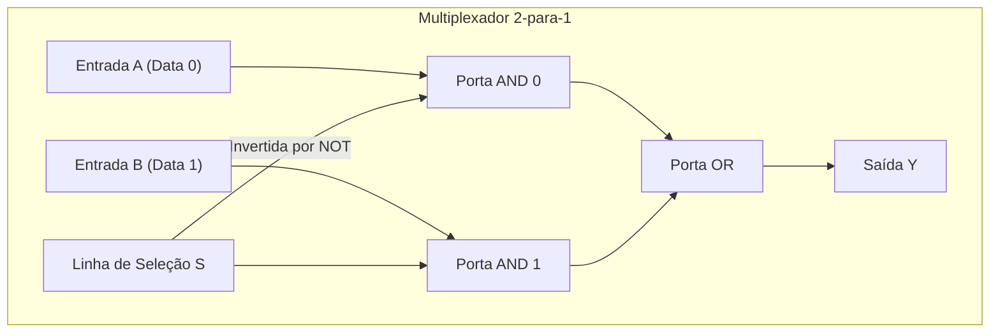
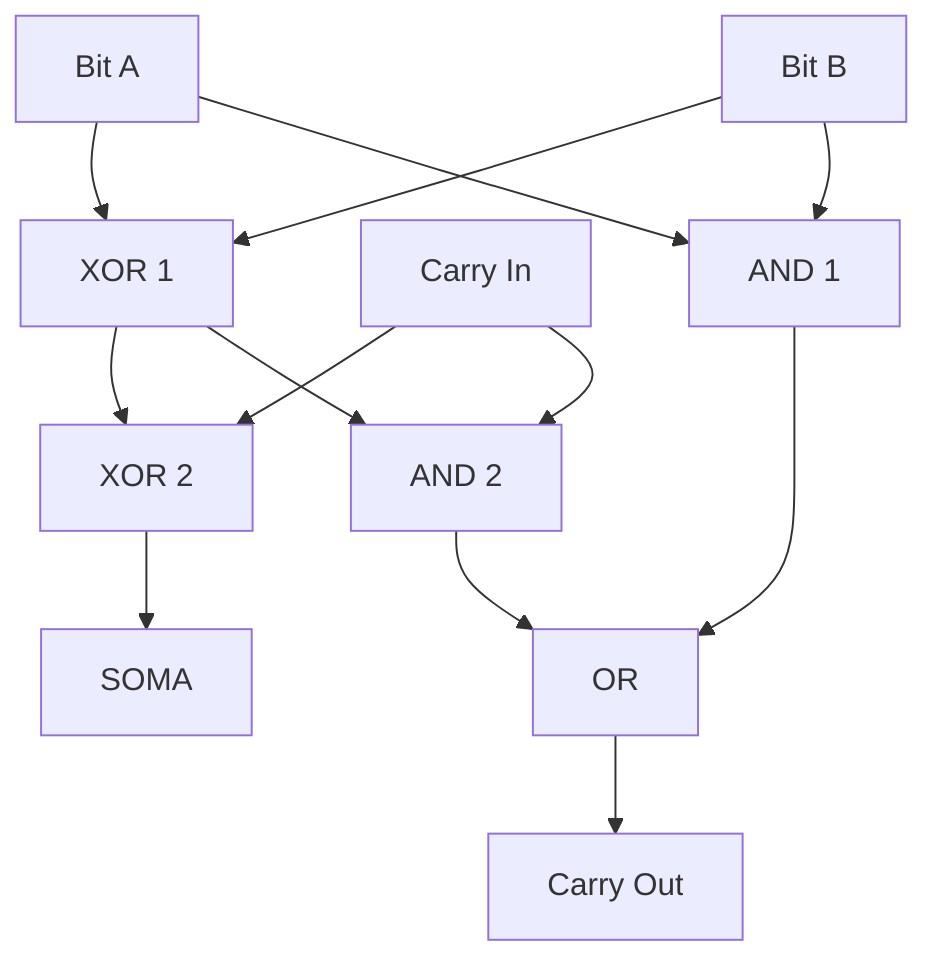

# 🟢 Aula 10: Conceitos de Lógica Digital, Portas e Circuitos

**Disciplina:** Arquitetura de Computadores (Cód. ARQ-01)
**Curso:** Inteligência Artificial e Ciência de Dados, Uniube
**Semana:** 15 | 25/05/2026
**Professor:** Romualdo Mathias Filho
**Tipo:** 📘 Teórica
**Tópicos:** Portas Lógicas Fundamentais, Circuitos Combinacionais (Mux e Somadores) e Circuitos Sequenciais (Latches, Flip-Flops e Clock).

---

> [!INFO] 🎯 Visão Geral da Aula & Recursos
> **Nesta aula, desceremos ao nível de silício para compreender como bilhões de transistores microscópicos operando como chaves físicas constroem a lógica binária de processadores modernos.**
> 
> * **O que você vai dominar:**
>   - Rastrear o fluxo de dados em portas lógicas primárias (AND, OR, NOT) e universais (NAND, NOR).
>   - Projetar e analisar circuitos combinacionais fundamentais, como Multiplexadores e Somadores Binários da ULA.
>   - Diferenciar lógica combinacional de lógica sequencial e compreender Flip-Flops e a sincronização por Clock.
> * **Pré-requisitos:** Representação binária de dados (Aula 12).
> * **📂 Recursos Adicionais para Download:**
>   - [Logisim-Evolution (Simulador de Lógica Digital Open Source)](https://github.com/logisim-evolution/logisim-evolution) — Simulador recomendado para modelagem de circuitos digitais e simulações didáticas.

---

## 🎯 Objetivo da Aula

Ao final desta aula, os alunos serão capazes de:
- **Explicar** o funcionamento dos transistores físicos operando como chaves eletrônicas para formar os estados lógicos binários de silício (0 e 1).
- **Esboçar** as tabelas verdade e símbolos de portas lógicas primárias (AND, OR, NOT) e derivadas (NAND, NOR, XOR, XNOR).
- **Projetar** circuitos combinacionais práticos (Multiplexadores e Somadores) e explicar como eles dão origem à ULA (Unidade Lógica e Aritmética) no núcleo do processador.
- **Diferenciar** circuitos combinacionais de circuitos sequenciais (Latches, Flip-Flops), entendendo como o clock sincroniza o armazenamento estável de estados de dados.

---

## 🔄 Revisão Rápida (5 min)

| **Conceito (Aulas Anteriores)** | **Conexão com a Aula de Hoje** |
| :--- | :--- |
| **[[Aula 09 - Mecanismos de Entrada e Saida\|Aula 09 (Entrada/Saída)]]** | Controladores e módulos de E/S vistos na última aula utilizam multiplexadores e decodificadores internos para selecionar e rotear dados de barramentos físicos. |
| **[[Aula 07 - Conjunto de Instrucoes e Ciclo da Instrucao\|Aula 07 (Ciclo da Instrução)]]** | O ciclo de instrução avança ciclo a ciclo. Veremos hoje que esse ritmo é ditado por um sinal de clock digital que comanda flip-flops sequenciais. |
| **[[Aula 05 - Unidades de Processamento\|Aula 05 (CPU e FPU)]]** | Compreendemos a CPU estruturalmente. Hoje entenderemos como as portas lógicas se combinam para criar a ULA (Unidade Lógica e Aritmética) no núcleo da CPU. |

---

## 📌 1. Transistores e Portas Lógicas Fundamentais [Teoria ⏳ 15 min]

Na base dos computadores modernos está o **silício**, um material semicondutor que, por meio de processos químicos de dopagem, pode ser alterado para controlar a passagem de corrente elétrica. O componente fundamental construído a partir deste material é o **transistor** (especificamente os transistores de efeito de campo de metal-óxido-semicondutor, ou **MOSFET**).

Os transistores MOSFET atuam de forma simples nos computadores digitais: como **chaves de liga/desliga eletrônicas**.
*   **Transistor NMOS:** Conduz corrente (chave fecha) quando uma tensão positiva é aplicada ao terminal de controle (gate). Representa a lógica ativa.
*   **Transistor PMOS:** Conduz corrente (chave fecha) quando a tensão de controle é nula ou baixa.

Ao combinar transistores de tecnologia complementar (**CMOS**), criamos as chamadas **portas lógicas**, que realizam operações booleanas matemáticas sobre os sinais elétricos. Mapeamos os níveis físicos de tensão para abstrações lógicas:
*   **Nível Lógico Baixo (0 V):** Equivalente ao bit lógico **0** (Falso).
*   **Nível Lógico Alto (1.2 V / 5 V):** Equivalente ao bit lógico **1** (Verdadeiro).

### 1.1 — Portas Lógicas Primárias

As portas lógicas primárias constituem a base matemática booleana. Cada porta possui uma representação simbólica normalizada e uma **Tabela Verdade** que mapeia todas as combinações de entrada possíveis para as respectivas saídas.

```
NOT (Inversora)        AND (Conjunção)        OR (Disjunção)
     ___                  _____                  ____
A --| >o-- Y         A --|     \            A --\    \
     ¯¯¯                 |  &   )--- Y           ) OR )--- Y
                     B --|_____/            B --/____/
```

*   **NOT:** Inverte o sinal de entrada. Se $A = 0$, então $Y = 1$. Se $A = 1$, então $Y = 0$.
*   **AND:** A saída $Y$ é verdadeira ($1$) se, e somente se, **todas** as entradas forem verdadeiras. Matemática: $Y = A \cdot B$.
*   **OR:** A saída $Y$ é verdadeira ($1$) se **pelo menos uma** das entradas for verdadeira. Matemática: $Y = A + B$.

### 1.2 — Portas Derivadas de Alta Eficiência

Ao inverter a saída das portas primárias, ou ao modelar lógicas de desigualdade, criamos portas derivadas cruciais para a computação:

*   **NAND (Não-AND):** Inverso da porta AND. $Y = \overline{A \cdot B}$.
*   **NOR (Não-OR):** Inverso da porta OR. $Y = \overline{A + B}$.
*   **XOR (OU Exclusivo):** A saída é verdadeira ($1$) se as entradas forem **diferentes**. Matemática: $Y = A \oplus B = (A \cdot \overline{B}) + (\overline{A} \cdot B)$.
*   **XNOR (Não OU Exclusivo):** A saída é verdadeira ($1$) se as entradas forem **iguais**. Matemática: $Y = \overline{A \oplus B}$.

> [!NOTE] 💡 O Segredo do Silício: As Portas Universais
> As portas **NAND** e **NOR** são chamadas de **Portas Universais**. Na física dos semicondutores CMOS, construir uma porta NAND ou NOR exige menos transistores (apenas 4 transistores) do que construir uma porta AND ou OR direta (que exigem uma NAND mais uma inversora NOT, totalizando 6 transistores). Como consequência, fundições de chips inteiras podem ser construídas utilizando puramente portas NAND e NOR arranjadas logicamente, reduzindo custos de fabricação e perdas térmicas.

> [!WARNING] ⚠️ Gotcha de Infraestrutura
> **Propagation Delay (Atraso de Propagação) e Fan-out:** Na engenharia física de silício, a mudança de estado de um transistor (de $0$ para $1$) não é instantânea; ela requer tempo para carregar a capacitância física das portas conectadas à sua saída. O limite máximo de portas que a saída de um único transistor consegue excitar eletricamente de forma estável é chamado de **fan-out**. Exceder esse limite causa uma latência acumulada intolerável (atraso de propagação de caminho crítico), provocando erros lógicos intermitentes nos circuitos integrados da CPU em alta frequência de clock.

---

## 📌 2. Circuitos Combinacionais e a Construção da ULA [Teoria & Prática ⏳ 20 min]

Circuitos lógicos são classificados em duas grandes categorias: combinacionais e sequenciais.
Em um **Circuito Combinacional**, a saída de dados em qualquer instante do tempo depende **única e exclusivamente** dos valores lógicos presentes em suas entradas naquele exato momento. O circuito não possui memória de eventos passados nem realimentação física (*feedback loop*).

### 2.1 — O Multiplexador (MUX): O Roteador de Sinais

O **Multiplexador (MUX)** é um circuito combinacional de seleção. Ele possui $2^n$ linhas de entrada de dados, $n$ linhas de seleção binária, e uma única saída. A combinação de bits aplicada às linhas de seleção decide qual das entradas de dados será direcionada fisicamente à saída.



*   Se $S = 0$, o sinal da **Entrada A** é propagado até a saída $Y$.
*   Se $S = 1$, o sinal da **Entrada B** é propagado até a saída $Y$.

Este componente é a espinha dorsal de barramentos de dados de processadores, sendo usado para selecionar quais registradores ou periféricos enviarão dados para a ULA.

### 2.2 — Somadores Binários e a ULA

A aritmética computacional é executada combinando portas lógicas. A operação mais básica é a soma binária de dois bits de dados ($A$ e $B$).

#### 2.2.1 — Meio-Somador (Half-Adder)
Soma dois bits isolados de entrada, gerando a soma acumulada ($Sum$) e o transporte de saída ($Carry$).
*   $Sum = A \oplus B$ (Soma é $1$ se as entradas forem diferentes).
*   $Carry = A \cdot B$ (Transporte é $1$ apenas se ambas forem $1$).

```
       Half-Adder
      +----------+
A --->|          |---> Sum (A XOR B)
      |          |
B --->|          |---> Carry (A AND B)
      +----------+
```

#### 2.2.2 — Somador Completo (Full-Adder)
O meio-somador é limitado porque não consegue receber o transporte gerado por uma soma de bits anterior ($Carry-in$). O **Somador Completo (Full-Adder)** resolve isso ao somar três bits: os dois operandos principais ($A$ e $B$) mais o transporte de entrada ($Cin$).

*   $Sum = A \oplus B \oplus Cin$
*   $Cout = (A \cdot B) + (Cin \cdot (A \oplus B))$



Ao interligar $N$ blocos de Full-Adders em cascata (conectando o $Cout$ de um estágio ao $Cin$ do seguinte), criamos um **Somador Paralelo de N Bits**. Este circuito forma o núcleo operacional de uma **ULA (Unidade Lógica e Aritmética)**, capaz de realizar somas, subtrações (via complemento de dois) e operações lógicas AND, OR e XOR em tempo real.

### 🧠 Checkpoint: Teste seu Conhecimento!

<details>
<summary><b>🔍 Exercício Rápido: Se tivermos um Multiplexador de 8 entradas de dados, quantas linhas de seleção (select lines) são estritamente necessárias no circuito lógico?</b></summary>
<blockquote>

**Resposta Correta:** São necessárias **3 linhas de seleção**.
A fórmula matemática para determinar o número de linhas de seleção $n$ a partir do número de entradas $E$ é dada por $E = 2^n$. Como temos $E = 8$, resolvemos $8 = 2^n \Rightarrow n = 3$. Assim, as 3 linhas lógicas binárias ($S_0$, $S_1$ e $S_2$) conseguem endereçar exatamente as 8 portas físicas de entrada de dados (de `000` a `111`).

</blockquote>
</details>

---

## 📌 3. Circuitos Sequenciais: A Base da Memória e do Clock [Prática Guiada ⏳ 15 min]

Diferente dos combinacionais, em um **Circuito Sequencial** a saída em qualquer instante de tempo depende não apenas das entradas atuais, mas também do **estado interno anterior** do circuito. Isso significa que ele possui **memória** de eventos anteriores. A base para construir essa retenção são caminhos de retroalimentação elétricos.

### 3.1 — O Latch SR (Set-Reset)
Construído cruzando a realimentação de duas portas NOR (ou NAND), o Latch SR possui dois estados de controle estáveis:
*   **Set (S):** Força o estado interno de dados $Q$ para $1$.
*   **Reset (R):** Força o estado interno de dados $Q$ para $0$.
*   Se ambos forem nulos ($S=0, R=0$), o circuito mantém estável o bit gravado anteriormente de forma indefinida.

### 3.2 — O Flip-Flop tipo D (Edge-Triggered)
O latch básico é suscetível a oscilações indesejadas e ruídos de propagação. Para estabilizar a gravação, insere-se um controle de **Clock** no circuito, criando o **Flip-Flop tipo D**.

Este circuito ignora mudanças nas entradas de dados $D$ exceto em um momento específico: a **borda de subida** ou **borda de descida** do clock.
*   **Borda de Subida (Rising Edge):** A transição do sinal elétrico do clock de $0$ para $1$. Nesse exato microssegundo, a entrada de dados $D$ é capturada pelo Flip-Flop e exposta na saída estável $Q$. Mudanças em $D$ após a borda do clock são ignoradas até o próximo ciclo.

```
Clock ____/¯¯¯¯\____/¯¯¯¯\____/¯¯¯¯
          ^         ^         ^
    (Transições de Borda - Captura Física de Dados)
```

Os flip-flops tipo D formam a base dos **registradores internos da CPU**, da memória estática ultra-rápida **SRAM** (Static RAM) e dos registradores de barreira em pipelines de execução, guardando os dados entre os ciclos de processamento.

### 3.3 — Prática Guiada: Simulação no Logisim

Para consolidar os conceitos lógicos, os alunos utilizarão o simulador **Logisim-Evolution** para desenhar e observar a simulação em tempo real.

#### Passo 1: Construção de uma Porta XOR Customizada
1. Abra o Logisim-Evolution e crie um novo projeto.
2. Adicione duas **Pins de Entrada** na barra superior e rotule-os como `A` e `B`.
3. Crie uma porta XOR utilizando a equação lógica: $A \oplus B = (A \cdot \overline{B}) + (\overline{A} \cdot B)$.
4. Utilize duas portas **NOT** para gerar as variáveis invertidas $\overline{A}$ e $\overline{B}$.
5. Adicione duas portas **AND** de 2 entradas. Conecte $A$ e $\overline{B}$ na primeira porta, e $\overline{A}$ e $B$ na segunda porta.
6. Adicione uma porta **OR** de 2 entradas ligando as saídas das portas AND.
7. Conecte a saída da porta OR a um **Pin de Saída (LED)** rotulado como `SomaCustom`.
8. Teste a tabela verdade alternando as entradas lógicas no simulador usando a ferramenta Hand (Mãozinha).

#### Passo 2: Construção do Meio-Somador (Half-Adder)
1. Crie uma segunda folha de projeto e combine uma porta **XOR** nativa do Logisim e uma porta **AND**.
2. Conecte as duas entradas `A` e `B` paralelamente a ambas as portas.
3. Conecte a saída XOR ao LED `Sum` e a saída AND ao LED `Carry`.
4. Teste as quatro combinações e verifique se a saída do carry se ativa apenas com `A=1` e `B=1`.

```
                LOGISIM WORKSPACE
       Inputs            Gates           Outputs
       +---+
A ---->|   |--------+-------------\ XOR
       +---+        |             )-----> Sum (LED)
                    |   +----+----/
       +---+        +-->|    |
B ---->|   |------------|    |----------> Carry (LED)
       +---+            +----+ AND
```

---

## 📋 Resumo Estrutural

| **Conceito / Comando** | **Definição e Aplicação Prática em Uma Frase** |
| :--- | :--- |
| **MOSFET / CMOS** | Tecnologia de transistores de efeito de campo complementares operando como chaves eletrônicas na formação da lógica binária. |
| **Porta Lógica** | Circuito básico integrado de transistores que realiza uma função booleana elementar (AND, OR, NOT, NAND, NOR). |
| **Portas Universais** | Portas NAND e NOR que conseguem construir qualquer outra lógica booleana, otimizando transistores e custos na fundição de chips. |
| **Circuito Combinacional** | Circuito cuja saída no instante $t$ é decidida estritamente pelas entradas daquele exato momento (Mux, Somadores, Decodificadores). |
| **Multiplexador (MUX)** | Circuito combinacional que funciona como chave seletora, roteando dados de barramentos e registradores para processamento. |
| **Circuito Sequencial** | Circuito que armazena estados internos e cuja saída depende de estados passados e entradas atuais (Flip-Flops, Latches). |
| **Flip-Flop tipo D** | Dispositivo sequencial síncrono ativado por borda de clock que retém um único bit de dados estável, compondo registradores de CPU. |
| **Clock** | Sinal oscilante de sincronização que coordena o tempo e a propagação de estados lógicos em circuitos sequenciais de chips. |

---

## 📄 Artigo de Aprofundamento

- [Logic Gates — GeeksforGeeks](https://www.geeksforgeeks.org/logic-gates-in-computer-organization/)
> *Resumo prático: Guia visual clássico de arquitetura apresentando a modelagem das portas lógicas booleanas, diagramas elétricos CMOS simplificados e montagem de circuitos combinacionais complexos.*

---

## 📚 Referências Bibliográficas

- **TANENBAUM, Andrew S.; FEAMSTER, Nicholas; WETHERALL, David J.** *Organização Estruturada de Computadores*. 6. ed. Rio de Janeiro: LTC, 2013. **(Capítulo 3: O Nível de Lógica Digital — pp. 85–130)**. Excelente cobertura de transistores, portas lógicas e circuitos sequenciais.
- **STALLINGS, William.** *Arquitetura e Organização de Computadores: projetando com foco em desempenho*. 11. ed. São Paulo: Pearson, 2024. **(Apêndice B: Sistemas Digitais — pp. 780–825)**. Aborda álgebra booleana, circuitos combinacionais, decodificadores e flip-flops sincronizados.
- **PATTERSON, David A.; HENNESSY, John L.** *Organização e Projeto de Computadores: A Interface Hardware/Software*. 5. ed. Rio de Janeiro: Elsevier, 2014. **(Apêndice B: O Básico de Lógica Digital — pp. B1–B82)**. Fornece análise profunda de caminhos críticos e ferramentas de síntese industrial de hardware.

---
*Última atualização: 2026-05-25 | Status: publicado*

%%
## ❓ Banco de Questões

> 🔒 *Esta seção é visível apenas no Obsidian do professor. Não publicada para os alunos no Quartz.*

### Questão 1 (Múltipla Escolha — Nível: Intermediário)

**Enunciado:** A equipe de engenharia do **iFood** está desenvolvendo um micro-controlador embarcado em caixas térmicas inteligentes de entregadores parceiros para gerenciar múltiplos sensores de temperatura analógicos. O firmware do processador embarcado do micro-controlador necessita ler ciclicamente informações de apenas um sensor de cada vez de forma alternada a partir de um barramento unificado de dados elétricos. Considerando a restrição estrita de área de silício do processador da caixa térmica, qual circuito combinacional básico de hardware deve ser projetado diretamente no chip de silício para gerenciar e rotear de forma eficiente esses múltiplos canais de sensores de dados compartilhados?

- [ ] A) Latch SR Cruzado, para persistir de forma estática o sinal de temperatura de todos os sensores ao mesmo tempo.
- [ ] B) Decodificador 3-para-8 Ativo, para inverter os canais lógicos e convertê-los em bits decimais na tela de saída do motor físico.
- [x] C) Multiplexador (MUX), pois ele recebe múltiplos canais de sinais de dados nas entradas lógicas e utiliza barramentos de seleção binária para guiar a temperatura de apenas um sensor selecionado por ciclo até a ULA. ✅
- [ ] D) Registrador de Deslocamento Sequencial, para rotacionar fisicamente os bits de temperatura dos sensores em um feedback loop assíncrono.

**Justificativa:** O Multiplexador é o circuito combinacional ideal de chaveamento e roteamento de múltiplos canais de dados compartilhando uma saída física comum. Através das linhas de seleção binária, o micro-controlador do iFood consegue ler ciclicamente cada sensor conectado individualmente sem risco de colisões elétricas ou desperdício de linhas de barramento de CPU externas, reduzindo a complexidade de conexões físicas na caixa térmica. As outras alternativas tratam de circuitos de armazenamento assíncronos (latch), decodificadores (que expandem saídas em vez de canalizar entradas) ou sequenciadores de mudança de bits em fila de dados.

---

### Questão 2 (Múltipla Escolha — Nível: Avançado)

**Enunciado:** Durante o pico de vendas de cartão de crédito do **Nubank** na Black Friday, a equipe de infraestrutura notou pequenas falhas intermitentes nos servidores de criptografia baseados em hardware proprietário (chips FPGA customizados). O arquiteto de hardware sênior diagnosticou que o circuito integrado do FPGA sofria de um atraso de propagação excessivo (caminho crítico estourado) especificamente nas somas da ULA porque os somadores binários estavam cascateados em configuração clássica de somadores paralelos Ripple Carry Adder (RCA), inviabilizando a operação de segurança exigida pelo clock do circuito. Qual reestruturação física no nível da arquitetura de lógica digital do processador deve ser proposta pelo arquiteto para eliminar a latência de transporte e resolver as falhas sob extrema carga de tráfego?

- [ ] A) Substituir os flip-flops tipo D dos registradores internos por latches SR analógicos, permitindo que a soma booleana propague sem atraso de clock de borda.
- [ ] B) Reduzir o fan-out físico dos transistores dos somadores adicionando inversores NOT adicionais para atrasar artificialmente as saídas de soma (Sum).
- [x] C) Substituir os blocos Ripple Carry Adder por circuitos de somadores do tipo Carry Lookahead Adder (CLA), que calculam o transporte binário de forma antecipada usando lógica booleana paralela paralela no silício. ✅
- [ ] D) Mapear todas as portas lógicas da ULA em portas de lógica assíncrona baseadas puramente em transistores NMOS isolados da fonte de alimentação de clock.

**Justificativa:** Os somadores Ripple Carry Adder sofrem com o gargalo físico de propagação linear do carry do primeiro até o último bit ($O(N)$), forçando todo o processamento da ULA a esperar pela estabilização elétrica do bit final antes de fechar o ciclo de clock. A adoção de um Carry Lookahead Adder calcula os termos de transporte de forma paralela e antecipada reduzindo a complexidade do caminho crítico para latência logarítmica ($O(\log N)$). Isso diminui drasticamente a latência acumulada na soma, permitindo o clock de altíssima performance nos FPGAs do Nubank sem falhas lógicas induzidas por tempo. A troca por latches SR introduziria glitches e instabilidade de corrida, e a adição de portas NOT ou lógica assíncrona NMOS apenas agravaria o atraso de propagação do sinal ou drenaria energia térmica severa.

---

### Questão 3 (Dissertativa — Nível: Avançado)

**Enunciado:** Um arquiteto de hardware sênior da fundição que fornece os processadores ASIC de observabilidade para o ecossistema GCP da SANA está analisando o impacto do sinal de clock no processamento de registradores de dados de alto desempenho. Em alguns trechos do chip que controlam as tabelas de roteamento de métricas, ele se deparou com a necessidade de selecionar e armazenar dados lógicos lidos nos registradores com segurança rígida de transição. Explique, sob a ótica física e teórica de portas e circuitos de hardware: (a) qual é a diferença crucial de funcionamento entre um Latch de dados comum e um Flip-Flop ativo por borda sob controle de clock e (b) de que maneira a ausência de um sinal de clock coordenador geraria condições de corrida catastróficas e instabilidades em caminhos lógicos profundos de uma CPU complexa.

**Resposta esperada:**
*   **(a) Diferença Crucial entre Latch e Flip-Flop:** Um Latch é um dispositivo transparente ativado por **nível lógico** (level-sensitive). Enquanto o sinal de controle (ou habilitação) estiver ativo (alto ou baixo), a saída do Latch acompanha continuamente as variações da entrada de dados (comportamento aberto/transparente). Já o Flip-Flop ativo por borda é sensível unicamente à **transição lógica** (edge-triggered, de subida ou descida) do sinal de Clock. A entrada é amostrada e trancada estaticamente no silício no exato microssegundo da borda (borda de subida/descida), permanecendo imune a quaisquer oscilações subsequentes na entrada até o início da próxima transição de clock, atuando como barreira física isolante confiável.
*   **(b) Impacto da Ausência de Clock (Condições de Corrida):** Em circuitos assíncronos sem clock unificador, os atrasos físicos de propagação elétrica através de portas lógicas diferentes não são coordenados. Sinais elétricos que deveriam se combinar simultaneamente chegam à entrada das portas receptoras em tempos ligeiramente desiguais por diferenças de comprimento de trilhas ou capacitâncias de transistores. Sem um clock central que force as saídas lógicas combinacionais a "pausarem" e se estabilizarem antes que os novos estados sejam gravados na memória sequencial seguinte, ocorrem **condições de corrida (race conditions)** e *glitches*. Nesses cenários, os Flip-Flops capturam estados transitórios corrompidos errôneos, levando o circuito lógico do processador a divergir de seu fluxo de execução e a provocar o congelamento completo ou comportamentos imprevistos imprevisíveis nos processadores ASIC do SANA.
---
%%
