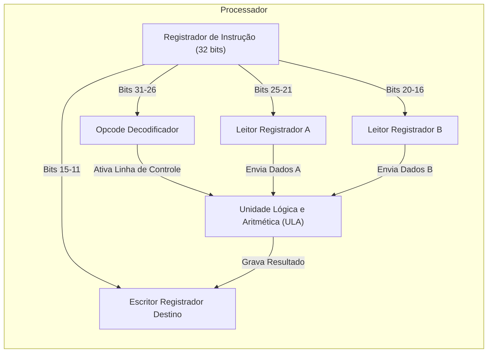

# 🟢 Aula 11: Noções de Linguagem de Máquina e Opcodes

**Disciplina:** Arquitetura de Computadores (Cód. ARQ-01)
**Curso:** Inteligência Artificial e Ciência de Dados, Uniube
**Semana:** 16 | 01/06/2026
**Professor:** Romualdo Mathias Filho
**Tipo:** 📘 Teórica
**Tópicos:** O Gap Semântico e Linguagem de Máquina, Anatomia das Instruções (Opcode e Operandos), e Prática Guiada no Compiler Explorer.

---

> [!INFO] 🎯 Visão Geral da Aula & Recursos
> **Compreenderemos como o software abstrato é traduzido fisicamente em pulsos de tensão e instruções primitivas binárias que o processador executa diretamente no silício.**
> 
> * **O que você vai dominar:**
>   - A anatomia física de uma instrução de máquina de CPU, dividindo-a em Código de Operação (Opcode) e Operandos.
>   - O processo de tradução e "Gap Semântico" de linguagens de alto nível para código de máquina.
>   - Análise comparativa prática de instruções assembly geradas para diferentes arquiteturas comerciais (x86 e ARM).
> * **Pré-requisitos:** Conceitos de Lógica Digital e Decodificadores (Aula 10).
> * **📂 Recursos Adicionais para Download:**
>   - [Compiler Explorer (Godbolt)](https://godbolt.org) — Ferramenta web recomendada para visualizar a tradução do código em tempo real.

---

## 🎯 Objetivo da Aula

Ao final desta aula, os alunos serão capazes de:
- **Explicar** o conceito de "Gap Semântico" e descrever o papel fundamental do compilador na tradução de linguagens de alto nível para código de máquina binário.
- **Decompor** uma instrução de máquina real nos seus constituintes principais: o Código de Operação (**Opcode**) e os **Operandos**.
- **Diferenciar** os formatos básicos de instrução (tipo R, tipo I) em arquiteturas de conjunto de instruções comercialmente relevantes (RISC vs. CISC).
- **Analisar** e interpretar saídas reais de códigos de baixo nível traduzidos para x86-64 e ARM utilizando visualizadores de compiladores.

---

## 🔄 Revisão Rápida (5 min)

| **Conceito (Aulas Anteriores)** | **Conexão com a Aula de Hoje** |
| :--- | :--- |
| **[[Aula 10 - Logica Digital\|Aula 10 (Lógica Digital)]]** | Os decodificadores digitais criados na aula passada são as ferramentas lógicas no hardware que leem o Opcode de uma instrução e selecionam fisicamente qual operação a CPU deve executar. |
| **[[Aula 07 - Conjunto de Instrucoes e Ciclo da Instrucao\|Aula 07 (Ciclo da Instrução)]]** | O primeiro estágio do ciclo da instrução é o **Busca (Fetch)**. Hoje entenderemos o formato exato das instruções binárias que são buscadas da memória principal e carregadas no registrador RI. |
| **[[Aula 05 - Unidades de Processamento\|Aula 05 (Unidades de Processamento)]]** | Vimos os registradores visíveis ao usuário. Hoje aprenderemos como as instruções de máquina utilizam e referenciam esses registradores para computar operações aritméticas. |

---

## 📌 1. Do Silício ao Código: O Gap Semântico e a Linguagem de Máquina [Teoria ⏳ 15 min]

Os programadores modernos escrevem códigos em linguagens de alto nível como Python, C, Java ou Rust. Estas linguagens oferecem abstrações poderosas: classes, funções, variáveis dinâmicas e gerenciamento automatizado de memória. No entanto, o hardware de silício é incapaz de processar essas estruturas diretamente. Ele funciona com base física na álgebra booleana e em circuitos combinacionais de transistores que operam exclusivamente com bits binários ($0$ e $1$).

A diferença de abstração entre as linguagens pensadas para humanos e as restrições físicas do silício é denominada **Gap Semântico** (Diferença Semântica).

```
+-----------------------------------------------------------+
| Linguagem de Alto Nível (C, Python, Java, Rust)           | <-- Abstração Humana
+-----------------------------------------------------------+
                              |
                     [ COMPILAÇÃO / TRADUÇÃO ]
                              v
+-----------------------------------------------------------+
| Linguagem Assembly (Representação Textual de Hardware)    | <-- Mapeamento 1-para-1
+-----------------------------------------------------------+
                              |
                    [ MONTAGEM / ASSEMBLER ]
                              v
+-----------------------------------------------------------+
| Código de Máquina Binário (0s e 1s em Silício)            | <-- Realidade do Hardware
+-----------------------------------------------------------+
```

Para fechar o gap semântico, entra em ação o **Compilador**. O compilador quebra o código abstrato complexo em uma sequência lógica de operações ultra-simples e primitivas, suportadas nativamente pelo processador. 

A **Linguagem de Máquina** é a linguagem nativa do processador. Ela é composta de instruções de máquina em formato de palavras binárias de comprimento fixo (ex: 32 bits em ARM/MIPS) ou variável (ex: 1 a 15 bytes em Intel x86) gravadas na memória RAM. Por ser difícil e propensa a erros a leitura humana direta de sequências binárias, utilizamos a **Linguagem Assembly** (ou de montagem), que fornece mnemônicos textuais legíveis para representar essas mesmas instruções primitivas binárias.

> [!WARNING] ⚠️ Gotcha de Infraestrutura
> **O Perigo do Buffer Overflow no Silício:** Linguagens de máquina puras não possuem o conceito de "escopo" de variáveis ou proteção nativa de vetores. A CPU simplesmente busca e executa sequências em endereços de memória. Se um programa em alto nível (como C) não validar os limites de gravação de um vetor, um invasor pode sobrescrever áreas adjacentes na memória contendo instruções de máquina, injetando códigos maliciosos binários arbitrários diretamente no registrador apontador de instrução (PC/IP), permitindo o sequestro completo do servidor de produção a nível de hardware.

---

## 📌 2. Anatomia de uma Instrução de Máquina: Opcode e Operandos [Teoria & Prática ⏳ 20 min]

Uma **instrução de máquina** é uma palavra de bits unificada contendo todas as diretivas para que o processador realize uma computação física elementar. Ela é dividida em campos lógicos padronizados pela arquitetura do conjunto de instruções (**ISA**). A estrutura básica de uma instrução divide-se em:

```
+------------------+----------------------------------------+
| Opcode (6 bits)  |           Operandos (26 bits)          |
+------------------+----------------------------------------+
```

### 2.1 — O Opcode (Código de Operação)
O **Opcode** (Operation Code) é o conjunto inicial de bits da instrução de máquina que especifica **o que fazer**. Ele informa ao decodificador de instruções da Unidade de Controle se a CPU deve realizar uma soma, uma subtração, uma leitura de memória (Load), uma escrita em memória (Store), ou um desvio de fluxo de execução (Jump/Branch).

*   **Exemplo didático (RISC MIPS de 32 bits):**
    *   `000000` -> Indica uma operação do tipo aritmética ou lógica (Tipo-R).
    *   `000010` -> Indica uma instrução de desvio incondicional (Jump).
    *   `100011` -> Indica uma instrução de leitura de dados na memória RAM (Load Word).

### 2.2 — Os Operandos
Os **Operandos** especificam **com quem fazer**. Eles indicam de onde os dados de entrada devem ser lidos e onde o resultado final deve ser gravado. Em arquiteturas modernas (Registrador-Registrador), os operandos podem apontar para:
*   **Registradores:** Endereços rápidos internos no arquivo de registradores do processador (ex: `$t0`, `$s1`).
*   **Constantes Imediatas:** Valores numéricos fixos embutidos diretamente no corpo da instrução (ex: somar `5` ou desviar `100` posições).
*   **Endereços de Memória:** Localizações específicas na memória RAM.

### 2.3 — Formatos de Instrução RISC (MIPS/ARM)

Para manter a simplicidade e a alta frequência de clock, processadores RISC padronizam as instruções em tamanhos idênticos (32 bits), variando apenas a organização interna dos bits (formatos):

#### 2.3.1 — Formato Tipo-R (Registradores)
Usado para instruções matemáticas e lógicas entre três registradores.
```
+----------------+----------------+----------------+----------------+----------------+----------------+
|  op (6 bits)   |  rs (5 bits)   |  rt (5 bits)   |  rd (5 bits)   | shamt (5 bits) |  funct (6 bits)|
+----------------+----------------+----------------+----------------+----------------+----------------+
```
*   `op` (Opcode): Identificador básico do tipo de instrução.
*   `rs` e `rt`: Registradores contendo as duas fontes dos dados originais.
*   `rd`: Registrador de destino (onde o resultado final da ULA é gravado).
*   `shamt`: Tamanho do deslocamento de bits (shift amount).
*   `funct` (Function): Campo de refinamento que diz exatamente qual operação a ULA deve fazer (ex: `100000` para somar).

#### 2.3.2 — Formato Tipo-I (Imediato)
Usado para operações aritméticas contendo uma constante embutida no código, ou para instruções de leitura/escrita na RAM (Load/Store).
```
+----------------+----------------+----------------+-------------------------------------------------+
|  op (6 bits)   |  rs (5 bits)   |  rt (5 bits)   |               immediate (16 bits)               |
+----------------+----------------+----------------+-------------------------------------------------+
```
*   `immediate`: Um operando constante numérico de até 16 bits, economizando uma busca na memória.



---

## 📌 3. Prática Guiada: Explorando o Assembly no Compiler Explorer [Prática ⏳ 15 min]

Para visualizar na prática como compilers modernos traduzem códigos complexos de produção para instruções puras de máquina, os alunos utilizarão o portal acadêmico interativo **Godbolt Compiler Explorer**.

### Passo 1 — Configuração Inicial
1. Acesse o site oficial: [godbolt.org](https://godbolt.org).
2. Na janela da esquerda (código fonte), certifique-se de que a linguagem selecionada é **C** ou **C++**.
3. Na janela da direita, exclua o compilador padrão e adicione um novo: selecione **x86-64 gcc** (arquitetura CISC Intel/AMD).

### Passo 2 — Inserindo a Função de Teste
Insira a seguinte função matemática em C representando o cálculo simplificado de uma taxa de transação PIX com acréscimo constante:

```c
int calcularTaxaPix(int saldo, int acrescimo) {
    return saldo + acrescimo + 42;
}
```

### Passo 3 — Analisando o Assembly Gerado (Intel x86-64)
Observe o código gerado no painel da direita. O compilador traduz a lógica para instruções assembly Intel reais:

```assembly
calcularTaxaPix(int, int):
        push    rbp
        mov     rbp, rsp
        mov     DWORD PTR [rbp-4], edi    ; Salva 'saldo' na pilha
        mov     DWORD PTR [rbp-8], esi    ; Salva 'acrescimo' na pilha
        mov     edx, DWORD PTR [rbp-4]    ; Carrega 'saldo' em um registrador
        mov     eax, DWORD PTR [rbp-8]    ; Carrega 'acrescimo' em outro registrador
        add     eax, edx                  ; Executa a soma 'saldo + acrescimo'
        add     eax, 42                   ; Executa a soma constante '+ 42'
        pop     rbp
        ret                               ; Retorna
```

*   **Abstração vs. Realidade:** Note como o simples operador `+` de alto nível gerou múltiplas movimentações de registradores e instruções `add` específicas na CPU x86.

### Passo 4 — O Poder do ARM (AWS Graviton / Apple Silicon)
1. Adicione um compilador em paralelo clicando no botão **Add Compiler**.
2. Selecione a arquitetura **ARM64 gcc** (paradigma RISC usado nos servidores Graviton modernos e em dispositivos mobile).
3. Compare o código gerado:

```assembly
calcularTaxaPix(int, int):
        sub     sp, sp, #16
        str     w0, [sp, 12]              ; Salva 'saldo' na pilha
        str     w1, [sp, 8]               ; Salva 'acrescimo' na pilha
        ldr     w1, [sp, 12]
        ldr     w0, [sp, 8]
        add     w0, w1, w0                ; Executa a soma
        add     w0, w0, 42                ; Adiciona a constante imediata 42
        add     sp, sp, 16
        ret
```

Note como os nomes de registradores (`w0`, `w1`, `sp`) e o formato da instrução refletem a abordagem RISC de instruções uniformes de 32 bits, diferindo radicalmente dos mnemônicos CISC da Intel.

> [!TIP] 💡 Dica de Produção (Pro-Tip)
> **Otimização de Compilador (-O2 / -O3):** Em ambientes de altíssimo volume de dados (ex: processamento de transações no Nubank), tempo de CPU é dinheiro. Por padrão, compiladores geram instruções redundantes para fins de depuração. No Godbolt, adicione no campo de argumentos de compilação a flag `-O2` (otimização de nível 2). O compilador reescreverá a saída de máquina eliminando o uso redundante de acessos de pilha de memória e reduzindo a função em C a apenas duas instruções de soma direta em registradores ultrarrápidos, acelerando o tempo de resposta do servidor em até 10x de forma puramente lógica.

---

## 📋 Resumo Estrutural

| **Conceito / Comando** | **Definição e Aplicação Prática em Uma Frase** |
| :--- | :--- |
| **Gap Semântico** | Distância conceitual entre o raciocínio em linguagens abstratas humanas e a realidade física binária do silício. |
| **Instrução de Máquina** | Palavra binária de dados interpretável de forma direta pelos decodificadores e lógica interna da CPU. |
| **Assembly** | Representação legível baseada em mnemônicos textuais que mapeia 1-para-1 a linguagem de máquina binária. |
| **Compilador** | Software responsável por fechar o gap semântico traduzindo a lógica abstrata para sequências de instruções primitivas físicas da CPU. |
| **Opcode (Código de Operação)** | Conjunto inicial de bits de uma instrução que especifica "o que" o hardware do processador deve fazer. |
| **Operando** | Parte da instrução que indica "com quem" a ação será feita (registradores, constantes imediatas ou endereços). |
| **Tipo-R / Tipo-I** | Formatos estruturais padronizados de alocação de bits das palavras de instrução binárias em paradigmas RISC. |
| **Godbolt Compiler Explorer** | Plataforma acadêmica online fundamental para inspecionar em tempo real o assembly gerado a partir de códigos de alto nível. |

---

## 📄 Artigo de Aprofundamento

- [Assembly Language Reference — Godbolt Compiler Explorer Wiki](https://github.com/compiler-explorer/compiler-explorer)
> *Resumo prático: Documentação colaborativa e guias demonstrativos de uso do Compiler Explorer, ensinando como configurar compiladores cruzados e depurar estruturas de assembly em tempo real.*

---

## 📚 Referências Bibliográficas

- **STALLINGS, William.** *Arquitetura e Organização de Computadores: projetando com foco em desempenho*. 11. ed. São Paulo: Pearson, 2024. **(Capítulo 12: Conjuntos de Instruções — pp. 380–425)**. Abrange detalhadamente formatos de instruções, tipos de operandos e opcodes.
- **TANENBAUM, Andrew S.** *Organização Estruturada de Computadores*. 6. ed. Rio de Janeiro: LTC, 2013. **(Capítulo 5: O Nível de Linguagem de Máquina — pp. 290–350)**. Mapeamento do formato de instruções, endereçamento e execução a nível de micro-arquitetura.
- **PATTERSON, David A.; HENNESSY, John L.** *Organização e Projeto de Computadores: A Interface Hardware/Software*. 5. ed. Rio de Janeiro: Elsevier, 2014. **(Capítulo 2: Instruções: A Linguagem do Computador — pp. 60–120)**. Definição didática e aprofundada da estrutura do assembly MIPS, opcodes e formatos binários.

---
*Última atualização: 2026-05-25 | Status: publicado*

%%
## ❓ Banco de Questões

> 🔒 *Esta seção é visível apenas no Obsidian do professor. Não publicada para os alunos no Quartz.*

### Questão 1 (Múltipla Escolha — Nível: Intermediário)

**Enunciado:** A equipe de SRE (Site Reliability Engineering) do **Mercado Livre** está enfrentando latências elevadas nos servidores AWS que processam a fila de mensagens de notificações push da Black Friday. As métricas do APM revelam que a CPU passa 40% do seu tempo de execução empilhando e desempilhando variáveis redundantes de memória RAM para funções simples de verificação de ID de transações. Um engenheiro de software sênior propõe adicionar a flag `-O3` de otimização no compilador GCC durante o build da imagem de produção em Docker. Sob a perspectiva da arquitetura de computadores e da linguagem de máquina, como essa alteração técnica mitiga o gargalo de desempenho observado nos servidores?

- [ ] A) O compilador desabilita a busca física de opcodes (Fetch), permitindo que a CPU decodifique as instruções antes que elas cheguem à memória cache L1.
- [ ] B) A flag de otimização substitui fisicamente o conjunto de instruções RISC do processador AWS por instruções CISC compactadas para economizar largura de banda.
- [x] C) O compilador realiza otimizações de nível de máquina eliminando acessos redundantes à memória RAM (operações de pilha sp/spindle) e mantendo as variáveis diretamente no arquivo de registradores rápidos de alta velocidade, diminuindo a quantidade geral de instruções a executar. ✅
- [ ] D) A flag do compilador desativa fisicamente a barreira de segurança de Buffer Overflow no silício, acelerando as transferências lógicas do MUX.

**Justificativa:** A flag de otimização de alto nível do compilador (`-O2` ou `-O3`) analisa o fluxo de controle e reduz a redundância de tradução direta. Ela otimiza o alocador de registradores, mantendo as variáveis locais em registradores de alta velocidade internos à CPU, em vez de realizar acessos redundantes de gravação e leitura na pilha de memória RAM (`str` e `ldr` em ARM ou push/pop em x86). Isso reduz consideravelmente a contagem de instruções de máquina necessárias para executar a lógica, reduzindo a latência sem necessidade de alterar o hardware.

---

### Questão 2 (Múltipla Escolha — Nível: Avançado)

**Enunciado:** Durante uma sessão de análise de segurança em produção nos servidores corporativos de processamento de pagamentos do **iFood**, a equipe de Red Team descobriu que uma API crítica legada desenvolvida em linguagem C realizava a cópia de payloads HTTP para um buffer de tamanho estático na memória RAM sem validar o tamanho dos dados enviados. Um invasor enviou um payload sob medida maior do que o buffer e obteve sucesso em alterar o fluxo do programa para executar um código arbitrário sequestrando a máquina. Qual conceito de arquitetura de computadores e linguagem de máquina explica cientificamente a execução desse ataque no nível de silício?

- [ ] A) Invasão de barramento físico de dados, onde os bits do payload alteram fisicamente a frequência do cristal de clock da placa-mãe.
- [ ] B) Conflito de paridade na ULA (Fan-out Overflow), forçando a CPU a mudar a lógica de execução para instruções assíncronas NAND estáticas.
- [x] C) Transbordo de buffer (Buffer Overflow), onde dados excedentes sobrescrevem endereços adjacentes de pilha contendo ponteiros de retorno e opcodes maliciosos na RAM, redirecionando o registrador Program Counter (PC/IP) para executar o payload malicioso como instrução nativa. ✅
- [ ] D) Mapeamento inválido no multiplexador de barramento, fazendo com que as linhas de seleção de dados direcionem o fluxo para registradores invisíveis ao usuário.

**Justificativa:** Sem validação de limites de escrita, os dados adicionais injetados no buffer transbordam e sobrescrevem a memória física adjacente. Na arquitetura clássica de Von Neumann, o segmento de dados e o segmento de controle/instrução compartilham a mesma RAM física. Ao transbordar o buffer na pilha, o atacante consegue reescrever o endereço de retorno da função que aponta para onde a CPU deve continuar. Substituindo esse endereço pelo endereço do próprio payload contendo instruções em linguagem de máquina maliciosa, o processador busca (Fetch) e executa o código do atacante de forma cega no próximo ciclo, configurando o buffer overflow.

---

### Questão 3 (Dissertativa — Nível: Avançado)

**Enunciado:** Em uma infraestrutura de microsserviços do **Nubank**, o processamento financeiro roda em clusters compostos por servidores x86 Intel e servidores ARM AWS Graviton em nuvem. Ao inspecionar a compilação de um trecho de verificação de limites do saldo (`int saldo, int limite`) no Compiler Explorer, um desenvolvedor de performance notou que: (1) a instrução em x86 possui tamanho de bytes variável na memória principal RAM e mnemônicos altamente complexos que realizam manipulação e verificação combinadas em um único ciclo lógico de texto; (2) a instrução em ARM possui exatamente 32 bits de comprimento fixo na RAM e exige múltiplos comandos simples sequenciados para atingir o mesmo resultado. Explique, sob os aspectos arquiteturais: (a) a que paradigmas arquiteturais de conjuntos de instruções (ISA) as duas saídas correspondem, (b) qual a vantagem do tamanho de instrução variável e complexa e (c) de que maneira a instrução uniforme e simples de comprimento fixo viabiliza pipelines superescalares eficientes no hardware.

**Resposta esperada:**
*   **(a) Paradigmas Correspondentes:** A saída x86 da Intel corresponde ao paradigma **CISC** (Complex Instruction Set Computer), que foca em fornecer instruções ricas e complexas capazes de realizar múltiplos passos de cálculo em um único opcode. A saída ARM corresponde ao paradigma **RISC** (Reduced Instruction Set Computer), que foca em um conjunto de instruções simplificado e altamente regular com instruções primitivas que executam tarefas elementares de forma ultra-rápida.
*   **(b) Vantagem do Tamanho Variável e Complexa (CISC):** A principal vantagem do tamanho variável e instruções complexas do CISC é a densidade de código de máquina. Como uma única instrução rica em bytecode consegue realizar leitura de dados na RAM, computar o cálculo aritmético na ULA e salvar o resultado de uma só vez, os programas gerados exigem menos palavras binárias e consequentemente menor ocupação de espaço físico de armazenamento em memória RAM, um aspecto de design crítico nas décadas de 70 e 80.
*   **(c) Vantagem do Tamanho Fixo e Simples (RISC):** Instruções uniformes e fixas (ex: sempre 32 bits em ARM) simplificam consideravelmente a lógica física de decodificação no hardware. Como o processador sabe exatamente onde o Opcode e cada operando se localizam em todas as instruções que chegam da memória, o decodificador pode ser construído puramente com portas lógicas simples e baratas, reduzindo o tempo de decodificação. Isso facilita enormemente a implementação de **pipelines profundos e arquiteturas superescalares** (busca e execução de múltiplos blocos em paralelo por ciclo de clock), permitindo frequências elevadas e altíssima eficiência energética ao silício.
---
%%
