# 🟢 Aula 12: Arquitetura de Virtualização e Hipervisores

**Disciplina:** Arquitetura de Computadores (Cód. ARQ-01)  
**Curso:** Inteligência Artificial e Ciência de Dados, Uniube  
**Semana:** 17 | 08/06/2026  
**Professor:** Romualdo Mathias Filho  
**Tipo:** 📘 Teórica / 🔬 Prática  
**Tópicos:** Anéis de Proteção da CPU e o Teorema de Popek-Goldberg, Hipervisores Tipo 1 vs. Tipo 2 e Aceleração por Hardware (Intel VT-x/AMD-V e SLAT/EPT), e Laboratório Prático de Provisionamento com Hyper-V, Nginx e Docker.

---

> [!INFO] 🎯 Visão Geral da Aula & Recursos
> **Compreenderemos a engenharia de hardware e as modificações físicas a nível de silício que permitem a abstração de recursos e a emulação segura de múltiplos sistemas operacionais independentes em um único processador físico.**
> 
> * **O que você vai dominar:**
>   - Os anéis de execução da CPU e o conceito de instruções privilegiadas vs. sensíveis no silício.
>   - A arquitetura interna de hipervisores Tipo 1 e Tipo 2, além do funcionamento da aceleração por hardware Intel VT-x/AMD-V (Ring -1) e tabelas de páginas estendidas (SLAT/EPT).
>   - Provisionar na prática uma máquina virtual Linux, implantar serviços web (Nginx) e comparar o custo operacional com a conteinerização (Docker).
> * **Pré-requisitos:** Noções de Linguagem de Máquina, Opcodes (Aula 11) e Memória Virtual (Aula 06).
> * **📂 Recursos Adicionais para Download:**
>   - [[../../40_Recursos/Cheatsheet_Comandos_Linux_SRE.pdf|Cheatsheet de Comandos Linux e Docker (PDF)]]
>   - [VirtualBox Oficial (Hipervisor Tipo 2 para testes)](https://www.virtualbox.org) — Alternativa local recomendada caso o Windows do aluno não suporte o Hyper-V.

---

## 🎯 Objetivo da Aula

Ao final desta aula, os alunos serão capazes de:
- **Explicar** os anéis de proteção do processador e o teorema de Popek-Goldberg para a virtualização clássica de hardware.
- **Diferenciar** hipervisores do Tipo 1 (Bare-Metal) e do Tipo 2 (Hosted) com base na latência e acesso físico aos registradores.
- **Descrever** como a virtualização assistida por hardware (Intel VT-x/AMD-V) e a paginação aninhada (SLAT/EPT) eliminam o overhead de tradução binária de software.
- **Provisionar** um servidor Linux Ubuntu Server em máquina virtual, configurar o servidor Nginx e implantar a mesma estrutura em um container Docker, comparando a eficiência de recursos físicos.

---

## 🔄 Revisão Rápida (5 min)

| **Conceito (Aulas Anteriores)** | **Conexão com a Aula de Hoje** |
| :--- | :--- |
| **[[Aula 12 - Nocoes de Linguagem de Maquina\|Aula 11 (Linguagem de Máquina)]]** | Vimos como as instruções binárias primitivas controlam diretamente a ULA e registradores. Hoje veremos que a virtualização exige classificar e interceptar essas instruções lógicas quando emitidas por uma VM. |
| **[[Aula 06 - Hierarquia de Memoria e Memoria Virtual\|Aula 06 (Hierarquia de Memória Virtual)]]** | A memória virtual mapeia o espaço de endereços do processo para a RAM física. Hoje aprenderemos sobre a tabela de páginas em dois níveis (EPT/SLAT), que realiza esse mapeamento duas vezes em hardware para as VMs. |
| **[[Aula 08 - Processamento Paralelo e Multicore\|Aula 08 (Processamento Paralelo)]]** | Discutimos a divisão física de tarefas em múltiplos núcleos. Os hipervisores utilizam o agendamento de hardware para mapear CPUs virtuais (vCPUs) em núcleos físicos reais da CPU. |

---

## 📌 1. O Silício Compartilhado: Anéis de Proteção da CPU e o Teorema de Popek-Goldberg [Teoria ⏳ 15 min]

Historicamente, os servidores físicos em data centers operavam com baixíssimas taxas de utilização de hardware (muitas vezes abaixo de $10\%$). Cada sistema operacional exigia um hardware dedicado para evitar conflitos de dependências de bibliotecas e instabilidade de sistema. A **[[30_Conceitos/Virtualizacao|Virtualização]]** surgiu para resolver esse desperdício de energia e espaço físico, permitindo a consolidação de múltiplas máquinas virtuais (VMs) em um único servidor físico com isolamento absoluto.

No silício, a capacidade de isolar múltiplos sistemas operacionais baseia-se na arquitetura dos **Anéis de Proteção do Processador** (Protection Rings).

```
+------------------------------------------------------+
| Ring 3 - Modo Usuário (Aplicações - Chrome, Spotify)  |
|   +----------------------------------------------+   |
|   | Ring 1 & 2 - Drivers de Dispositivos         |   |
|   |   +--------------------------------------+   |   |
|   |   | Ring 0 - Modo Supervisor (Kernel OS) |   |   |
|   |   +--------------------------------------+   |   |
|   +----------------------------------------------+   |
+------------------------------------------------------+
```

*   **Ring 0 (Modo Supervisor):** Onde o Kernel do Sistema Operacional é executado. Possui privilégio físico absoluto para emitir instruções que alteram o hardware diretamente (como manipular tabelas de memória virtual ou desligar interrupções físicas).
*   **Ring 3 (Modo Usuário):** Onde rodam as aplicações dos usuários. Qualquer tentativa de executar um comando sensível de hardware dispara uma exceção imediata enviada ao Kernel.

### 1.1 — Instruções Privilegiadas vs. Sensíveis: O Teorema de Popek-Goldberg

Em 1974, Gerald J. Popek e Robert P. Goldberg estabeleceram as propriedades formais que um processador deve possuir para suportar a virtualização de forma eficiente: **O Teorema de Popek-Goldberg**. Eles dividiram as instruções da linguagem de máquina em três grupos:

1.  **Instruções Privilegiadas (Privileged):** Instruções que causam uma trap (interrupção de proteção) quando executadas fora do Ring 0.
2.  **Instruções Sensíveis de Controle (Control-Sensitive):** Instruções que tentam alterar a configuração física dos recursos do sistema (como alterar registradores de barramento ou mapeamento de RAM).
3.  **Instruções Sensíveis de Comportamento (Behavior-Sensitive):** Instruções cuja execução depende do estado atual do hardware físico (como ler o registrador que aponta para o endereço físico de uma tabela).

> [!IMPORTANT]
> **A Regra de Ouro de Popek-Goldberg:** Um processador só é virtualizável clássico por hardware se **todas as instruções sensíveis forem um subconjunto estrito das instruções privilegiadas**. 

### 1.2 — O "Buraco" da Virtualização x86 (Virtualization Hole)

Os processadores Intel/AMD baseados na arquitetura **x86 clássica** violavam essa regra. Havia exatamente **17 instruções sensíveis que NÃO eram privilegiadas** (como `SGDT` - *Store Global Descriptor Table*, ou `popf` - *Pop to Flags*). 

Quando o Kernel do OS convidado (Guest OS) na VM tentava rodar uma dessas instruções, a CPU executava a instrução silenciosamente no modo usuário (Ring 3) sem disparar a trap para o hipervisor. O sistema operacional da VM achava que tinha configurado o hardware global, mas na verdade a instrução falhava de forma silenciosa, corrompendo a máquina virtual. Esse gargalo técnico histórico exigia que hipervisores clássicos fizessem uma pesada varredura e tradução binária por software de todas as instruções da VM em tempo de execução, degradando drasticamente o desempenho do servidor.

> [!WARNING] ⚠️ Gotcha de Infraestrutura
> **O Impacto do "Buraco" no Desempenho:** Executar virtualização em processadores que não possuem aceleração nativa obriga a CPU hospedeira a emular cada instrução por software. Isso aumenta o uso de ciclos lógicos em até $80\%$ para operações de I/O intensivas, provocando aquecimento excessivo nos núcleos de silício e desperdício financeiro de energia em servidores de produção.

---

## 📌 2. A Anatomia dos Hipervisores e Aceleração por Hardware [Teoria & Prática ⏳ 20 min]

O software responsável por gerenciar as VMs, alocar recursos e garantir a emulação segura é o **[[30_Conceitos/Hipervisor|Hipervisor]]** (ou *Virtual Machine Monitor - VMM*).

### 2.1 — Hipervisores Tipo 1 vs. Tipo 2

A eficiência no silício depende do nível de proximidade do hipervisor com o hardware bruto:

| Métrica / Aspecto | **Hipervisor Tipo 1 (Bare-Metal)** | **Hipervisor Tipo 2 (Hosted)** |
| :--- | :--- | :--- |
| **Instalação física** | Diretamente sobre o silício (sem SO abaixo) | Como aplicação instalada em um OS (ex: Windows/Mac) |
| **Desempenho (Overhead)**| Quase zero latência ($95\text{-}98\%$ de hardware nativo) | Latência média por depender do escalonador do Host |
| **Segurança e Isolamento**| Máxima (superfície de ataque ultra reduzida) | Vulnerável a brechas e falhas do OS Hospedeiro |
| **Exemplos Comerciais** | Proxmox VE (KVM), Microsoft Hyper-V, VMware ESXi | Oracle VirtualBox, VMware Workstation |

```mermaid
graph TD
    subgraph TIPO_2 [Hipervisor Tipo 2 - Hosted]
        H2[Hardware Físico] --> OS2[Sistema Operacional Host]
        OS2 --> VMM2[Hipervisor - Ex: VirtualBox]
        VMM2 --> VM2[Máquina Virtual Guest]
    end

    subgraph TIPO_1 [Hipervisor Tipo 1 - Bare-Metal]
        H1[Hardware Físico] --> VMM1["Hipervisor - Ex: Proxmox/Hyper-V (Ring -1)"]
        VMM1 --> VM1[Máquina Virtual Guest]
    end

    style TIPO_1 fill:#0d1b2a,stroke:#58a6ff,stroke-width:2px
    style TIPO_2 fill:#1b1b1b,stroke:#30363d,stroke-width:1px
```



### 2.2 — Virtualização Assistida por Hardware: O Ring -1

Para sanar o "buraco" de virtualização da arquitetura x86, em 2005 as fabricantes introduziram extensões lógicas no silício: **Intel VT-x** (código `VMX`) e **AMD-V** (código `SVM`).

Essas tecnologias adicionaram dois novos modos de operação física à CPU:
1.  **VMX Root Operation:** O modo onde o **Hipervisor** é executado. Ele opera em uma nova camada lógica, frequentemente apelidada de **Ring -1**.
2.  **VMX Non-Root Operation:** O modo restrito onde as **VMs** rodam. O Kernel do Guest OS pensa que está no Ring 0, mas qualquer instrução sensível ou privilegiada que ele execute é interceptada fisicamente pela CPU e gera uma trap direta para o Hipervisor no Ring -1.

```
       [ VMX Root Mode (Ring -1) ]  <-- Hipervisor gerencia
                 |             ^
        VM Entry |             | VM Exit (Trap por instrução sensível)
                 v             |
     [ VMX Non-Root Mode ]          <-- Máquina Virtual
        Ring 0 (OS Guest Kernel)
        Ring 3 (Guest Apps)
```

*   **VM Entry:** O hipervisor transfere o controle para a máquina virtual.
*   **VM Exit:** A CPU intercepta uma tentativa da VM de alterar o hardware, congela a VM e transfere o controle de volta ao hipervisor no Ring -1 para processar a instrução com segurança.

### 2.3 — Gerenciamento de Memória Assistido: EPT e SLAT

Na arquitetura de computadores convencional, o processador e o MMU convertem Endereços Virtuais de processos para Endereços Físicos de RAM usando uma tabela de páginas. Na virtualização, temos dois níveis de conversão:
1.  **Guest Virtual Address (GVA) ➔ Guest Physical Address (GPA):** Gerenciado pela VM.
2.  **Guest Physical Address (GPA) ➔ Host Physical Address (HPA):** Gerenciado pelo hipervisor.

No início da virtualização, o hipervisor realizava essa segunda tradução via software, criando tabelas de sombra (*shadow page tables*), o que gerava gargalos severos de memória. As CPUs modernas trazem o recurso **SLAT** (Second Level Address Translation) — chamado de **EPT** (Extended Page Tables) na Intel, e **RVI** (Rapid Virtualization Indexing) na AMD. Esse circuito físico embutido no chip realiza a tradução de dois níveis em hardware de forma ultra rápida, poupando ciclos de CPU da VM.

### 🧠 Checkpoint: Teste seu Conhecimento!

<details>
<summary><b>🔍 Exercício Rápido: Por que os hipervisores Tipo 1 (como o KVM no Proxmox) possuem latência de CPU muito inferior aos hipervisores Tipo 2 (como o VirtualBox)?</b></summary>
<blockquote>

**Resposta Correta:**
Hipervisores do Tipo 1 rodam diretamente sobre o hardware (bare-metal) e operam no modo **VMX Root (Ring -1)**. Quando a VM executa um VM Exit por instrução sensível, a trap é processada pelo silício de forma imediata e sem intermediários. No Tipo 2, a trap gerada no Ring -1 precisa ser redirecionada de volta para o sistema operacional hospedeiro (Windows/Mac) através de drivers e syscalls convencionais do Kernel do Host, acrescentando múltiplas camadas de trocas de contexto de registradores por software, o que degrada o desempenho.

</blockquote>
</details>

---

## 📌 3. Hands-On Lab: Provisionamento, Nginx e Virtualização de OS com Docker [Prática ⏳ 25 min]

Agora colocaremos em prática os conceitos de virtualização no hardware. Faremos um laboratório completo de provisionamento de uma VM, instalação do servidor de páginas **NGINX**, e em seguida implantaremos a mesma solução com **Docker** (virtualização a nível de sistema operacional) para avaliar a diferença arquitetural.

### Parte 1 — Criação da VM no Hyper-V

1.  Abra o menu Iniciar, digite **Hyper-V Manager** e execute-o.
2.  No menu da direita, clique em **New ➔ Virtual Machine**.
3.  Defina o nome da máquina virtual como `AOC_Aula13_VM` e avance.
4.  Selecione **Generation 2** (recomendada para sistemas modernos de 64 bits com firmware UEFI).
5.  Defina a RAM como **2048 MB** (2GB) e deixe marcado "Use Dynamic Memory" (que permite ao hipervisor reaver RAM ociosa fisicamente).
6.  Em Networking, selecione o switch virtual conectado à internet (geralmente **Default Switch**).
7.  Crie um novo disco rígido virtual dinâmico de **20 GB**.
8.  Em Installation Options, selecione **Install an operating system from a bootable image file** e aponte para o arquivo ISO do **Ubuntu Server 24.04 LTS** previamente baixado.
9.  Finalize a criação, conecte-se à VM e inicie-a. Siga os passos na tela configurando seu usuário e senha.

---

### Parte 2 — Atualização do SO e Instalação do Nginx

Após instalar a VM e realizar o login, configure o sistema de rede e o servidor Nginx com os comandos de terminal Bash:

1.  **Atualize as listas de pacotes e pacotes de sistema:**
    ```bash
    sudo apt update && sudo apt upgrade -y
    ```
2.  **Instale o servidor web Nginx (servidor de alta performance e baixo consumo de CPU):**
    ```bash
    sudo apt install nginx -y
    ```
3.  **Inicie e habilite o serviço do Nginx no sistema:**
    ```bash
    sudo systemctl start nginx
    ```
    ```bash
    sudo systemctl enable nginx
    ```
4.  **Descubra o IP local da VM atribuído pelo roteador:**
    ```bash
    ip a
    ```
5.  No navegador da sua máquina física (Host Windows), digite o IP da VM. Você deverá visualizar a tela de boas-vindas padrão do Nginx.

---

### Parte 3 — Criando a Página Interativa de Boas-Vindas

Navegue até o diretório padrão de publicação do Nginx e substitua a página inicial estática por um painel dinâmico e responsivo em HTML/CSS/JS para saudar os alunos de arquitetura:

1.  Acesse o diretório HTML padrão:
    ```bash
    cd /var/www/html
    ```
2.  Crie um backup da página padrão e edite o arquivo principal:
    ```bash
    sudo mv index.nginx-debian.html index.nginx-debian.html.bak
    ```
    ```bash
    sudo nano index.html
    ```
3.  Cole o seguinte código unificado no editor `nano`, pressione `Ctrl+O` para salvar e `Ctrl+X` para sair:
    ```html
    <!DOCTYPE html>
    <html lang="pt-BR">
    <head>
        <meta charset="UTF-8">
        <meta name="viewport" content="width=device-width, initial-scale=1.0">
        <title>Aula 12: Arquitetura de Virtualização</title>
        <style>
            body {
                font-family: 'Segoe UI', Tahoma, Geneva, Verdana, sans-serif;
                background-color: #0d1117;
                color: #c9d1d9;
                display: flex;
                flex-direction: column;
                justify-content: center;
                align-items: center;
                height: 100vh;
                margin: 0;
            }
            .container {
                background-color: #161b22;
                border: 1px solid #30363d;
                border-radius: 12px;
                padding: 40px;
                max-width: 480px;
                text-align: center;
                box-shadow: 0 8px 24px rgba(0, 0, 0, 0.5);
            }
            h1 {
                color: #58a6ff;
                font-size: 1.8rem;
                margin-bottom: 10px;
            }
            p {
                color: #8b949e;
                font-size: 1rem;
                margin-bottom: 25px;
            }
            input[type="text"] {
                width: 80%;
                padding: 12px;
                border: 1px solid #30363d;
                background-color: #0d1117;
                color: #c9d1d9;
                border-radius: 6px;
                margin-bottom: 15px;
                font-size: 1rem;
            }
            button {
                padding: 12px 24px;
                background-color: #238636;
                color: #ffffff;
                border: none;
                border-radius: 6px;
                font-size: 1rem;
                font-weight: bold;
                cursor: pointer;
                transition: background-color 0.2s;
            }
            button:hover {
                background-color: #2ea043;
            }
            #greeting {
                margin-top: 25px;
                font-size: 1.2rem;
                color: #3fb950;
                font-weight: bold;
            }
        </style>
    </head>
    <body>
        <div class="container">
            <h1>AOC - Aula 12 🖥️</h1>
            <p>Laboratório Prático de Virtualização de Servidores e Hipervisores</p>
            <input type="text" id="nameInput" placeholder="Digite seu nome para o log" />
            <br>
            <button id="greetButton"> Registrar Acesso </button>
            <div id="greeting"></div>
        </div>
        <script>
            document.getElementById('greetButton').addEventListener('click', function() {
                const name = document.getElementById('nameInput').value;
                const out = document.getElementById('greeting');
                if (name) {
                    out.innerText = `Olá, ${name}! VM e Nginx respondendo diretamente do hardware virtualizado.`;
                } else {
                    out.innerText = 'Por favor, insira o seu nome de aluno!';
                }
            });
        </script>
    </body>
    </html>
    ```
4.  Atualize a página no navegador do seu host. O painel dinâmico em dark-mode estará totalmente funcional.

---

### Parte 4 — A Abordagem Container: Docker

Agora executaremos a mesma página web utilizando contêineres **Docker**. Diferente da VM, que virtualiza todo o hardware físico (processador, controladoras e disco), o Docker realiza a **virtualização a nível de sistema operacional**, compartilhando o próprio Kernel do Linux host com as instâncias por meio de recursos de isolamento lógicos do Kernel: **Namespaces** (isolamento de processos/redes) e **Control Groups - cgroups** (limitação física de uso de RAM/CPU).

1.  **Instale o Docker na sua máquina virtual Ubuntu:**
    ```bash
    sudo apt update
    ```
    ```bash
    sudo apt install docker.io -y
    ```
2.  **Inicie e habilite o serviço do Docker daemon:**
    ```bash
    sudo systemctl start docker && sudo systemctl enable docker
    ```
3.  **Inicie um container isolado do Nginx mapeando a porta local 8080 para a porta do container:**
    ```bash
    sudo docker run -d -p 8080:80 --name nginx-aoc nginx
    ```
4.  **Copie o código da sua página HTML que criamos para dentro da pasta pública do container:**
    ```bash
    sudo docker cp index.html nginx-aoc:/usr/share/nginx/html/index.html
    ```
5.  Acesse o IP da VM no navegador especificando a porta do container: `http://<IP_DA_VM>:8080`.
6.  A mesma página interativa responderá instantaneamente.

> [!TIP] 💡 Dica de Produção (Pro-Tip)
> **VM vs. Container em Produção (SRE & FinOps):** A criação de uma VM exige alocar espaço fixo em disco para o Kernel completo do OS convidado (ex: 2GB de espaço mínimo e boot de 30 segundos). O container Docker inicializa em menos de **100 milissegundos** e consome apenas alguns **megabytes de memória RAM**, pois compartilha as instruções físicas do Kernel do Linux hospedeiro. Em arquiteturas em nuvem modernas (como AWS EKS ou GCP GKE), essa leveza arquitetural permite empilhar centenas de microsserviços em um único servidor bare-metal físico de alta densidade, otimizando os custos computacionais da corporação.

> [!NOTE] 💼 Pergunta de Entrevista
> **[Simulação de Entrevista Técnica - Engenheiro SRE / DevOps]**: Se um container Docker compartilha o Kernel do sistema hospedeiro, o que impede um processo invasor malicioso dentro do container de acessar arquivos sigilosos de outros contêineres ou do próprio Host?
> 
> **Resposta Esperada:** O isolamento físico dos contêineres no silício é feito através de duas diretivas de proteção lógicas do Kernel do Linux: (1) os **Namespaces**, que criam tabelas de partições isoladas que impedem um container de enxergar processos (`PID`), interfaces de rede (`NET`), sistemas de arquivos montados (`MNT`) ou usuários de fora do seu próprio escopo; e (2) as chamadas de filtro de chamadas de sistema (**seccomp** e **AppArmor**), que barram chamadas sensíveis do container ao Kernel físico da CPU.

---

## 📋 Resumo Estrutural

| **Conceito / Comando** | **Definição e Aplicação Prática em Uma Frase** |
| :--- | :--- |
| **Anéis de Proteção** | Níveis físicos de privilégio do processador (Ring 0 ao Ring 3) que impedem aplicações comuns de alterarem o silício. |
| **Teorema Popek-Goldberg** | Regra acadêmica que exige que qualquer instrução de alteração de hardware (sensível) gere uma trap para o hipervisor para ser virtualizável. |
| **Virtualization Hole** | Os 17 comandos não privilegiados mas sensíveis do x86 clássico que violavam o teorema e exigiam tradução por software lenta. |
| **Ring -1 (VMX Root Mode)** | Modo físico especial introduzido no processador para executar o hipervisor de forma isolada e sem intermediários. |
| **VM Exit / VM Entry** | Transições de controle rápidas e físicas que o silício executa para gerenciar interrupções e instruções da VM. |
| **SLAT / EPT** | Circuito de hardware da CPU (MMU) que traduz de forma direta tabelas de páginas de RAM em dois níveis para máquinas virtuais. |
| **Hyper-V / KVM** | Exemplos industriais líderes de hipervisores do Tipo 1 (Bare-Metal) estáveis para infraestruturas corporativas. |
| **Docker (Namespaces/cgroups)** | Abstração que executa virtualização a nível de OS no kernel compartilhado, eliminando o overhead de hypervisors tradicionais. |
| `docker run -d -p 8080:80` | Executa um container Docker em segundo plano mapeando a porta de rede 8080 do host para a porta interna 80. |
| `docker cp [arquivo] [container]:[destino]` | Comando utilitário para injetar arquivos ou páginas web do sistema de arquivos host para dentro de uma imagem rodando em container. |

---

%%
## ❓ Banco de Questões

> 🔒 *Esta seção é visível apenas no Obsidian do professor. Não publicada para os alunos no Quartz.*

### Questão 1 (Múltipla Escolha — Nível: Intermediário)

**Enunciado:** A equipe de infraestrutura SRE do **Nubank** migrou o banco de dados principal de processamento de transações Pix de servidores físicos dedicados para instâncias virtualizadas em um cluster VMware ESXi baseado em hipervisor Tipo 1. Logo após a migração, durante testes de carga simulando o pico de vendas de Natal, o banco de dados virtualizado passou a sofrer com perdas massivas de desempenho na persistência, com a fila da CPU do host ultrapassando $90\%$ de uso. O diagnóstico de baixo nível identificou que as CPUs físicas passavam a maior parte do tempo processando acessos à memória RAM, buscando tabelas de sombra (*shadow page tables*) por software devido à desativação acidental do suporte a EPT/SLAT (Extended Page Tables) nas configurações de BIOS do servidor físico Host. Sob a ótica da arquitetura de hardware da CPU, qual é a causa física do gargalo térmico de processamento observado no banco de dados e como a ativação do SLAT mitigaria esse problema?

- [ ] A) A ausência de EPT/SLAT desliga fisicamente o decodificador de opcodes lógicos da CPU (Fetch), limitando o clock dos núcleos de processamento.
- [ ] B) Sem SLAT, o hipervisor é forçado a reescrever fisicamente o barramento físico de dados elétricos, provocando conflito de fan-out nos pinos físicos do chip.
- [x] C) Sem suporte a EPT/SLAT por hardware, o processador é obrigado a manter tabelas de páginas duplicadas (*shadow page tables*) por software, exigindo que a CPU hospedeira intermedeie cada acesso de escrita e leitura de RAM da VM via VM Exits pesados, enquanto a ativação do SLAT realiza a tradução de endereços de dois níveis diretamente nos circuitos do MMU a nível de silício sem overhead. ✅
- [ ] D) A ausência de SLAT força as CPUs virtuais (vCPUs) a operarem exclusivamente no Ring -1, superaquecendo o barramento físico do chipset.

**Justificativa:** O mapeamento de memória em máquinas virtuais sem virtualização assistida por hardware (sem SLAT/EPT) exige que a VMM gerencie por software o mapeamento entre a tabela de páginas da VM e a RAM física real do host. Isso exige dezenas de transições VM Exit de alta latência que suspendem temporariamente a VM para que a CPU processe o mapeamento na tabela sombra. Ao habilitar o SLAT/EPT, o processador físico utiliza um MMU estendido para resolver a tradução de dois níveis (GPA para HPA) diretamente nos circuitos elétricos da CPU de forma paralela por hardware, reduzindo drasticamente o overhead de CPU e a latência de acesso aos bancos de dados de produção do Nubank.

---

### Questão 2 (Múltipla Escolha — Nível: Intermediário)

**Enunciado:** Em uma auditoria de segurança de dados em andamento na infraestrutura de APIs de entregadores do **iFood**, a equipe de cibersegurança e Red Team propõe isolar microsserviços críticos contendo cartões de pagamento em containers Docker independentes compartilhando o mesmo nó físico. Durante os testes de invasão, um engenheiro especialista descobriu que, embora as Namespaces criassem um isolamento lógico robusto de processos, a equipe de desenvolvimento de software havia ativado acidentalmente o privilégio de superusuário do host dentro do container (`--privileged`). Sob a perspectiva da arquitetura de sistemas operacionais e linguagem de máquina, por que essa configuração anula o isolamento lógico das Namespaces do Kernel e permite a invasão completa do servidor host a nível de hardware?

- [ ] A) O parâmetro privileged reprograma fisicamente as portas lógicas NAND do processador, forçando os flip-flops da ULA a limparem a memória RAM global.
- [ ] B) A flag privilegiada burla o decodificador de instrução (Fetch), gravando o código diretamente nas conexões físicas das pontes norte/sul da placa-mãe.
- [x] C) A ativação do modo privileged concede ao container acesso direto aos dispositivos de hardware físico (`/dev/`) e ao barramento do host, desabilitando os filtros do Kernel (seccomp) e permitindo que o processo no container envie instruções diretamente no Ring 0 do host, escapando do sandbox lógico das Namespaces. ✅
- [ ] D) O privilégio estendido força a CPU a desativar as instruções Intel VT-x no Ring -1, fundindo o contexto do container com o escalonador do BIOS hospedeiro.

**Justificativa:** O isolamento de containers do Docker reside puramente em barreiras de software aplicadas pelo Kernel do Linux (como as Namespaces e cgroups) e restrições de chamadas de sistema (seccomp). Quando a flag `--privileged` é ativada em tempo de execução, o Docker desativa todos os filtros de syscalls protetores e concede ao container acesso irrestrito a todos os dispositivos de bloco do sistema hospedeiro. Isso permite que um processo malicioso montando volumes brutos acesse e modifique o Kernel em execução no Ring 0 da máquina host. Diferente de uma VM executando sobre hipervisor Tipo 1 (que possui barreiras físicas de anéis de processamento baseados no modo VMX Non-Root da CPU que disparam traps no Ring -1), o container compartilha o mesmo Kernel host. A invasão contorna as Namespaces e atinge o hardware diretamente.

---

### Questão 3 (Dissertativa — Nível: Avançado)

**Enunciado:** A equipe de Core Banking e SRE do **Mercado Livre** está planejando estruturar seu novo ambiente local de testes acadêmicos e desenvolvimento. Um desenvolvedor júnior sugere instalar o hipervisor de Tipo 2 Oracle VirtualBox rodando sobre um sistema operacional Windows local para testar a escalabilidade de APIs sob pesada concorrência de rede. Um engenheiro de infraestrutura sênior opõe-se imediatamente à sugestão, recomendando adotar uma infraestrutura baseada no hipervisor Tipo 1 Proxmox VE (KVM) bare-metal rodando diretamente sobre o silício dos servidores locais. Explique cientificamente, com base nos aspectos de arquitetura de processadores estudados na aula: (a) de que maneira a ausência de um sistema operacional hospedeiro no Tipo 1 elimina a latência física e as perdas de contexto da CPU observadas no Tipo 2, (b) como o teorema de Popek-Goldberg se relaciona com a necessidade física de interrupções (VM Exits) e (c) como a virtualização assistida por hardware Intel VT-x resolve as limitações de instruções sensíveis clássicas a nível de anéis de execução da CPU.

**Resposta esperada:**
*   **(a) Eliminação de Latência no Tipo 1:** Nos hipervisores Tipo 1 (Bare-Metal), o software de virtualização roda diretamente no silício e atua no modo especial **VMX Root (Ring -1)**. Quando a VM executa uma instrução sensível, a interrupção física (VM Exit) é tratada diretamente pelos circuitos elétricos da CPU no Ring -1 de forma ultra rápida. Nos hipervisores Tipo 2 (Hosted), o hipervisor funciona como uma aplicação executando no modo usuário (Ring 3) de um OS hospedeiro intermediário. Uma instrução sensível da VM gera a trap no silício, que é interceptada pelo driver do hipervisor e precisa ser escalonada de volta para o sistema hospedeiro através de syscalls complexos e múltiplas trocas de registradores na pilha de memória do OS host, gerando overhead severo e desordenado de CPU.
*   **(b) Relação do Teorema com VM Exits:** O Teorema de Popek-Goldberg define que um sistema é plenamente virtualizável se todas as instruções que interagem ou modificam recursos de hardware (sensíveis) gerarem uma interrupção física controlada (trap) para o hipervisor quando rodadas fora do Ring 0. No nível da CPU, a trap equivale ao **VM Exit**. A CPU física suspende temporariamente o pipeline de execução da VM, salva os registradores no bloco de controle físico (VMCS - *Virtual Machine Control Structure*) no silício e transfere as linhas de seleção de dados para o hipervisor. Isso garante que a VM nunca altere ou corrompa o silício real diretamente de forma indesejada.
*   **(c) Intel VT-x e os Anéis de Execução:** A tecnologia Intel VT-x (e AMD-V) implementa de forma nativa a nível de circuitos físicos do processador dois modos de execução distintos: **VMX Root Operation** (Ring -1, onde opera o hipervisor) e **VMX Non-Root Operation** (onde rodam as VMs). Dentro do VMX Non-Root, as CPUs físicas oferecem a estrutura completa de anéis padrão (Ring 0 ao Ring 3). O Guest OS executa no Ring 0 do VMX Non-Root achando ter privilégio total, mas a CPU física no silício bloqueia e intercepta automaticamente todas as 17 instruções sensíveis clássicas (como `SGDT`, `popf` e `SIDT`), redirecionando-as imediatamente para o hipervisor no VMX Root Mode de forma transparente e instantânea em hardware, eliminando o "buraco" de virtualização e a necessidade de tradução de instruções lenta por software.

---
%%

## 📄 Artigo de Aprofundamento

- [KVM (Kernel-based Virtual Machine) Documentation — Linux Kernel](https://www.kernel.org/doc/html/latest/virt/kvm/index.html)
> *Resumo prático: Documentação oficial de engenharia do Linux KVM descrevendo a arquitetura interna que transforma o Kernel do Linux em um hipervisor do Tipo 1, integrando-se diretamente aos recursos de hardware Intel VT-x e AMD-V.*
- [Proxmox VE Architecture and Virtualization Guides](https://pve.proxmox.com/wiki/Main_Page)
> *Resumo prático: Wiki e documentação técnica da arquitetura do Proxmox VE apresentando boas práticas de implementação e gerenciamento de hipervisores KVM e contêineres LXC a nível empresarial.*

---

## 📚 Referências Bibliográficas

- **TANENBAUM, Andrew S.; FEAMSTER, Nicholas; WETHERALL, David J.** *Organização Estruturada de Computadores*. 6. ed. Rio de Janeiro: LTC, 2013. **(Capítulo 8: Arquiteturas de Computadores Paralelas - Seção 8.4: Virtualização — pp. 450–475)**. Análise didática das shadow page tables, hipervisores e anéis de execução.
- **STALLINGS, William.** *Arquitetura e Organização de Computadores: projetando com foco em desempenho*. 11. ed. São Paulo: Pearson, 2024. **(Capítulo 17: Processamento Multinúcleo e Suporte a Máquinas Virtuais — pp. 580–615)**. Detalha extensões lógicas Intel/AMD, suporte de silício para hypervisors e virtualização de E/S.
- **PATTERSON, David A.; HENNESSY, John L.** *Organização e Projeto de Computadores: A Interface Hardware/Software*. 5. ed. Rio de Janeiro: Elsevier, 2014. **(Capítulo 5: Grande e Rápida: Explorando a Hierarquia de Memória - Seção 5.6: Máquinas Virtuais — pp. 310–335)**. Aborda formalmente o Teorema de Popek-Goldberg, tradução de páginas em dois níveis (EPT/SLAT) e VMCS.

---
*Última atualização: 2026-06-01 | Status: publicado*
